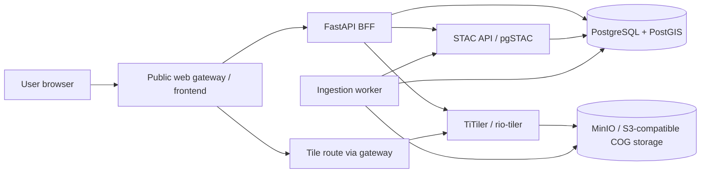
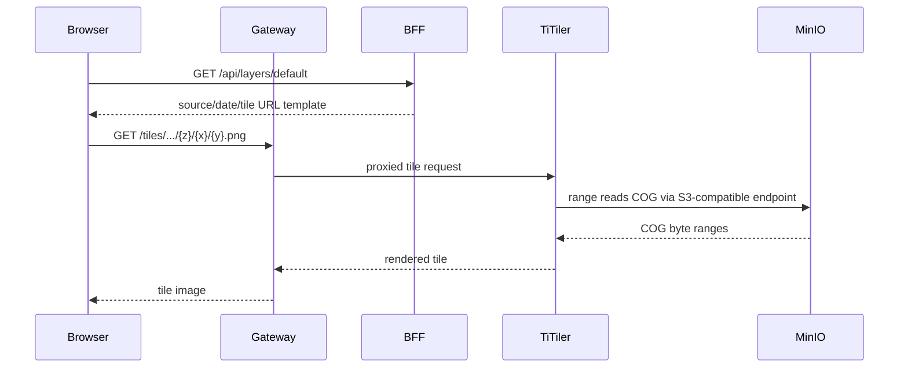
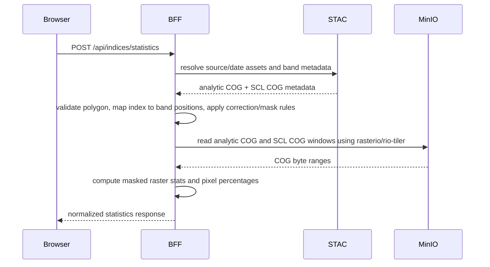

# Final Tech Stack and Architecture

## Architecture goal

Build a Railway-first MVP that keeps clean service boundaries and remains portable to Docker Compose/on-prem deployments. The frontend must never know object-storage paths directly. It asks the backend-for-frontend for source/date/layer information, and raster work stays behind TiTiler/rio-tiler.

## High-level architecture



The public `web` service is a single container = built React static assets + a reverse proxy (Caddy) that serves the SPA and proxies `/api`→`api` and `/tiles`→`titiler`. Source stays in `apps/frontend` and `infra/gateway` but is deployed as one Railway public service.

## Component responsibilities

| Component | Responsibility | Publicly reachable? |
|---|---|---|
| Frontend | Map UI, layer panel, plot drawing/import/export, index result display. | Yes, through web gateway. |
| Web gateway | Serves frontend and routes `/api` and `/tiles` requests to internal services. Handles TLS/CORS/rate limits where applicable. | Yes; only the `web` gateway is publicly reachable. |
| FastAPI BFF | App configuration, catalog queries, plot CRUD, index request orchestration, formula/band mapping, and masked statistics using rasterio/rio-tiler. Browser calls arrive only through same-origin `/api/*` on the gateway. | No. |
| TiTiler | RGB display tile serving and optional index display overlays. Reads COGs from MinIO via GDAL S3 config. Browser tile calls arrive only through same-origin `/tiles/*` on the gateway. | No. |
| STAC API / pgSTAC | Catalog collections/items, date/source discovery, asset metadata. | No. |
| PostgreSQL/PostGIS | Stored plots, pgSTAC catalog, app metadata. | No. |
| MinIO | S3-compatible COG object storage. | No. |
| Ingestion worker | Manual/seed ingestion first; scheduled CDSE/Bhoonidhi ingestion later. | No. |

## Final technology choices

| Layer | Choice | Notes |
|---|---|---|
| Frontend | React + TypeScript + Vite | Fast build, strong ecosystem, Railway-friendly Docker build. |
| Map renderer | MapLibre GL JS | Open-source map rendering without Mapbox token lock-in. |
| Plot drawing | Terra Draw + MapLibre adapter | MapLibre-native polygon drawing/editing. |
| Server state | TanStack Query or equivalent | Cache source/date/config/index API responses cleanly. |
| Backend | FastAPI + Python | Thin BFF for orchestration, validation, and app-specific APIs. |
| Raster tiling/statistics | TiTiler component packages + rio-tiler/rasterio/GDAL | TiTiler serves RGB/display tiles; the BFF computes masked polygon statistics with rasterio/rio-tiler. |
| Catalog | STAC + pgSTAC via stac-fastapi-pgstac | One collection per satellite/source family; one item per scene/date/mosaic. |
| Database | PostgreSQL + PostGIS | Plot persistence and STAC catalog backend. |
| Object storage | MinIO | S3-compatible COG storage; portable between Railway and on-prem. |
| COG creation | GDAL + rio-cogeo | SAFE/JP2/TIF inputs to validated COGs with overviews. |
| Deployment | Railway multi-service project | Separate services, private networking, volumes, variables, and health checks. |
| Local runtime | Docker / Docker Compose | Required for local development and future on-prem portability. |
| Reverse proxy | Caddy, Nginx, or equivalent | Public gateway for frontend/API/tile routes. |
| Observability | Railway logs/metrics first; structured app logs | Add Prometheus/Grafana later if needed. |

## Frontend architecture

### Key screens/components

- `MapPage`: owns map initialization and top-level layout.
- `LayerPanel`: source/date selection, cloud percentage, opacity, visibility.
- `PlotToolbar`: draw/edit/import/export actions.
- `IndexPanel`: index selector, request status, statistics, legend.
- `MapLayerManager`: converts API layer metadata into MapLibre sources/layers.
- `ApiClient`: typed client for BFF endpoints.

### Frontend rules

- Use MapLibre raster sources for satellite tiles.
- Keep basemap and satellite layers separate.
- Never fetch COGs directly from the browser.
- Never hard-code satellite asset URLs in frontend code.
- Use API-provided source/date/tile metadata.

## BFF API shape

| Endpoint | Method | Purpose |
|---|---:|---|
| `/health` | GET | Service health check. |
| `/api/config` | GET | AOI, map defaults, max polygon area, supported indices. |
| `/api/sources` | GET | Satellite/product source list from STAC collections. |
| `/api/sources/{sourceId}/dates` | GET | Available dates with AOI cloud/usable-pixel percentages. |
| `/api/layers/default` | GET | Default source/date/layer metadata. |
| `/api/plots` | GET/POST | List/create named plots. |
| `/api/plots/{plotId}` | GET/PATCH/DELETE | Read/update/delete a plot. |
| `/api/plots/import/geojson` | POST | Validate and import GeoJSON polygon(s). |
| `/api/plots/{plotId}/export.geojson` | GET | Export plot as GeoJSON. |
| `/api/indices/statistics` | POST | Compute index stats for geometry + source + date + index type. |

Only the `web` (gateway) service is publicly reachable. The browser calls `/api/*` and `/tiles/*` on the same public origin; the gateway proxies them to the internal `api` and `titiler` services. FastAPI, TiTiler, STAC API, PostGIS and MinIO are never given a public domain.

### Error response

```json
{ "error": { "code": "POLYGON_TOO_LARGE", "message": "Polygon exceeds maximum area of 50 ha.", "details": {} } }
```

Codes: 400 bad request / validation, 422 invalid geometry, 413 (or 400) polygon too large, 429 rate limited, 504 index timeout, 502 upstream (TiTiler/STAC) failure.

### Tile route contract

```text
Tile route (same public origin):
  GET /tiles/{sourceId}/{acquisitionDate}/rgb/{z}/{x}/{y}.png
  (Wave 2 optional) GET /tiles/{sourceId}/{acquisitionDate}/index/{indexType}/{z}/{x}/{y}.png
The gateway proxies /tiles/* to TiTiler; the frontend only ever uses relative same-origin tile URLs.
```

`/api/layers/default` response:

```json
{
  "sourceId": "sentinel-2-l2a",
  "acquisitionDate": "2026-01-15",
  "tileUrlTemplate": "/tiles/sentinel-2-l2a/2026-01-15/rgb/{z}/{x}/{y}.png",
  "bounds": [77.4, 12.8, 77.8, 13.2],
  "minzoom": 8,
  "maxzoom": 14,
  "attribution": "Copernicus Sentinel-2",
  "usablePixelPercent": 87.4
}
```

### BFF API contracts

`GET /api/config`:

```json
{
  "appName": "Akasha",
  "aoi": { "id": "bangalore", "name": "Bangalore", "center": [77.59, 12.97], "zoom": 11,
           "bounds": [77.4, 12.8, 77.8, 13.2] },
  "basemapStyleUrl": "",
  "basemap": {
    "provider": "esri",
    "style": "arcgis/imagery",
    "styleFamily": "arcgis",
    "usageModel": "session",
    "places": "none",
    "sessionDurationSeconds": 43200
  },
  "maxPolygonAreaHa": 50,
  "maxPolygonVertices": 5000,
  "usablePixelThresholdPercent": 70,
  "supportedIndices": ["NDVI", "NDRE", "NDMI", "NDWI_GREEN_NIR"],
  "defaultIndex": "NDVI"
}
```

`GET /api/sources`:

```json
[ { "id": "sentinel-2-l2a", "label": "Sentinel-2 L2A", "provider": "Copernicus",
    "supportedIndices": ["NDVI","NDRE","NDMI","NDWI_GREEN_NIR"] } ]
```

`GET /api/sources/{sourceId}/dates`:

```json
[ { "acquisitionDate": "2026-01-15", "datetime": "2026-01-15T05:20:00Z",
    "usablePixelPercent": 87.4, "cloudMaskedPercent": 12.6,
    "isLatestUsable": true, "tileAvailable": true } ]
```

`GET/POST /api/plots`, `GET/PATCH/DELETE /api/plots/{plotId}` plot object:

```json
{ "id": "uuid", "name": "North field", "geometry": { "type": "Polygon", "coordinates": [] },
  "areaHa": 12.4, "createdAt": "...", "updatedAt": "..." }
```

`POST /api/plots/import/geojson` → returns `{ "imported": [<plot>], "rejected": [{ "reason": "...", "feature": {} }] }`.
`GET /api/plots/{plotId}/export.geojson` → a GeoJSON Feature.
All errors use the standard error shape above.

### Index statistics request contract

Request shape:

```json
{
  "geometry": { "type": "Polygon", "coordinates": [] },
  "sourceId": "sentinel-2-l2a",
  "acquisitionDate": "2026-01-15",
  "indexType": "NDVI"
}
```

`indexType` is one of `NDVI`, `NDRE`, `NDMI`, `NDWI_GREEN_NIR`.

Response shape:

```json
{
  "indexType": "NDVI",
  "sourceId": "sentinel-2-l2a",
  "acquisitionDate": "2026-01-15",
  "statistics": {
    "min": 0.12,
    "max": 0.81,
    "mean": 0.53,
    "stddev": 0.09,
    "validPixelPercent": 87.4,
    "cloudMaskedPercent": 12.6,
    "coveragePercent": 100.0
  },
  "metadata": {
    "formula": "(B08 - B04) / (B08 + B04)",
    "cloudMask": "SCL classes excluded",
    "reflectanceCorrection": "Sentinel-2 L2A scale/offset applied"
  }
}
```

Percentage denominators are defined in data-ingestion "Pixel accounting and percentages".

## Data flow: default map tiles



No vegetation index math runs in the default tile path.

## Data flow: on-demand index statistics

Cloud-masked index statistics are computed in the **BFF (FastAPI) using rasterio/rio-tiler**, not by plain TiTiler `/cog/statistics`. The BFF reads the analytic COG window and the SCL COG window for the request polygon, applies per-band scale/offset, applies the SCL mask, then computes min/max/mean/stddev and the pixel-percentage fields. **TiTiler serves RGB display tiles (and optional index *display* overlays) only — it is not used for masked statistics**, because vanilla TiTiler `/cog/statistics` takes a single `url` and cannot apply a categorical mask from a second COG.



## Data model boundaries

### App tables

- `plots`: id, name, geometry, area, created_at, updated_at.
- `index_requests` optional: request metadata, duration, status, error summary for debugging/rate-limit insight.
- `app_settings` optional: AOI config, default source/date override, max polygon area.

### Catalog data

STAC/pgSTAC owns satellite collections, items, asset URLs, acquisition timestamps, cloud metrics, projection metadata, and raster band metadata. The BFF reads this data but should not duplicate it into app tables.

## Runtime design decisions

- Use one STAC collection per satellite/product family, for example `sentinel-2-l2a`.
- Use one STAC item per acquisition date/scene or date mosaic.
- Use MosaicJSON or pgSTAC-backed mosaics when a date/source covers multiple scenes.
- Use positional TiTiler band expressions built from STAC metadata; do not assume hard-coded band positions outside the BFF/index module.
- Only the `web` (gateway) service is publicly reachable; route browser `/api/*` and `/tiles/*` calls through the same public origin to internal services.
- Use QGIS Desktop only as a QA/reference tool, not as a runtime dependency.

## Versioning and dependency policy

- Pin GDAL, rasterio, rio-tiler, rio-cogeo, and TiTiler versions together.
- Do not use floating `latest` container tags for raster services.
- Keep frontend dependencies locked.
- Prefer explicit Dockerfiles for each deployable service.
- Add `/health` endpoints before configuring Railway health checks.

## Native capability roadmap

The browser only uses same-origin `/api/*` and `/tiles/*` routes. Capabilities that are not backed
by Akasha-owned data sources remain disabled or placeholder-only until native services are added.

| Capability | Current implementation | Native extension direction |
|---|---|---|
| Field management | Native `akasha.plots` + field AOI metadata | Add grouping, metadata, and import/export workflows without external mirrors. |
| Scene timeline | pgSTAC/STAC query and seed fallback | Filter by field AOI, scene coverage, and cloud/valid-pixel metrics. |
| True-colour and index display tiles | COG/TiTiler-backed same-origin `/api/tiles/*` routes | Keep true-colour `[1,8,9]` default and add optional native index overlays. |
| Field analytics trend | BFF rasterio/rio-tiler statistics over STAC/COG assets | Broaden trend coverage as catalog density increases. |
| Imagery export | BFF native CSV/GeoJSON selected-field exports | Add server-side GeoTIFF/vector exports without signed storage URLs in the browser. |
| Weather forecast/history | Placeholder / unavailable in risk scoring | Add an Akasha-selected weather adapter normalized behind BFF routes. |
| Soil moisture | Unavailable | Add a native soil-moisture source when validated. |
| Vegetation VRA zoning | Placeholder | Implement native zoning using quantile/k-means over cloud-masked index rasters. |
| Reports/leaderboard | Akasha-native BFF reports | Continue composing from fields, cloud-free index statistics, weather, operations, and risk evidence. |
| Risk/disease/pest context | Akasha-native transparent rule model | Validated crop/stage/weather/scout models; no disease/pest diagnosis from NDVI alone. |

Native extension work must preserve the same public DTOs, standard error shape, and secret-leak guardrails used by the retained Akasha APIs.
