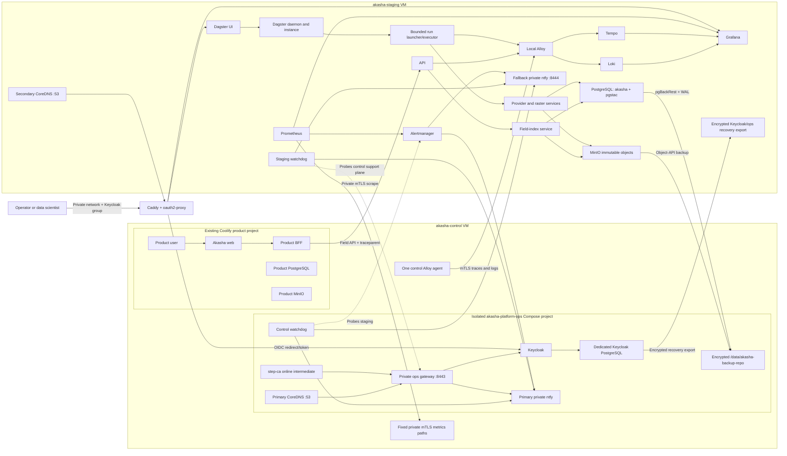

# Production ingestion orchestration and observability implementation plan

## 1. Purpose and completion statement

This is the implementation-ready plan for making Akasha's satellite ingestion and field-index processing observable, operable, measurable, and safe in production. It replaces every existing ingestion scheduler and operator surface with one Dagster OSS control plane on `akasha-staging`.

The final architecture review found and resolved the earlier blockers around access control, asset granularity, readiness ownership, legacy deletion, concurrency, publication atomicity, dry-run behavior, cross-VM telemetry, alert delivery, retention, recovery objectives, capacity qualification, cloud portability, and cutover order. No architecture choice is intentionally deferred to implementation.

Values such as Keycloak realm/group names, private DNS names, notification topics, secrets, and measured volume sizes are deployment inputs, not architecture decisions. Section 4 assigns each input to a phase gate so missing values cannot silently reach production.

The target provides:

- Dagster UI for schedules, run graph, step timing, dry/live launches, bounded backfills, cancellation, retry, lineage, and checks;
- six stable logical assets backed by one detailed 13-stage dynamic execution graph;
- domain-owned publication and freshness facts, without a second workflow/readiness ledger;
- immutable upload-first publication followed by one Akasha-plus-pgSTAC database transaction;
- correlated metrics, traces, and structured logs across the control/application and staging/ingestion VMs;
- provisioned dashboards, actionable alerts, runbooks, recovery drills, and repeatable performance gates;
- self-hosted identity, private PKI/DNS, notifications, liveness monitoring, and backup repositories that can move unchanged to on-premises infrastructure;
- no ingestion scheduling, history, monitoring, or trigger feature in the Akasha product UI or BFF.

This changes orchestration and operations. It does not rewrite satellite algorithms, provider integrations, PostgreSQL/pgSTAC, MinIO, TiTiler, GDAL/rasterio, or field-index calculations.

## 2. Final locked decisions

| ID | Decision |
|---|---|
| AD-01 | Dagster OSS on `akasha-staging` is the only production ingestion scheduler and execution-history authority after cutover. |
| AD-02 | Use a dedicated `dagster` database and least-privilege user in the existing PostgreSQL cluster; do not migrate legacy workflow history. |
| AD-03 | Use `DefaultRunLauncher`, `QueuedRunCoordinator`, Dagster daemon, and a bounded multiprocess executor on the single ingestion VM. Do not introduce Kubernetes. |
| AD-04 | Represent the workflow as six coarse logical assets backed by a common 13-stage op graph with bounded dynamic mapping. Do not create one asset per stage. |
| AD-05 | Use explicit request windows for live and backfill jobs. Do not introduce native Dagster partitions in this phase. |
| AD-06 | Use one self-hosted Keycloak realm group, `/akasha-operators`, for Dagster and Grafana access. All members have the same operational privileges; Dagster OSS is not claimed to provide application-level RBAC. Keycloak is only the operator identity provider and does not replace Akasha product-user authentication. |
| AD-07 | Use the `oauth2-proxy` `keycloak-oidc` provider with exact `/akasha-operators` group authorization against the private Keycloak issuer in front of the private reverse proxy. Strip caller-supplied identity headers before injecting verified identity. |
| AD-08 | Treat proxy access logs plus Dagster run/event history as an operational audit trail, not a compliance-grade per-action identity system. `requested_by` is informational and non-authoritative. |
| AD-09 | The Akasha product is not an ingestion control plane. Delete its ingestion UI, routes, clients, BFF endpoints, compatibility redirects, and scheduler-derived monitoring. |
| AD-10 | Remove Celery Beat/workers, Flower, Redis, the host Systemd scheduler, inbox dispatcher, SQLite/JSON ledgers, and their runtime code. If Phase 0 finds an unexpected Redis consumer, refactor it before cutover; Redis is not retained as an unresolved exception. |
| AD-11 | Drop `backfill_runs`, `processing_job_stages`, `processing_jobs`, and unused `audit_logs` only after all runtime dependencies are removed and the release image passes a zero-reader/writer scan. |
| AD-12 | Readiness and freshness are derived from validated, published domain/catalog facts using acquisition time. Do not create or retain a readiness projection table or make product readiness depend on Dagster history. |
| AD-13 | Globally allow at most two Dagster runs and at most one mutating run. Use pools and bounded process execution as specified in Section 8. |
| AD-14 | Use deterministic request fingerprints/run keys, immutable domain identities, input fingerprints, and short transaction-scoped advisory locks. Do not hold a database session lock for an entire run. |
| AD-15 | Publish content-addressed immutable objects first, verify them remotely, then register Akasha-domain and pgSTAC facts in one transaction in the shared PostgreSQL database. |
| AD-16 | A dry run may search providers and read internal metadata, but it never orders, downloads, creates scratch data, or mutates Akasha, pgSTAC, MinIO, or readiness state. Dagster's own run metadata is the only write. |
| AD-17 | Manual live/backfill runs require a dry-run plan fingerprint generated within 30 minutes and fail before download on plan drift. Scheduled runs plan and execute within one run. |
| AD-18 | Provider-native and computed cloud values remain separate. The maximum threshold is 20%; missing or unreliable native cloud is never treated as zero. |
| AD-19 | Run Alloy on `akasha-control` and `akasha-staging`; keep Prometheus, Tempo, Loki, Grafana, and Alertmanager centralized on `akasha-staging`; transport cross-VM telemetry only over the private network with mTLS. |
| AD-20 | Do not use Microsoft Entra ID, Azure Monitor, Action Groups, Blob Storage, Key Vault, Private DNS, or Azure notification services. Azure supplies VM compute, attached disks, and basic networking only; all Akasha platform services run inside the portable VM deployment. |
| AD-21 | PostgreSQL and Dagster have a 15-minute RPO and 4-hour RTO; MinIO has a 24-hour RPO, 8-hour service RTO, and 24-hour full-corpus recovery objective. |
| AD-22 | Raw/source audit artifacts are never automatically deleted. Automatic cleanup is limited to inactive scratch and proven-unreferenced derived publication candidates. |
| AD-23 | Do not create a third VM. Run Keycloak, its dedicated PostgreSQL instance, primary CoreDNS, `step-ca`, primary ntfy, the control watchdog, and staging backup repositories in a separately managed `akasha-platform-ops` Compose project on `akasha-control`. It has its own lifecycle, users, networks, port registry, secrets, persistent roots, quotas, and resource limits and is never added to the existing Coolify product Compose project. |
| AD-24 | Run a minimal fallback ntfy receiver, secondary static-zone CoreDNS, and staging watchdog on `akasha-staging`. Alertmanager and both watchdogs publish critical firing/resolved events to both authenticated receivers. Do not configure SMTP, SMS, Firebase, Apple Push Notification Service, browser Web Push, or an ntfy upstream. Operators use the private ntfy web stream or F-Droid Android client over the private network/VPN. |
| AD-25 | With no service or node outside the two-VM estate, simultaneous loss of both VMs or their private network cannot deliver an alert or provide an online backup copy. This is an explicit availability limitation, never a passing dead-man or disaster-recovery claim. Production sign-off must accept it until a separately powered/networked on-premises failure domain exists. |
| AD-26 | Use root-managed, service-scoped host secret files under `/etc/akasha/secrets/<service>` with mode `0400` or `0440` and explicit service ownership, mounted read-only into only the required containers. Provision and rotate them over the private administrative channel and keep one encrypted, access-controlled recovery copy offline; do not require a cloud or hosted secret manager. |
| AD-27 | On the current 4-vCPU/16-GiB control VM, cap the steady `akasha-platform-ops` project at an aggregate 1.5 vCPU and 3 GiB RAM and cap backup work at 0.5 vCPU/1 GiB with low I/O priority and concurrency one. Preserve at least 2 vCPU and 10 GiB for Coolify plus the product stack. If baseline or contention gates fail, first remove duplicate collectors/tune bounded retention and limits; if they still fail, vertically resize the same control VM and rerun all gates. Do not add a VM. |
| AD-28 | Store small operations state under the separate `/data/akasha-platform-ops` root, but place the staging backup repository on a separately mounted, encrypted, capacity-sized filesystem at `/data/akasha-backup-repo`. Backup units fail without starting if that mount is absent or wrong, while core operator services remain available; Docker must never create the path on the OS disk or inside the product app's existing `/data/akasha` tree. |
| AD-29 | Use a repository-pinned, checksum-verified `rclone` release over MinIO's S3 API for object backup. Immutable/content-addressed prefixes use additive `rclone copy --immutable --checksum`; mutable prefixes, if Phase 0 proves any are required for recovery, go to timestamped protected generations. Never use `sync`, `move`, `delete`, `purge`, or filesystem-level copying against the live MinIO data directory. |
| AD-30 | Introduce no commercial control plane, SaaS, or managed runtime. Use only self-hosted community distributions for the new platform components. The only permitted incremental infrastructure is capacity attached to the two existing VMs—principally a dedicated encrypted control-VM backup disk if no unused dedicated block device meets the measured capacity and I/O gate; no third VM or Azure PaaS is allowed. |
| AD-31 | Put a digest-pinned Tecnativa Docker Socket Proxy release between Alloy and Docker on each VM. Allow only Docker `PING`, `INFO`, and `CONTAINERS` read endpoints required by tested discovery/log collection, set `POST=0`, deny every other API section, expose it only on an Alloy-plus-proxy collector network, and never mount the raw Docker socket into Alloy. |

### 2.1 Non-goals

- Application-level RBAC or compliance-grade user/action attribution in Dagster OSS.
- A replacement ingestion console in the Akasha product.
- Native Dagster partitions or partition backfills in this phase.
- A second run ledger, readiness projection, dual writes, compatibility views, or historical workflow import.
- Kubernetes, Kafka, Grafana Cloud, or another managed application-observability platform.
- Azure PaaS/control-plane dependencies beyond VM compute, attached disks, and basic networking.
- Guaranteed notification or online recovery after simultaneous loss of both Akasha VMs and their private network while no external operations node or service is allowed.
- Active-active database/object-store high availability on the current two-VM topology.
- Automatic deletion of reproducibility inputs merely to recover space.

## 3. Repository, deployment, and ownership scope

| Area | Repository/location | Production responsibility |
|---|---|---|
| Web application and BFF | `akasha-project`, `akasha-control` | User-facing product and field analytics request initiation; no ingestion operations |
| Satellite ingestion and analytics | `akasha-ingestion`, `akasha-staging` | Providers, Dagster, processing, catalog, storage, and field-index API |
| Orchestration metadata | `dagster` database in PostgreSQL on `akasha-staging` | Runs, events, retries, schedules, sensors, and ticks |
| Domain/catalog data | `akasha` database with `akasha` and `pgstac` schemas | Scene, asset, validation, publication, and catalog facts |
| Immutable objects | MinIO on `akasha-staging` | Raw/source audit inputs and published content-addressed outputs |
| Operator identity | Keycloak plus a dedicated local PostgreSQL container in the isolated `akasha-platform-ops` project on `akasha-control` | Private OIDC issuer, operator accounts, MFA, and `/akasha-operators` membership without coupling to either application database lifecycle |
| Private PKI and DNS | `step-ca` and primary CoreDNS in `akasha-platform-ops` on `akasha-control`; secondary static-zone CoreDNS on `akasha-staging` | Portable private names, certificates, trust, and rotation without cloud DNS/PKI |
| Telemetry agents | Alloy on both VMs | Local OTLP receipt, local log collection, redaction, and forwarding |
| Telemetry backends | `akasha-staging` | Prometheus, Tempo, Loki, Grafana, and Alertmanager |
| Independent liveness and notification | Control watchdog + primary ntfy on `akasha-control`; staging watchdog + fallback ntfy on `akasha-staging` | Symmetric cross-VM probes and private authenticated operator delivery without Azure/SMS/email services |
| Recovery repositories | Dedicated encrypted `/data/akasha-backup-repo` filesystem on `akasha-control`; encrypted Keycloak/ops recovery export on `akasha-staging` | Staging PostgreSQL/WAL/object backups outside staging, plus reciprocal recovery for the control-hosted operator plane |

Implementation branches:

- `akasha-project`: `dev-akasha-core`
- `akasha-ingestion`: `development`

### 3.1 Canonical data owners after cutover

| Fact | Canonical owner |
|---|---|
| Run/step status, retries, ticks, execution events | Dagster PostgreSQL |
| Operator browser identity/access | Identity-proxy access logs |
| Business outcome and run summary | Dagster tags/events/materialization metadata |
| Provider, scene, cloud, validation, publication facts | Akasha domain tables |
| Catalog items/assets | pgSTAC in the same database transaction as domain publication |
| Raw and derived objects | MinIO |
| Current readiness/freshness | Query derived from published valid domain/catalog facts |
| Metrics, traces, searchable logs | Prometheus, Tempo, Loki |

## 4. Required deployment inputs and blocking phase

These are concrete values that cannot be inferred from code. They do not reopen architecture decisions.

| Input | Owner | Must exist before | Validation |
|---|---|---|---|
| Control-VM port/process/mount/network inventory, current Coolify/product p95 CPU/RAM/I/O, `/data` headroom, and `akasha-platform-ops` Compose project/UID/GID allocation | Platform | Phase 0 | No name/port/path/network/user collision; product reserve and operations caps fit measured headroom |
| Keycloak realm name, `/akasha-operators` group, OIDC clients/redirect URIs, two recovery admins, and MFA policy | Platform | Phase 2 integration | Authorized group succeeds; non-member and wrong-issuer tokens fail; recovery-admin drill passes |
| CoreDNS private zone and control-hosted `step-ca` offline-root/online-intermediate ceremony for Dagster, Grafana, Keycloak, ntfy, metrics, OTLP, and backup transport | Platform | Phase 2 integration | SAN, chain, trust distribution, expiry, rotation, offline-root recovery, secondary-DNS behavior, and public-denial tests pass |
| Primary control/fallback staging ntfy URLs, private topics/tokens, two named operator clients, and signed acknowledgement of the two-VM-estate-outage limitation | Platform manager | Phase 6 | Both authenticated firing/resolved paths reach two named humans without SMTP/SMS/FCM/APNS/Web Push/upstream traffic |
| Encrypted `/data/akasha-backup-repo` mount and capacity on control, plus encrypted Keycloak/ops recovery destination on staging | Platform | Phase 6 | Mount fail-closed behavior, restore credentials, encryption, capacity, delete protection, reciprocal restore, and no product/OS-disk fallback verified |
| Source credentials, provider endpoints, per-source window/cap/rate/freshness/grace values | Data Engineering | Phase 1 | Typed source-registry validation passes for every enabled source |
| AOI inventory and stable AOI identifiers | Data Engineering | Phase 1 | Unknown/unbounded AOIs are rejected |
| Both-VM CPU/RAM/disk/inode/port/network inventory and dedicated product, operations, backup, scratch, and telemetry budgets | Platform | Phase 0 | Capacity worksheet, collision scan, cgroup limits, mount guards, and low-space thresholds approved |
| Scientific fixtures and tolerances | Data Science | Phase 1 | Golden-result tests approved before orchestration parity claims |

Missing input blocks its named phase and production cutover; it does not authorize an implementation-time guess.

## 5. Target architecture

### 5.1 Security boundary

- Bind Dagster, Grafana, Prometheus, Loki, Tempo, Alertmanager, MinIO, PostgreSQL, Alloy receivers, and the control metrics endpoint only to internal networks.
- Expose Dagster and Grafana through Caddy plus `oauth2-proxy`; use the private Keycloak issuer and require the exact `/akasha-operators` group claim.
- Reject caller-supplied `X-Auth-Request-*`, user, email, and group headers at the external proxy boundary. Only the authenticated proxy may inject them.
- Keep the Keycloak administration surface on the private management network. Require MFA for operators and administrators, two separately held recovery-admin accounts, short sessions, login throttling, and tested realm/database restore. Bootstrap credentials are removed after initialization.
- Serve the same Git-managed static private zone from primary CoreDNS on `akasha-control` and secondary CoreDNS on `akasha-staging`; do not use Azure Private DNS or public DNS for internal service discovery. Configure both resolver addresses, in that order, on the two VMs and private-network/VPN operator clients, then prove resolution with either server stopped. Bind each CoreDNS instance only to its VM's private IP so it does not replace or collide with the host loopback resolver. Run `step-ca` with an offline root and an online intermediate in the control operations project; distribute the root explicitly to VM and operator trust stores. Issue seven-day leaf certificates, renew daily, and alert when less than 48 hours remain.
- Deny access from workloads to Azure metadata identity/token endpoints and do not ship Azure SDK credentials, resource IDs, or service integrations. Provider-specific internet egress remains separately allowlisted where ingestion requires it.
- Disable local/basic login where the component supports it. Do not expose backend admin APIs through the browser proxy.
- The BFF has analytics API credentials only. It has no Dagster, provider, MinIO, pgSTAC-write, or orchestration credentials.
- Use separate least-privilege PostgreSQL roles for Dagster, application migrations, application reads, atomic Akasha/pgSTAC publication, exporters, and backups. The publication role receives only the cross-schema privileges required by Stage 11.
- Use non-root MinIO service identities scoped by bucket/prefix/action; application services never use MinIO root credentials.
- Validate all source IDs, AOIs, windows, and modes against typed registries. Dagster config cannot supply arbitrary URLs, filesystem paths, commands, SQL, or object prefixes.
- Provider egress is allowlisted by adapter. Redirects are revalidated to prevent SSRF. Archive extraction rejects absolute paths, traversal, links, devices, and expansion beyond configured limits.
- Store runtime secrets only in root-managed `/etc/akasha/secrets/<service>` files with mode `0400` or `0440` and explicit service ownership, mounted read-only into the minimum required containers. Provision/rotate them over the private administrative channel and keep an encrypted offline recovery copy; never place plaintext secrets in image layers, Git, Dagster config/tags, logs, dashboards, or committed `.env` files.
- Pin application and infrastructure images by digest for production; generate SBOMs and fail release qualification on unresolved critical/high exploitable findings.

### 5.2 Control-VM isolation and resource contract

The operations support plane shares the host only; it does not share the product stack's Compose lifecycle or Docker resources.

| Boundary | Locked implementation |
|---|---|
| Lifecycle | Host-managed Compose project `akasha-platform-ops` from a pinned manifest under `/opt/akasha/platform-ops`; a core Systemd unit starts identity/DNS/PKI/notification/gateway services, while separate backup-profile units/timers start pgBackRest and `rclone`; never embedded in or stopped by the Coolify product project |
| Naming | No `container_name`; Compose-generated names remain under the `akasha-platform-ops` project prefix; images and labels use an explicit `com.akasha.plane=platform-ops` label |
| Networks | Dedicated internal `ops_core` and `ops_backup` networks; no attachment to any Coolify/product network; only the private ops gateway and fixed backup/metrics endpoints cross the boundary |
| Private host bindings | Control private IP TCP `8443` for the ops gateway, TCP `8432` for pgBackRest, and TCP/UDP `53` for CoreDNS; staging private IP TCP `8444` for fallback ntfy and TCP/UDP `53` for secondary CoreDNS; all other ports use `expose` only |
| Small state | `/data/akasha-platform-ops/{keycloak-postgres,keycloak,ntfy,step-ca,coredns,logs}` with a 20-GiB project quota; no anonymous volumes and no paths anywhere inside the product-owned `/data/akasha` tree |
| Backup state | Separately mounted encrypted filesystem `/data/akasha-backup-repo`; a `findmnt`/filesystem-UUID preflight must pass before pgBackRest or object backup starts |
| Secrets | `/etc/akasha/secrets/<service>` with service-specific ownership and read-only mounts; no reuse of product database, MinIO-root, API, or Coolify credentials |
| Compute | Dedicated cgroup-v2 parents plus per-container limits whose sums enforce an aggregate steady cap of 1.5 vCPU/3 GiB and backup-job cap of 0.5 vCPU/1 GiB; per-container PID limits, health checks, and `no-new-privileges`; preserve at least 2 vCPU/10 GiB for Coolify plus product workloads |
| I/O | Backup concurrency one, `nice`/`ionice` low priority, explicit bandwidth limit, off-peak schedule, and automatic pause on product SLO breach, control-disk pressure, or backup-mount pressure |
| Logs/cache | Docker local logging capped at `25m` x 4 files per container; ntfy uses bounded SQLite/cache with seven-day retention and 1-GiB maximum; Keycloak event retention is bounded to the 90-day operator-audit policy |

Before every operations deployment, a preflight inventories `docker compose ls`, containers, networks, volumes, `ss -lntup`, UIDs/GIDs, mount UUIDs, free bytes/inodes, and current cgroup limits. Any collision or missing small-state mount fails the core deployment before container creation. Backup units declare `RequiresMountsFor=/data/akasha-backup-repo`, verify the configured filesystem UUID and that the resolved path is outside the OS/product filesystems, and fail without starting backup containers when the check does not pass. A missing backup mount raises a critical alert but does not stop Keycloak, DNS, PKI, ntfy, or the private gateway. Core services start after `network-online.target`, Docker, and their state mount; backup timers start only after the core health gate and backup-mount guard.

Product deployment tests prove that a Coolify redeploy neither restarts nor removes operations containers. Operations deployment tests prove that it does not restart, reconnect, or mutate product containers, networks, volumes, or routes. Upgrades use `docker compose config` validation, signed digest verification, a configuration/state backup, health-gated replacement, and an explicit last-known-good manifest; rollback targets only the operations project and never invokes a host-wide Docker cleanup.

Use one Alloy agent on `akasha-control`; do not deploy a second Alloy instance inside `akasha-platform-ops`. Use a dedicated Keycloak PostgreSQL container instead of either existing application database, and use ntfy SQLite instead of adding another database. Do not reuse the product `web`/Caddy container for private operator endpoints; the small private ops gateway has an independent configuration and lifecycle.

### 5.3 Cloud portability contract

- Production Compose, configuration, backup, identity, DNS, PKI, monitoring, and notification manifests are cloud-neutral. They accept hostnames, private addresses, mount paths, and secrets as deployment inputs and contain no Azure service API calls.
- Azure UAT uses only VMs, their attached disks, and basic private networking. No Entra ID, Azure Monitor, Action Group, Blob Storage, Key Vault, Private DNS, managed database, SMTP, or SMS dependency is permitted.
- Persistent paths are explicit host mounts, never anonymous Docker volumes. The on-premises migration remaps those mounts and private addresses without changing application contracts or data formats.
- A disconnected qualification test blocks Azure service endpoints while retaining explicitly approved satellite-provider and package-registry egress; identity, operator access, telemetry, alert delivery, backup, and restore must continue to work.
- Simultaneous loss of both VMs or their private network remains unobservable and removes the online backup copy. Runbooks and production approval state this limitation exactly until a separate on-premises failure domain exists.

### 5.4 Software and cost boundary

| Category | Locked choice | Cost/portability consequence |
|---|---|---|
| Orchestration and access | Dagster OSS, Keycloak, OAuth2 Proxy, CoreDNS, `step-ca`, and the private gateway | Self-hosted community distributions; no Dagster+, Entra ID, hosted identity, cloud DNS, or managed certificate service |
| Telemetry and notification | Grafana OSS stack, Alloy, Alertmanager, ntfy, and local watchdogs | Self-hosted community distributions; no Grafana Cloud, Azure Monitor, Action Groups, hosted paging, SMS, or email service |
| Backup and data | pgBackRest, `rclone`, PostgreSQL, and MinIO APIs | Self-hosted tooling and portable file/object formats; no Blob Storage or hosted backup service |
| Infrastructure | Existing `akasha-control` and `akasha-staging` VMs only | No new VM. A dedicated encrypted VM-attached backup disk is mandatory only if Phase 0 proves no existing unused dedicated block device meets the retention, restore, and contention gates; it remains ordinary VM block storage and maps to local block storage on-premises |
| External data providers | Existing approved satellite-provider accounts and policies | This plan introduces no new provider subscription or paid ordering path; any provider licensing/egress cost remains separately owned and approved |

Record exact component versions, image digests, source repositories, licenses, and vulnerability status in the release SBOM. Qualification fails if an image silently selects an enterprise/cloud-only feature, requires a hosted control plane, or sends telemetry/notification/backup data to an unapproved external endpoint.

## 6. Canonical workflow and domain contract

### 6.1 Six logical assets

| Asset | Meaning | Backing stages |
|---|---|---|
| `provider_observations` | Normalized, policy-evaluated provider candidates for a source/AOI/window | 1-3 |
| `raw_satellite_products` | Downloaded, checksum-verified immutable source inputs | 4 |
| `prepared_analytic_scenes` | Prepared analytic bands, masks, and scene validation facts | 5-6 |
| `source_aoi_composites` | Validated source/AOI composites where the source requires them | 7-8 |
| `derived_index_rasters` | Validated NDVI/NDMI/NDWI/MSAVI outputs supported by the source | 9-10 |
| `published_catalog_items` | Atomically published domain and pgSTAC facts plus observed freshness | 11-13 |

These assets are intentionally coarse. The detailed operator graph comes from the stage ops below. Assets are not partitioned; `window_start` and `window_end` are validated run config.

### 6.2 Common 13-stage op graph

Every enabled source uses these names. A source may return `not_applicable`, but may not invent a conflicting name for an equivalent stage.

| # | Stage key | Responsibility | Required evidence |
|---:|---|---|---|
| 1 | `plan_and_preflight` | Validate registry/config, credentials, disk, caps, request fingerprint, and conflicts | Validated bounded plan |
| 2 | `provider_search` | Read provider catalog/inbox | Safe request summary and candidate count |
| 3 | `normalize_and_filter_candidates` | Normalize, deduplicate, check existing domain identity, apply native-cloud and asset policy | Candidate decisions and plan fingerprint |
| 4 | `download_and_checksum` | Dynamically map bounded downloads and verify integrity | Bytes, duration, checksum, immutable raw reference |
| 5 | `prepare_analytic_and_mask_cogs` | Safely extract and prepare bands/masks/COGs | Candidate immutable outputs and computed quality facts |
| 6 | `validate_scene_assets` | Validate bands, datatype, CRS, resolution, COG, masks, and usable pixels | Blocking/warning check results |
| 7 | `build_composite` | Build source/AOI composite where required | Contributors and coverage |
| 8 | `validate_composite` | Validate coverage and scientific constraints | Composite check results |
| 9 | `generate_indices` | Generate configured supported indices | Candidate raster references and timings |
| 10 | `validate_derived_indices` | Validate range, nodata, dimensions, and resolvability | Derived check results |
| 11 | `upload_verify_and_publish` | Upload immutable objects, verify remote facts, then transact domain plus pgSTAC publication | Checksums, STAC IDs, committed publication facts |
| 12 | `observe_published_freshness` | Read published valid facts and emit freshness/readiness observations | Latest usable acquisition time and derived status; no readiness write |
| 13 | `cleanup_and_publish_summary` | Cooperatively clean scratch, emit final outcome and metrics | Cleanup result, counts, outcome, trace link |

Stages 4-6 dynamically map per candidate and join deterministically. Stages 7-10 may be source-dependent. Stage 11 is the only publication boundary.

### 6.3 Execution status and business outcomes

Dagster execution statuses remain `QUEUED`, `STARTED`, `SUCCESS`, `FAILURE`, and `CANCELED`.

Akasha business outcomes are:

- `ingested`
- `already_current`
- `no_new_candidates`
- `no_usable_scenes`
- `rejected_cloud`
- `partial_success`
- `validation_failed`
- `dry_run`

Rules:

- A duplicate immutable domain identity with the same input fingerprint is `SUCCESS + already_current`.
- No provider candidates is `SUCCESS + no_new_candidates`.
- Policy-handled cloud rejection is `SUCCESS + rejected_cloud`; a failure to execute required cloud computation is `FAILURE`.
- Policy-handled missing/invalid metadata after supported derivations is `SUCCESS + no_usable_scenes`.
- `partial_success` requires at least one atomically published scene/output and individually visible failed candidates.
- A blocking scientific check that executes correctly and prevents every candidate from publishing is `SUCCESS + validation_failed`; an exception or inability to execute the check is `FAILURE`.
- Corrupt download, provider authentication failure, database/MinIO failure, unhandled scientific validation error, or unsafe unresolved disk pressure is `FAILURE`.
- Cancellation is not rewritten as a business success; it remains Dagster `CANCELED` with cleanup evidence.

### 6.4 Cloud and quality policy

- The effective threshold is `min(source_threshold, 20%)`; an operator cannot raise it in Launchpad.
- A versioned source policy classifies native cloud metadata as `reliable`, `unreliable`, or `absent`. Provider payloads cannot self-declare reliability.
- Sentinel-2 Earth Search `eo:cloud_cover` is a reliable pre-download filter, while the downloaded SCL-derived result remains the final validation fact when available.
- ResourceSat/Bhoonidhi native cloud is treated as absent or unreliable until a source-specific validation changes the versioned policy; a computed prepared-mask result is required for publication.
- Reliable native cloud greater than 20% is rejected before download.
- Missing/unreliable native cloud is `pending_computed_cloud` during planning. Live execution may download it only inside count, byte, and disk caps.
- Computed cloud greater than 20% blocks publication. A valid unknown result becomes `cloud_unknown`; a computation execution failure fails the candidate/run according to the outcome rules.
- Store `native_cloud_percent`, `native_cloud_reliability`, `computed_cloud_percent`, `effective_cloud_percent`, `cloud_decision_source`, `cloud_threshold_percent`, `cloud_policy_version`, and `cloud_decision_reason` separately.
- Never silently overwrite a native value with a computed value or convert unknown to zero.

Blocking checks cover checksum, safe extraction, bands/order/datatype, CRS/transform/resolution/bounds/nodata/dimensions, COG validity, mask classes, cloud policy, usable pixels, AOI coverage, finite/index range, STAC schema, and referenced-object resolution. A blocking failure prevents Stage 11; warnings remain visible.

### 6.5 Idempotency, fingerprints, and locking

- Canonicalize `source_id`, `aoi_id`, window, mode, caps, policy versions, and config-schema version, then hash them as the request fingerprint and scheduled sensor run key.
- The candidate-plan fingerprint additionally hashes the ordered normalized candidate identities, native cloud facts/reliability, planned action, expected size when known, and policy versions.
- Domain identities are immutable natural identities such as provider/product/acquisition/profile/output kind plus an input fingerprint. Re-execution never force-overwrites an existing identity.
- The run coordinator rejects an active equivalent mutating request. Global mutating serialization is the primary execution guard.
- Use transaction-scoped PostgreSQL advisory locks only around final identity recheck and publication. Never hold a session advisory lock through provider/download/raster work.
- Do not add a replacement workflow ledger to achieve idempotency.

### 6.6 Atomic publication and reconciliation

1. Use `/srv/akasha/scratch/dagster/{run_id}` as the run workspace. A run writes only under its directory.
2. Upload derived outputs to content-addressed immutable MinIO keys and store the canonical SHA-256 in object metadata and domain publication facts. A matching checksum is idempotent; a different payload can never overwrite the key.
3. Verify remote size, canonical SHA-256 metadata, and required metadata with `HEAD` or equivalent before database work.
4. Open one PostgreSQL transaction spanning the `akasha` and `pgstac` schemas in the shared `akasha` database.
5. Acquire the transaction-scoped identity lock, recheck for an existing identical publication, insert/update domain publication facts, and register pgSTAC.
6. Commit once. A rollback publishes no database/catalog visibility; uploaded objects remain unreferenced candidates for reconciliation.
7. Only after commit may Stage 12 report the new acquisition as usable.

The sweeper runs at service startup and hourly. It may delete:

- inactive run scratch older than 24 hours when Dagster shows no active run;
- derived content-addressed candidates older than 24 hours only after two consecutive scans prove no Akasha or pgSTAC reference.

It must never automatically delete raw/source audit artifacts or any referenced object. Every deletion emits a structured audit event and metric. Low disk does not authorize broader deletion; it blocks new mutating runs and pages the platform owner.

### 6.7 Readiness and product contract

- Readiness is a query over validated, published domain/catalog facts, not a table maintained by orchestration.
- `latest_usable_acquisition_at` uses satellite acquisition time, not ingestion completion time.
- Product-facing analytics may expose source, acquisition time, publication state, validation state/version, cloud/usable-pixel/coverage facts, supported indices, and an explicitly derived freshness state.
- Remove job IDs, job status, stage status, next scheduler run, retry/cancel links, and readiness-projection fields from product contracts.
- Dagster schedule ticks answer when Akasha will poll. Domain facts answer whether usable imagery exists. Neither is mislabeled as the exact next satellite acquisition.

## 7. Dry-run and launch contracts

### 7.1 Required jobs

| Job | Purpose | Mutation contract |
|---|---|---|
| `ingestion_dry_run` | Validate, provider-search, normalize, deduplicate, apply native-cloud policy, cap, and summarize | No order/download/scratch/domain/pgSTAC/MinIO/readiness mutation; Dagster metadata only |
| `ingestion_live` | Execute one bounded current window | Full graph and atomic publication |
| `ingestion_backfill` | Execute an explicit bounded historical window | Same graph, stricter source-registry caps; not a native partition backfill |

There is no `readiness_reconcile` job because there is no readiness projection to repair.

### 7.2 Dry-run rules

- Provider search is allowed and may consume quota or appear in provider audit logs; dry-run is application-state read-only, not externally side-effect-free.
- Provider ordering, staging requests, paid actions, download endpoints, scratch creation, and object writes are forbidden.
- Reads of domain, pgSTAC, and MinIO metadata are allowed for deduplication and `already_current` decisions.
- Use the same pure request builder, normalizer, deduplicator, asset validator, cap logic, cloud policy, and fingerprint code as live execution.
- Dry-run reports reliable native-cloud accept/reject decisions and `pending_computed_cloud` where download-dependent computation is required. It never claims final acceptance for deferred candidates.
- Output includes request/config/policy versions, query time, candidate identities, decisions/reasons, expected bytes when known, caps, existing-publication state, and the candidate-plan fingerprint.

### 7.3 Launchpad and manual-change contract

- All jobs require `source_id`, `aoi_id`, `window_start`, `window_end`, `max_downloads`, `reason`, and `change_ref`; backfill also requires its stricter byte/window caps.
- Manual live/backfill additionally requires `expected_plan_fingerprint` from a successful dry run no more than 30 minutes old.
- Live repeats provider search and planning. Any candidate, cloud fact, cap, or policy-version difference fails as `plan_drift` before download.
- Scheduled runs create and execute their plan inside one run and do not require an earlier dry run.
- `reason` and `change_ref` are authoritative operational context. `requested_by` may be displayed but is never treated as verified identity.
- Retry inherits original config, reason, and change reference. Cancellations must be linked in the active change/incident record; proxy logs and Dagster events provide the evidence path.

## 8. Dagster instance and operator contract

### 8.1 Exact concurrency controls

- Use `QueuedRunCoordinator` and set `concurrency.runs.max_concurrent_runs: 2`.
- Tag every live/backfill/scheduled run `workload=mutating`; add a `concurrency.runs.tag_concurrency_limits` entry for that exact value with limit `1`.
- Dry runs use `workload=planning` and may coexist with one mutating run inside the global limit.
- Set `concurrency.pools.granularity: op` and `concurrency.pools.default_limit: 1`.
- Define `provider_search`, `provider_download`, `raster_cpu`, and `publication` pools, each limit `1` initially.
- Configure the multiprocess executor with `max_concurrent: 2`.
- Enable run monitoring and set `free_slots_after_run_end_seconds: 300`.
- Disable Dagster's anonymous usage telemetry in `dagster.yaml`; Akasha's OpenTelemetry instrumentation is the only application telemetry path.
- ResourceSat/Sentinel dynamic candidate caps, byte caps, and disk headroom remain source-registry limits below these global controls.
- Revisit limits only after the production benchmark proves field API SLOs, scratch headroom, and database/object-store latency remain healthy.

### 8.2 Private operator experience

- One Keycloak `/akasha-operators` group can view, launch, retry, cancel, and inspect both Dagster and Grafana. No higher-privilege subgroup is claimed inside those applications.
- Dagster and Grafana are reachable only through the private routed network/WireGuard plus the identity proxy. Direct backend access is firewalled.
- Grafana is provisioned read-only for dashboards/data sources through configuration; users do not create arbitrary data sources or proxy requests to internal hosts.
- Every run exposes bounded tags and metadata: source, AOI class, trigger, mode, environment, schema/policy versions, business outcome, timestamps/durations, counts, bytes, disk high-water mark, quality facts, checks, and trace link.
- High-cardinality run, scene, product, request, and trace identifiers belong in Dagster metadata, traces, or logs—not Prometheus labels.
- Credentials, authorization headers, signed URLs, local provider paths, arbitrary filesystem paths, and raw stack traces never appear in Dagster config/tags/materializations.

### 8.3 Operational audit boundary

- Identity-proxy logs record the verified Keycloak subject, group authorization result, path, method, timestamp, source IP, and request ID after redaction.
- Dagster records run/action events and immutable config snapshots. `reason` and `change_ref` connect manual launches to operational change records.
- The combination supports operational investigation but does not prove which browser user caused every Dagster-internal action. The product and documentation must not claim compliance-grade attribution.
- Retain proxy/operator access logs for 90 days. A future compliance requirement requires a separate architecture decision, not silent expansion of this design.

## 9. Clean replacement and deletion contract

### 9.1 Keep

- Provider adapters, plain processing services, source registry, scientific algorithms, domain scene/asset/output/publication models, PostgreSQL/pgSTAC, MinIO, TiTiler, and field analytics APIs.
- Product BFF field-index client/routes and corresponding product experiences.

### 9.2 Delete from the product

- Ingestion source/status, schedule, job list/detail, pipeline, and manual run pages/components.
- `/admin/ingestion*`, legacy `/monitoring/ingestion-jobs*`, redirects, navigation, and route-specific shell behavior.
- Ingestion schedule/source/job/trigger frontend types, API functions, React Query keys/hooks, fixtures, and tests.
- BFF ingestion monitoring/trigger routers, `source_monitoring` scheduler/status behavior, filesystem/SQLite/JSON readers, mounts, config, and response contracts.
- Product feature flags and role permissions that exist only for ingestion operations.

### 9.3 Delete from ingestion/deployment

- Celery Beat, all Celery workers/task wrappers, Flower, Celery history, and packages.
- Redis and its exporter/volumes after all discovered consumers are refactored.
- Host Systemd ingestion timer/service/wrapper/installers.
- Inbox dispatcher/control files, JSON/JSONL/SQLite ledgers, scheduler wrappers, obsolete file locks, and volumes.
- `backfill_runs`, `processing_job_stages`, `processing_jobs`, and unused `audit_logs`, including indexes/constraints/readers/writers.

Build and test the destructive migration before cutover, but apply it in production only after all old processes are stopped and the release image proves zero dependencies. Do not create archive tables, compatibility views, dual writes, tombstones, adapters, or history imports.

### 9.4 Control-host cleanup and coexistence

- Before creating `akasha-platform-ops`, classify every existing control container, Compose project, network, volume, bind mount, port listener, Systemd unit, and service account as Coolify, product, host-platform, or proven orphan. Remove only proven orphans after a named owner, backup check, and rollback record; never use an unscoped `docker system prune`, `docker volume prune`, or projectless `down --remove-orphans`.
- Keep existing product data under `/data/akasha` intact. The current product `/data/akasha/backups` directory remains product-owned and is never reused for staging pgBackRest or object backups.
- Do not copy staging scratch, provider downloads, intermediate rasters, or the live staging MinIO filesystem onto control. Only object-API backup content and verified recovery artifacts enter `/data/akasha-backup-repo`.
- Remove duplicate control telemetry collectors only after query parity proves the single Alloy agent covers product and operations targets. Promtail removal follows P4-04; no second Alloy, node exporter, container exporter, or ad-hoc log shipper is retained for the operations project.
- Configure Docker log rotation before first operations start. After the 72-hour rollback window, remove only superseded operations image digests that are not referenced by the running or rollback manifests; preserve the last-known-good signed digest.
- Review `/data` inode/space consumers monthly. Operations cache/log cleanup may delete only bounded ntfy cache, rotated logs, expired Keycloak events, and verified temporary backup files; it may never delete product data or protected backup generations.

## 10. Telemetry contract

### 10.1 Two-VM transport and degraded mode

- Run exactly one Alloy agent on each VM. Applications export OTLP to loopback/local Docker networking only.
- The single `akasha-control` Alloy instance collects both existing Coolify/product and isolated `akasha-platform-ops` logs/traces without joining their Docker networks. Do not mount the raw Docker socket into Alloy: a digest-pinned Tecnativa Docker Socket Proxy exposes only `PING`, `INFO`, and `CONTAINERS` reads on a collector-only network, sets `POST=0`, and denies every other API section. Log paths/configuration are mounted read-only and explicit allowlists plus service labels preserve `plane=product|platform_ops`. Forward to `akasha-staging` over private mTLS with a file-backed trace queue sized for at least six hours at measured p95 volume.
- Persist Docker log rotation and Alloy positions on `akasha-control`; size the retained local window for at least six hours at measured combined product-plus-operations p95 volume. Do not enable an experimental log WAL merely to claim durability.
- Central Prometheus pull-scrapes the fixed metrics-only ops-gateway paths bound to the control VM's private IP over mTLS. Paths proxy only approved product, Keycloak, CoreDNS, `step-ca`, ntfy, watchdog, backup, node/container, and Alloy self-metrics; no arbitrary upstream or query parameter is accepted. Do not enable Prometheus remote-write receiver as the general collection design.
- `akasha-staging` applications use local Alloy/backends; no internal telemetry port is public.
- Exporters are non-blocking and bounded. Telemetry outage or queue saturation must never fail ingestion or a field request. When a bounded queue fills, drop telemetry, increment drop counters, preserve application availability, and alert through the independent path.
- A private-link outage produces an explicit control scrape gap and queued trace/log lag. The plan promises bounded recovery, not losslessness beyond the configured six-hour window.

### 10.2 Trace and log policy

- Continue W3C `traceparent` from BFF to the analytics API. Generate `X-Request-ID` only when absent and propagate it separately.
- Ingestion runs start a trace and put the trace ID in safe Dagster metadata.
- Instrument BFF/FastAPI, Dagster ops, provider HTTP, SQLAlchemy, MinIO, raster reads, reprojection, masking, statistics, and encoding.
- Retain 100% of ingestion traces, errors, and field requests slower than five seconds. Deterministically sample 10% of other successful field requests by trace ID.
- Emit structured JSON stdout with timestamp, severity, service, environment, event, safe message, bounded source/stage/status/outcome, request ID, trace ID, run ID, attempt, and duration.
- Apply a shared redaction library before stdout/OTLP. Secret-canary tests cover tokens, cookies, authorization, signed URLs, connection strings, query secrets, provider paths, and exception chains.
- Loki labels are limited to bounded service/environment/severity/source/stage/log-class values. IDs remain structured metadata or parsed fields.

### 10.3 Required metrics

Use seconds, bytes, `_total` counters, stable histogram buckets, and a centralized label allowlist.

| Metric | Type | Bounded labels |
|---|---|---|
| `akasha_ingestion_runs_total` | Counter | `source`, `trigger`, `status`, `outcome`, `mode` |
| `akasha_ingestion_stage_duration_seconds` | Histogram | `source`, `stage`, `status`, `mode` |
| `akasha_ingestion_queue_wait_seconds` | Histogram | `source`, `trigger` |
| `akasha_ingestion_products_total` | Counter | `source`, `decision` |
| `akasha_ingestion_download_bytes_total` | Counter | `source`, `status` |
| `akasha_ingestion_quality_checks_total` | Counter | `source`, `check`, `status`, `severity` |
| `akasha_ingestion_active_runs` | Gauge | `source`, `mode` |
| `akasha_source_consecutive_failures` | Gauge | `source` and bounded `aoi` |
| `akasha_source_latest_usable_acquisition_timestamp_seconds` | Gauge | `source` and bounded `aoi` |
| `akasha_source_next_due_timestamp_seconds` | Gauge | `source` and bounded `aoi` |
| `akasha_field_index_request_duration_seconds` | Histogram | `source`, `index`, `status`, `cache` |
| `akasha_field_index_stage_duration_seconds` | Histogram | `source`, `index`, `stage`, `status` |
| `akasha_field_index_pixels_total` | Counter | `source`, `index`, `status` |
| `akasha_field_index_bytes_read_total` | Counter | `source`, `status`, `cache` |
| `akasha_field_index_requests_total` | Counter | `source`, `index`, `status`, `cache` |
| `akasha_publication_reconciliation_total` | Counter | `action`, `status` |

Never label metrics with run, scene, product, field, user, request, trace, object key, or arbitrary AOI identifiers.

### 10.4 Explicit retention and capacity policy

| Data | Retention | Capacity behavior |
|---|---|---|
| Prometheus | 45 days | Time and size cap; size budget cannot exceed 70% of the telemetry volume |
| Tempo | 14 days | Compactor retention; sampled traces only as above |
| Loki application/Dagster logs | 30 days | Compactor retention enabled with persistent marker/delete state |
| Loki proxy/operator audit streams | 90 days | Separate `log_class=operator_audit` stream retention rule |
| Dagster runs/events | 180 days | Supported maintenance purge of complete runs only; no second archive ledger |
| Dagster local compute logs | 30 days | Dedicated bounded volume; structured/redacted copy remains in Loki under its retention policy |
| Dagster successful ticks | 30 days | Instance retention configuration |
| Dagster skipped ticks | 7 days | Instance retention configuration |
| Dagster failed ticks | 90 days | Instance retention configuration |
| Alloy trace queue/control local logs | At least 6 hours at measured p95 | Hard disk limit and queue-age/drop alerts |
| Raw/source MinIO artifacts | Indefinite by default | No automatic deletion; block ingestion and expand storage when necessary |
| Referenced derived publications | Indefinite until a separately approved data-retention policy exists | Immutable and protected from the sweeper |

Retention deletion and disk-full behavior are tested. Observability volumes do not share the Dagster scratch filesystem.

## 11. Dashboards, alerts, ownership, and runbooks

### 11.1 Provisioned dashboards

1. Source health and schedule calendar: next poll/due, revisit window, latest usable acquisition, freshness, active/manual runs.
2. Ingestion pipeline: run outcomes, queue wait, stage p50/p95/p99, candidate decisions, bytes, retries, and publication.
3. Quality and lineage: checks, native/computed cloud, usable pixels, coverage, and source-to-publication links.
4. Field analytics latency: BFF/API/stage latency, bytes/pixels, cache, timeout/error rate, source/index/area/complexity.
5. Infrastructure, storage, backup, and telemetry: both VMs, control product-versus-operations resource budgets, disks/mounts/inodes/I/O, PostgreSQL, MinIO, Dagster daemon/queue, Keycloak, CoreDNS, step-ca, ntfy, watchdogs, Alloy queues/drops, backend capacity, and backup age.

All dashboards and data sources are version-controlled and provisioned. No production-only manual dashboard edits are accepted.

### 11.2 Alert ownership and routing

| Owner label | Scope |
|---|---|
| `platform` | VM, disk, PostgreSQL, MinIO, Dagster daemon/queue, telemetry, backups, certificates |
| `data` | Provider, ingestion outcomes, cloud/quality, publication, source freshness |
| `product-platform` | BFF/analytics API latency, errors, and timeouts |

Every rule includes `severity`, `owner`, `service`, `environment`, `runbook_url`, and `dashboard_url`, plus actionable summary/description. Critical alerts go immediately to both authenticated private ntfy receivers; warnings go to an owner-specific private ntfy topic. Use `group_by: [alertname, service, source]`, `group_wait: 30s`, `group_interval: 5m`, critical `repeat_interval: 2h`, and warning `repeat_interval: 12h`. Send resolved notifications.

Inhibit dependent service/source alerts when the hosting VM, PostgreSQL, MinIO, or the telemetry backend is known down. Silences require an owner, change/incident reference, and expiry. No indefinite silence is allowed.

A control watchdog in `akasha-platform-ops` probes ICMP/TCP plus authenticated readiness endpoints for `akasha-staging`, Prometheus, and Alertmanager every minute. After five consecutive failures it publishes directly to local primary ntfy and remote fallback ntfy without depending on the staging telemetry stack. A staging watchdog probes the control private gateway, Keycloak, primary ntfy, `step-ca`, control Alloy/metrics path, and backup-repository endpoint and publishes to both receivers. Alertmanager also fan-outs critical firing/resolved events to both receivers. Each watchdog writes a signed heartbeat consumed by its peer so a wedged process is distinguishable from a monitored-service failure.

Both ntfy servers are private, default-deny, token-authenticated, persistent, and configured without SMTP, SMS, Firebase, APNS, browser Web Push, or `upstream-base-url`. Two named operators must demonstrate live acknowledgement using the private web stream or the F-Droid Android client over the private network/WireGuard. iOS background delivery is not accepted as an instant-paging path under the no-external-service constraint. A daily synthetic alert verifies Prometheus -> Alertmanager -> both ntfy receivers with an automated authenticated subscriber, while a weekly operator exercise verifies human acknowledgement and stops each receiver/watchdog in turn to prove the other path.

If both VMs or their shared private network are unavailable, no component in this architecture can deliver an alert. Monitoring documentation and production approval must show this as an accepted limitation until an independently reachable on-premises failure domain exists.

### 11.3 Initial actionable alerts

| Alert | Initial condition | Severity/owner |
|---|---|---|
| Source overdue | `time()` exceeds source next-due plus grace for 15m; critical at twice grace | Warning/critical, data |
| Published data stale | Latest usable acquisition exceeds source freshness SLO for 15m | Critical, data |
| Repeated ingestion failure | `consecutive_failures >= 3` with no later success | Critical, data |
| Provider authentication | Any current authentication failure | Critical, data |
| Provider throttling | Sustained rate-limit response for 15m | Warning, data |
| Queue saturation | Oldest queued mutating run exceeds 15m | Warning, platform |
| Stuck mutating run | Runtime exceeds source stage/run ceiling and no progress heartbeat | Critical, platform/data |
| Cloud rejection streak | All candidates rejected for three consecutive due windows | Warning, data |
| Blocking quality check | Any new blocking check fails | Critical, data |
| Publication reconciliation | Orphan/reference mismatch or reconciliation error | Critical, platform/data |
| Disk safety warning | Free bytes below twice the largest allowed workspace or below 20% | Warning, platform |
| Disk safety critical | Free bytes below preflight minimum or below 10%; inode equivalent | Critical, platform |
| PostgreSQL/MinIO unavailable | Synthetic check fails for 2m | Critical, platform |
| WAL archive lag | Last successful archive exceeds 15m | Critical, platform |
| Backup stale | Daily backup/replication verification exceeds 26h | Critical, platform |
| Backup mount missing/wrong | `/data/akasha-backup-repo` UUID/mount check fails or backup path resolves onto the product/OS filesystem | Critical and backup jobs fail closed, platform |
| Control resource isolation | Product reserve falls below 2 vCPU/10 GiB, operations cgroup OOM/throttle persists 5m, or backup I/O causes product SLO breach | Warning/critical, platform/product-platform |
| Telemetry degradation | Export failures, queue age/drop, backend errors, or scrape missing for 5m | Warning, platform |
| Telemetry stack unavailable | Control watchdog synthetic path fails for 5m | Critical, platform |
| Identity/DNS/PKI unavailable | Keycloak or `step-ca` readiness fails for 5m, or both CoreDNS resolvers fail | Critical, platform |
| Notification path degraded | Either ntfy receiver or watchdog is unavailable, or its last synthetic acknowledgement exceeds 26h | Critical, platform |
| Field request latency | Warm-typical p95 >5s for 15m with at least 20 requests | Warning, product-platform |
| Field timeout/error | Error+timeout rate >=1% for 10m with at least 100 requests, or 5 failures at lower volume | Critical, product-platform |
| Certificate expiry | Seven-day private leaf certificate has less than 48h remaining, or daily renewal fails twice | Warning/critical, platform |

Each alert links to a runbook with impact, verification queries, immediate containment, recovery steps, escalation, and post-recovery validation. Runbooks cover every row plus cancellation, plan drift, and low-disk cleanup boundaries. Review alert quality monthly; threshold changes require evidence and must not weaken correctness, freshness, backup, or security gates.

## 12. Backup, restore, and disaster recovery

### 12.1 Recovery objectives

| Scope | RPO | RTO | Method |
|---|---:|---:|---|
| Akasha domain + pgSTAC + Dagster PostgreSQL cluster | 15 minutes | 4 hours | pgBackRest full/differential plus continuous WAL to encrypted `/data/akasha-backup-repo` on control |
| MinIO service and recent immutable objects | 24 hours | 8 hours | One-way object-API backup to encrypted `/data/akasha-backup-repo` on control over mTLS |
| Full MinIO corpus | 24 hours | 24 hours | Object-API restore plus inventory/checksum reconciliation |
| Keycloak operator identity | 24 hours | 4 hours | Dedicated local Keycloak PostgreSQL plus encrypted daily dump/realm export copied to staging and tested recovery-admin procedure |
| Deployment config, private PKI/DNS, dashboards, rules, and runbooks | One approved commit | 2 hours | Git plus encrypted secret/config backup and offline CA-root custody |
| Historical Prometheus/Loki/Tempo data | No recovery objective | Recreate service within 4 hours | Back up configuration only; telemetry is not a system of record |

### 12.2 Backup implementation

- Back up the entire PostgreSQL cluster so the `akasha`, `pgstac`, and `dagster` state is recoverable to a coherent point. Run a weekly full, daily differential, continuous WAL archive, retain four full generations, and set `archive_timeout` to at most five minutes so a low-write period cannot silently violate the 15-minute RPO.
- Run the pgBackRest repository host inside the control operations project over its private mTLS/SSH-restricted protocol, with exactly matching pgBackRest versions. The encrypted repository is `/data/akasha-backup-repo/postgresql`, credential-separated from staging and fail-closed on missing/wrong mount UUID. Alert on archive failure/lag, mount identity, and repository capacity.
- Enable MinIO versioning and run a nightly, one-way `rclone` backup over MinIO's S3 API to `/data/akasha-backup-repo/objects`. Pin the tested `rclone` release and container/image digest in the deployment lockfile and record it in the SBOM. Classify every bucket/prefix during Phase 0; unclassified prefixes fail the backup preflight.
- Copy content-addressed immutable prefixes additively with `rclone copy --immutable --checksum --transfers 1 --checkers 2` into a stable destination. The job must never invoke `sync`, `move`, `delete`, or `purge`, so a source-side delete cannot remove the protected copy. Treat an immutable-key content mismatch as a critical integrity alert, not as an overwrite.
- If recovery requires any mutable/system prefix, copy it into a new UTC timestamped generation and retain at least 30 daily generations. Never overwrite an earlier generation. Emit a per-run manifest containing source endpoint identity, bucket/prefix, object key, size, canonical application SHA-256 when present, available S3 checksum/ETag metadata, completion status, tool version, and a SHA-256 hash of the manifest. Sign the manifest with the operations backup-signing key. Treat `rclone --checksum` as a transport check, not the sole integrity proof, because multipart S3 ETags may not be content MD5 values.
- Run PostgreSQL and object backup work at concurrency one, low CPU/I/O priority, and a measured bandwidth limit outside peak product hours. Pause before the next transfer chunk when product latency breaches its warning SLO, control free memory falls below 2 GiB, the product `/data` filesystem crosses its warning threshold, or the backup filesystem exceeds 80%; resume only after a ten-minute healthy window.
- Protect the destination from source-side delete propagation for at least 30 days. After every run, compare source and destination object counts and byte totals for the copied scope and perform checksum verification where the S3 metadata is trustworthy; download-hash a rotating sample daily and complete a full inventory/download-hash reconciliation monthly. A backup remains unverified until these checks pass.
- Create an encrypted daily Keycloak database dump plus realm export and copy it with identity-proxy, CoreDNS zone, `step-ca` intermediate/configuration, ntfy/watchdog configuration, and manifest checksums to a bounded recovery directory on staging. Do not copy ntfy message cache or bulk operator logs. Keep the CA root offline with two-custodian recovery material. Secrets remain encrypted and access-audited.
- The two-VM backup design protects against failure of either single VM, not simultaneous estate loss. A backup is not described as off-site or disaster-independent while its only online copy remains on the peer VM.
- Do not spend the recovery budget backing up disposable scratch or historical Prometheus/Loki/Tempo blocks.

### 12.3 Restore drills

- Monthly: restore PostgreSQL to an isolated instance at a selected point in time; validate migrations, Dagster instance integrity, schedules disabled, domain-to-pgSTAC consistency, and application queries.
- Monthly: restore sampled MinIO objects from every zone/prefix and validate checksums plus pgSTAC resolution.
- Monthly: rebuild `akasha-platform-ops` in an isolated namespace from the staging recovery export and prove Keycloak login/MFA, DNS, PKI, ntfy, and watchdog behavior without touching the product project.
- Quarterly and before production cutover: execute a timed full disaster drill against the stated RTOs, including Keycloak login/MFA, private DNS/PKI, ntfy delivery, secret/config restore, and reconciliation.
- A backup is not `verified` until a restore/read/checksum test succeeds. Dashboard timestamps reflect verified restore evidence, not only backup command exit status.

## 13. Dependency-ordered implementation plan

Task IDs in this version are the final implementation references. A phase may start only when its dependency gate passes. Independent tasks inside a phase may run in parallel.

### Phase 0 — Freeze, inventory, and capacity inputs

Depends on: none.

| ID | Task | Acceptance evidence |
|---|---|---|
| P0-01 | Freeze new legacy scheduler features; allow correctness fixes only. | Change-control record and owners |
| P0-02 | Inventory Docker Engine/Compose versions, cgroup-v2 support, deployed images, Compose projects, containers, host ports, networks, volumes/mount UUIDs, UIDs/GIDs, Systemd units, schedules, timers, Celery queues, Redis consumers, locks, schemas/tables, routes, and capacity on both VMs. Upgrade the portable Docker/Compose runtime before Phase 2 if required features such as profiles or `cgroup_parent` are unavailable. | Signed redacted baseline, runtime compatibility evidence, and explicit control collision map |
| P0-03 | Prove all Redis consumers and plan their removal/refactor. | Repository/runtime dependency report; no unresolved consumer |
| P0-04 | Capture golden scientific fixtures and current successful/no-candidate/cloud/partial/failure behavior. | Data-science-approved fixtures |
| P0-05 | Capture current field/ingestion performance plus a 24-hour control-VM Coolify/product CPU, RSS, I/O, disk/inode, port, and latency baseline, including product sizes/bytes/scratch high-water marks. | Machine-readable baseline proving the locked product reserve exists |
| P0-06 | Supply and validate all Section 4 inputs required by Phases 1-2. | Input checklist signed |

Gate G0: baseline, scientific fixtures, source/AOI registry inputs, control collision/resource/mount inputs, Keycloak/private-PKI inputs, and Redis disposition are complete.

### Phase 1 — Domain contracts and orchestration-neutral services

Depends on: G0.

| ID | Task | Acceptance evidence |
|---|---|---|
| P1-01 | Define typed source registry, 13-stage enum, caps, cloud reliability, freshness/grace, and policy versions. | Unit tests cover every enabled source |
| P1-02 | Extract Celery bodies into plain typed provider/search/download/prepare/validate/composite/index services. | Old wrapper and direct-service parity tests |
| P1-03 | Implement pure planner, normalization, deduplication, cloud decisions, request fingerprint, and candidate-plan fingerprint. | Deterministic vectors and boundary tests |
| P1-04 | Add immutable domain identities/input fingerprints and `already_current`; remove workflow-ledger coupling. | Retry/idempotency integration tests |
| P1-05 | Implement upload/remote-verify plus one-transaction Akasha/pgSTAC publication with transaction advisory lock. | Failure-at-every-boundary rollback tests |
| P1-06 | Replace readiness projection reads/writes with queries over validated published facts and acquisition time. | Product/domain contract tests; no readiness table dependency |
| P1-07 | Implement cooperative cancellation, run workspace, startup/hourly scoped sweeper, and low-disk guard. | Kill/cancel/orphan/two-scan tests |
| P1-08 | Standardize safe error codes and shared secret redaction. | Secret-canary tests |
| P1-09 | Add destructive migration for exact legacy tables, but do not apply it in production. | Fresh install and upgrade tests |

Gate G1: services are independently callable, idempotent, atomically publishing, projection-free, and scientifically equivalent.

### Phase 2 — Dagster and private-access foundation, schedules disabled

Depends on: G1 and control-isolation/Keycloak/private DNS/PKI inputs.

| ID | Task | Acceptance evidence |
|---|---|---|
| P2-01 | Pin Dagster release 1.13.13 with its published matching library versions, lock all runtime dependencies, and pin production image digests. | Clean lock/install, SBOM, vulnerability gate |
| P2-02 | Create orchestration definitions/resources/config/check/job/schedule modules without production side effects on load. | Definition loading in CI |
| P2-03 | Configure dedicated Dagster database/user, Postgres storages, queue, exact concurrency, monitoring, and tick retention. | Instance and least-privilege tests |
| P2-04 | Add webserver, daemon, and code-location services with health/resource limits; keep schedules default-disabled. | Compose integration health |
| P2-05 | Provision the host-managed `akasha-platform-ops` Compose/Systemd foundation on control with dedicated users, `ops_core`/`ops_backup` networks, `/data/akasha-platform-ops` quota, disabled backup profile/unit templates with a `/data/akasha-backup-repo` UUID guard, port bindings, cgroup/PID/log limits, private gateway, primary CoreDNS, and `step-ca`; deploy secondary CoreDNS on staging and keep the root CA offline. Do not create a fallback backup directory. | Cold rebuild, backup profile refuses missing/wrong mount while core remains healthy, port/network/user collision scan, trust, daily renewal, DNS failover, resource-cap, and Azure-service negative tests |
| P2-06 | Deploy private Keycloak with a dedicated local PostgreSQL container/volume, `/akasha-operators`, MFA/recovery admins, OIDC clients/group claim, and the staging `oauth2-proxy` `keycloak-oidc` protection for Dagster/Grafana. | Authorized/non-member/wrong-issuer/MFA/recovery/header-spoof/public-denial tests |
| P2-07 | Add daemon, queue, code-location, schedule-owner, Keycloak, Keycloak-PostgreSQL, CoreDNS, PKI, mount, cgroup, and ops-gateway health probes. | Synthetic failure visibility |
| P2-08 | Prove lifecycle isolation in both directions: product redeploy/down/rollback cannot restart/remove operations resources, and operations deploy/down/rollback cannot mutate product containers, networks, volumes, routes, or credentials. | Before/after Docker/port/mount inventories and uninterrupted product/identity smoke tests |

Gate G2: private operator stack works, all schedules remain disabled, and public/unauthorized access is denied.

### Phase 3 — Six assets, 13-stage graph, and launch controls

Depends on: G2.

| ID | Task | Acceptance evidence |
|---|---|---|
| P3-01 | Implement six assets backed by the 13 common ops and bounded dynamic mapping. | Graph/dependency/source tests |
| P3-02 | Implement blocking/warning asset checks and typed outcome aggregation. | Full outcome/check matrix |
| P3-03 | Implement exact pools/run limits, deterministic run keys, active equivalent-run checks, and transaction locks. | Concurrency/duplicate/freed-slot tests |
| P3-04 | Implement strict application-read-only dry-run and mutation snapshot tests. | Search occurs; order/download/storage writes do not |
| P3-05 | Implement live/backfill config, caps, reason/change reference, 30-minute plan fingerprint, and drift failure. | Launchpad/schema/drift tests |
| P3-06 | Implement schedules/sensors from registry with one code path and schedules disabled by deployment default. | Inventory equals enabled sources; no live tick |
| P3-07 | Emit bounded Dagster metadata, checks, observations, and trace links without workflow-ledger writes. | UI/query integration tests |

Gate G3: dry/manual/scheduled definitions load, mutation is serialized, dry-run is non-mutating, and schedules are still disabled.

### Phase 4 — Cross-VM telemetry and security hardening

May start after G2 and overlap Phase 3 after schemas/metric names are stable. P4-01's Dagster instrumentation depends on P3-01, and Gate G4 cannot pass until G3 passes.

| ID | Task | Acceptance evidence |
|---|---|---|
| P4-01 | Instrument BFF, analytics API, Dagster, providers, SQLAlchemy, MinIO, and raster stages. | One BFF-to-API and one run-to-provider/storage trace |
| P4-02 | Add shared structured logging/redaction and bounded custom metrics. | Schema, cardinality, and secret-canary tests |
| P4-03 | Deploy one Alloy per VM, Tempo centrally, mTLS transport, persistent trace queues, one allowlisted control collector for product plus operations logs, a mutation-denying local Docker discovery/log proxy with no raw socket in Alloy, local log positions/rotation, and fixed private control metrics paths. | Duplicate-agent/raw-socket/mutating-Docker-API negative tests plus link-loss/restart/recovery and product/operations label-separation tests |
| P4-04 | Migrate Promtail parsing/targets to Alloy, prove Loki query parity, then remove Promtail. | Query parity and no Promtail service/package |
| P4-05 | Configure explicit sampling, retention, quotas, backend volume isolation, and telemetry drop/lag metrics. | Retention and capacity tests |
| P4-06 | Configure Grafana metric-trace-log correlations and service map. | Known run navigation test |
| P4-07 | Harden service users, MinIO policies, egress/SSRF, archive extraction, images, secrets, and internal endpoints. | No unresolved critical/high finding |

Gate G4: correlated telemetry works across both VMs, bounded outage behavior is proven, the control agent does not join product/operations networks, and all internal surfaces remain private.

### Phase 5 — Build the clean replacement release

Depends on: G3. May overlap Phase 4.

| ID | Task | Acceptance evidence |
|---|---|---|
| P5-01 | Delete product ingestion pages, routes, redirects, navigation, clients, types, hooks, fixtures, and tests. | Build/tests and repository negative scan |
| P5-02 | Delete BFF ingestion monitoring/trigger/source-status routers, contracts, mounts, env, and readers; retain field analytics. | Old endpoints `404`; field E2E passes |
| P5-03 | Delete Celery/Flower/Redis, the legacy ingestion Systemd timer/service, inbox/ledger code, packages, Compose services, exporters, and volumes from the new release. | Release image/runtime dependency scan |
| P5-04 | Remove every reader/writer for the exact legacy tables and unused audit table. | Static and runtime zero-dependency tests |
| P5-05 | Validate the destructive migration against current schema and a clean database. | Migration up/fresh tests; production not yet changed |
| P5-06 | Update or explicitly supersede older deployment/architecture/runbook documents that prescribe Celery, product ingestion controls, projections, or legacy schemas. | Documentation link/search review |
| P5-07 | Build coordinated product and ingestion release artifacts; schedules remain disabled. | Signed image digests and coordinated contract test |

Gate G5: releasable artifacts contain no product control plane or legacy launcher/runtime dependency; production is not yet destructively changed.

### Phase 6 — Operations, recovery, and performance qualification

Depends on: G4 and G5.

| ID | Task | Acceptance evidence |
|---|---|---|
| P6-01 | Provision all five dashboards and data sources from version control. | Fresh environment loads without edits |
| P6-02 | Deploy authenticated primary ntfy/control watchdog and fallback ntfy/staging watchdog, Section 11 routing/inhibition, peer heartbeats, daily dual-receiver synthetic delivery, and weekly single-path failure exercises. Disable SMTP/SMS/FCM/APNS/Web Push/upstream delivery. | Rule tests plus firing/resolved acknowledgement by two named operators on both paths and single-VM-loss matrix |
| P6-03 | Write every linked runbook and assign owner/on-call rotation. | Runbook drill and owner sign-off |
| P6-04 | Build the deterministic component/k6/ingestion benchmark suite and calculate initial scratch, MinIO growth, telemetry retention, Alloy queue, operations-state, and 30-day protected-backup capacity from measured p95 volumes plus approved growth margin. | Machine-readable reproducible reports and signed initial capacity worksheet |
| P6-05 | Provision or select the dedicated encrypted control-VM backup block device/filesystem at the approved size, register its filesystem UUID, mount it at `/data/akasha-backup-repo`, and prove missing/wrong-mount failure without impacting core operations or product services. | Block-device ownership record, encryption recovery procedure, UUID/mount guard tests, bytes/inodes thresholds, and no product/OS fallback |
| P6-06 | Configure pgBackRest/WAL repository hosting and pinned `rclone` MinIO S3-API backup on the guarded encrypted control backup mount, plus reciprocal encrypted Keycloak/ops recovery exports to staging. | Encrypted peer-VM artifacts, prefix classification, protected generations, signed manifests, bandwidth/I/O limits, and verification metrics |
| P6-07 | Execute isolated staging-data restores and a control operations-plane rebuild from the staging recovery export; measure RPO/RTO without touching the product project. | Section 12 objectives and lifecycle-isolation checks met |
| P6-08 | Prove field SLOs idle and under one mutating ingestion run, including a two-hour soak plus product load during Keycloak login, telemetry, backup, and restore work; finalize quotas, bandwidth limits, pause thresholds, resource reserves, capacity alerts, and the optimize/vertical-resize trigger for the existing VMs. | Section 14 gates, final capacity report, product reserve evidence, and no SLO breach |
| P6-09 | Run the cloud-portability/disconnected test with all Azure service endpoints and credentials absent, then record acceptance of the simultaneous two-VM outage limitation. | No Azure PaaS dependency; signed availability decision and future on-prem mount/address mapping |

Gate G6: on-call delivery, runbooks, restores, security, correctness, and pre-production performance all pass.

### Phase 7 — Parity, canary, and failure qualification

Depends on: G6.

| ID | Task | Acceptance evidence |
|---|---|---|
| P7-01 | Run strict dry-run comparisons for every enabled source. | Candidate/filter/window explanations approved |
| P7-02 | Pause legacy launchers for one bounded LISS-3 scope and run one Dagster live canary; never run both owners. | Scientific/catalog/domain/telemetry approval |
| P7-03 | Inject provider timeout/auth/rate limit, corrupt data, low disk, DB/MinIO outage, kill/cancel, duplicate, plan drift, publication boundary, and telemetry outage. | Expected status/outcome/cleanup/alert matrix |
| P7-04 | Run auth, header-spoof, SSRF, traversal, archive bomb/link, secret leakage, and private-exposure tests. | No critical/high unresolved |
| P7-05 | Exercise launch, retry, cancellation, audit evidence, alert, and runbook flows with operators. | Operator acceptance record |
| P7-06 | Repeat full pre-cutover PostgreSQL/MinIO restore drill and reconcile. | RPO/RTO and integrity pass |
| P7-07 | Obtain Data Science, Platform, Product Platform, security, and rollback-owner sign-off. | Signed go/no-go checklist |

Gate G7: production cutover is authorized.

### Phase 8 — Coordinated destructive cutover

Depends on: G7. Execute in one maintenance/change window.

| ID | Ordered action | Acceptance evidence |
|---|---|---|
| P8-01 | Announce maintenance, freeze manual triggers, capture the final inventory, a fresh pgBackRest recovery point, verified MinIO protected generation, signed configuration/secret export, and pinned image manifests. | Change record, immutable recovery-manifest hashes, and fresh isolated-restore evidence |
| P8-02 | Stop legacy Celery, the ingestion Systemd timer/service, inbox, product trigger paths, and all processes that can read/write legacy tables; drain runs and locks. | Process/connection/lock inventory is zero |
| P8-03 | Re-run zero-dependency scan against signed release images and database sessions. | No legacy table/runtime consumer |
| P8-04 | Apply the destructive database migration while old/new application processes are stopped. | Exact tables absent; domain/pgSTAC integrity checks pass |
| P8-05 | Deploy coordinated product, ingestion, Dagster, Alloy, and observability release with Dagster schedules disabled. | Health, schema, negative-route, and public-denial checks |
| P8-06 | Run one production dry run, verify fingerprint, then one bounded manual live run. | Atomic publication, freshness query, traces/logs/metrics/alerts approved |
| P8-07 | Verify schedule inventory has exactly one owner per source, then enable Dagster schedules. | Signed single-owner inventory |
| P8-08 | Begin 72-hour observation and daily domain/pgSTAC/object reconciliation. | No unexplained mismatch, duplicate, or missed due window |

Gate G8: the 72-hour acceptance period passes. Legacy schedulers are never an allowed rollback target.

### Phase 9 — Close rollback window and establish production baseline

Depends on: G8.

| ID | Task | Acceptance evidence |
|---|---|---|
| P9-01 | Delete residual legacy ledger data/volumes and confirm Redis/Celery/Flower/legacy-ingestion-Systemd/inbox absence. | Host/image/volume/package inventory |
| P9-02 | Expire the restricted pre-change backup generation under the approved retention policy while preserving the normal protected generations. | Change record closure and post-expiry restore-point inventory |
| P9-03 | Collect 30 days of production metrics, establish stage/source baselines, and review alert quality. | Approved baseline report |
| P9-04 | Tune only noise/performance windows with evidence; do not weaken correctness/freshness/recovery/security gates. | Reviewed config change |
| P9-05 | Record each existing VM's saturation point and approved optimize/vertical-resize trigger; any future multi-node on-premises design requires a separate architecture decision. | Capacity decision record |

## 14. Benchmark design and release gates

### 14.1 Fixtures and scenarios

| Dimension | Values |
|---|---|
| Field area | 1 ha, 10 ha, 50 ha |
| Geometry | Simple and high-vertex polygon near the 5,000-vertex limit |
| Source | LISS-4, LISS-3, AWiFS, and each enabled Sentinel source |
| Index | NDVI, NDMI, NDWI, MSAVI where supported |
| Cache | Cold and warm |
| Result | Statistics, point query, overlay where supported |

Record commit SHA, image digest, VM SKU, CPU/RAM, container limits, GDAL/rasterio versions, source identity, dimensions/resolution, geometry vertices/area, pixels/bytes, cache state, timings, status, and correctness delta.

Run:

- component benchmarks for catalog, object read, reprojection, mask, statistics, and encoding;
- at least 100 measured requests per short scenario after warm-up;
- k6 at 1, 5, and 10 concurrent users;
- a two-hour expected-mix soak;
- ingestion-idle and one-mutating-run comparisons;
- every ingestion stage using capped representative inputs for each enabled source.

`warm typical` means a 10 ha simple polygon, warm catalog/object cache, supported source/index, and normal response payload.

### 14.2 Pre-cutover gates

- Warm-typical field request p95 <=5 seconds.
- p99 remains below the 30-second BFF timeout.
- Error plus timeout rate <1% and zero correctness failures.
- Results remain inside Data Science-approved numerical tolerances.
- No scenario regresses more than 20% against the same-fixture baseline without explicit approval.
- Field SLOs pass while one mutating ingestion run executes under the production resource/concurrency limits.
- No OOM, swap thrash, unsafe disk/inode pressure, database pool exhaustion, or telemetry queue overflow.
- Scratch preflight supports the largest allowed run plus safety margin; otherwise lower caps before release.

The 30-day production baseline is a post-cutover Phase 9 task, not an impossible pre-cutover dependency.

## 15. Test and acceptance matrix

| Layer | Required coverage |
|---|---|
| Scientific | Unit/golden tests per provider, mask, composite, and index |
| Planner/cloud | Native reliable/unreliable/absent, unknown, exactly 20, over 20, deferred computation, deterministic fingerprints |
| Dagster definitions | Six assets, 13 ops, dynamic mapping, jobs, schedules, disabled default, retries, cancellation |
| Concurrency/idempotency | Global/pool limits, active duplicate, run keys, transaction lock, `already_current`, slot recovery after 300s |
| Publication | Upload/verify, database rollback at every boundary, pgSTAC/domain atomicity, orphan reconciliation, immutable collision |
| Dry run | Search allowed; no order/download/scratch/database/catalog/object mutation; fingerprint drift and expiry |
| Readiness | Acquisition-time published-fact query; no projection/job dependency |
| Persistence/deletion | Fresh migration, destructive upgrade, exact table absence, zero old reader/writer, backup/PITR/MinIO restore |
| Operator access | Keycloak group allow/deny, wrong issuer, MFA/recovery, header spoof, public denial, config validation, audit evidence |
| Product | Field analytics retained; all old orchestration endpoints/routes/pages/redirects absent |
| Control isolation | Project/container/network/port/UID/path/secret separation, backup-only mount-UUID fail-closed, core availability without backup mount, product/operations deploy-down-rollback independence, one Alloy agent with no raw Docker socket, Docker-mutation denial, cgroup/PID/log/quota enforcement |
| Observability | Cross-VM trace, product/operations plane labels, redaction, retention, dashboards, dual-ntfy routes, peer watchdogs, link loss, backend restart, two-VM-estate limitation |
| Resilience | Provider/DB/MinIO outage, either single VM lost, missing backup mount, low disk, process kill, cancellation, duplicate, certificate expiry, queue full |
| Performance | Components, 1/5/10 users, soak, ingestion contention, simultaneous product load plus Keycloak/telemetry/backup work, source stages |
| Security | Authentication, service privilege, SSRF, traversal, archive safety, secrets, images/SBOM, private surfaces |

## 16. Cutover, rollback, and stop rules

### 16.1 Go/no-go

Cutover requires G7 plus:

- fresh verified PostgreSQL and MinIO recovery evidence;
- all Section 4 production values present;
- both private ntfy paths acknowledged by two named operators, control lifecycle/resource isolation proven, backup mount UUID verified, and the simultaneous two-VM-estate limitation signed;
- no unresolved critical/high security, correctness, publication, or recovery defect;
- named incident commander, Data Science approver, Platform approver, Product Platform approver, security approver, and rollback owner present.

### 16.2 Immediate stop/rollback triggers

- duplicate mutating execution for the same effective request;
- incorrect scientific output, domain/pgSTAC divergence, or referenced missing object;
- cloud/quality policy bypass;
- inability to stop launches, release resources, or keep disk above the safety threshold;
- operations deployment mutates/restarts a product resource, a product deployment mutates/restarts an operations resource, the backup mount guard fails, or operations/backup work causes a product SLO gate breach;
- private-access/authentication failure that prevents safe operation;
- unrecoverable Dagster/database state under the tested restore path;
- field analytics release-gate breach caused by the release and not immediately mitigated.

### 16.3 Rollback procedure

1. Disable Dagster schedules and block manual mutating launches.
2. Drain or cancel active runs and verify no transaction locks or publication transaction remains.
3. Run domain/pgSTAC/object reconciliation; quarantine unreferenced derived candidates without deleting raw/source data.
4. Redeploy the signed corrected/last-known-good new-stack image, or leave ingestion paused.
5. Restore the pre-change pgBackRest recovery point, MinIO protected generation, and signed configuration export only when required and after preserving incident evidence. A PostgreSQL restore reverts the whole coherent database cluster, not selected workflow tables.
6. Never reactivate Celery, the legacy ingestion Systemd launcher, inbox, product-trigger, or legacy ledger paths.
7. Before resuming, pass a dry run, private access, field analytics, publication transaction, telemetry, and single-owner schedule check.
8. Record run IDs, trace IDs, plan/input fingerprints, restore point, reconciliation, and corrective actions in the incident record.

## 17. Definition of done

The initiative is complete only when:

- Dagster is the sole scheduler and execution-history authority;
- six logical assets and the 13-stage graph are visible and navigable for every enabled source;
- strict dry-run, bounded live/backfill, cancellation, and retry work through private Dagster UI;
- request/plan/domain fingerprints and atomic publication prevent duplicate or partially visible results;
- readiness is derived from validated publication facts and acquisition time with no projection/ledger dependency;
- all cloud values, provenance, policy versions, decisions, and blocking checks are visible;
- product and BFF contain no ingestion operations surface while field analytics remains functional;
- legacy launchers, packages, Redis, schemas, volumes, and readers/writers are absent;
- both VMs produce correlated, redacted, bounded telemetry with explicit retention and degraded behavior;
- `akasha-platform-ops` remains lifecycle-, network-, port-, identity-, storage-, secret-, and resource-isolated from the existing Coolify product project on the shared control host;
- actionable dashboards, alerts, private on-call routing, independent self-hosted watchdogs, and runbooks are operational;
- Keycloak, CoreDNS, `step-ca`, ntfy, backups, and deployment manifests run without any Azure PaaS or service API beyond the VM's attached disks and basic networking;
- PostgreSQL/MinIO restore drills meet the stated RPO/RTO;
- pre-cutover correctness/performance gates and 72-hour reconciliation pass;
- 30-day production baseline, capacity ceiling, monthly alert review, quarterly disaster drill, and owners are scheduled.

## 18. Residual risks and mitigations

| Risk | Accepted mitigation/trigger |
|---|---|
| Single staging VM is a runtime and telemetry-backend failure domain | Peer recovery on control, control watchdog/primary ntfy, and tested RTO; vertically resize the existing staging VM if capacity is the constraint, and consider a multi-node data plane only in a separately approved future on-premises design |
| Control VM hosts the public product, operator identity/PKI/DNS, primary notification, and staging backup repository | Separate `akasha-platform-ops` lifecycle/networks/users/ports/secrets/paths, strict cgroups/quotas, dedicated backup filesystem, low-priority backup I/O, staging fallback ntfy/watchdog, reciprocal ops recovery export, and product-contention gates |
| Control VM fails | Product and primary operator services are unavailable and the staging backup repository is offline; staging fallback ntfy/watchdog remains available and encrypted ops recovery data supports the tested 4-hour rebuild |
| Both VMs/private network fail together | No in-estate system can notify or provide an online backup copy; require explicit production risk acceptance until a separately powered/networked on-premises failure domain exists |
| Provider availability/behavior changes | Typed/versioned policies, bounded retry, dry plan, drift guard, alerts, per-provider runbooks |
| ResourceSat cloud/atmospheric quality remains scientifically uncertain | Computed-mask publication gate, validation facts, Data Science fixtures/sign-off |
| Raw/source retention grows without bound | Capacity forecasting and alerts; block ingestion/add storage; never emergency-delete reproducibility inputs |
| Ingestion competes with interactive analytics | One mutating run, pools/process caps, resource limits, and contention benchmark; tune first, then vertically resize the affected existing VM if the SLO trigger is reached—do not add an Azure VM |
| Dagster OSS cannot prove per-user action identity | Trusted group, proxy access logs, reason/change reference, operational-only audit claim |
| Telemetry outage exceeds local buffers | Explicit six-hour bounded guarantee, drop/lag metrics, independent watchdogs, domain/Dagster facts remain canonical |
| Destructive cutover removes legacy recovery path | Scientific fixtures, signed artifacts, verified PostgreSQL/object/config restore, pause-or-new-stack rollback only |

## 19. Primary implementation references

- [Dagster OSS instance configuration](https://docs.dagster.io/deployment/oss/oss-instance-configuration)
- [Dagster concurrency](https://docs.dagster.io/guides/operate/managing-concurrency)
- [Dagster asset checks](https://docs.dagster.io/guides/test/asset-checks)
- [OAuth2 Proxy Keycloak OIDC configuration](https://oauth2-proxy.github.io/oauth2-proxy/configuration/providers/keycloak_oidc/)
- [Keycloak production configuration](https://www.keycloak.org/server/configuration-production)
- [Keycloak container deployment](https://www.keycloak.org/server/containers)
- [CoreDNS manual](https://coredns.io/manual/toc/)
- [Caddy internal/private TLS](https://caddyserver.com/docs/caddyfile/directives/tls)
- [step-ca private certificate authority](https://smallstep.com/docs/step-ca/)
- [ntfy self-hosted configuration](https://docs.ntfy.sh/config/)
- [OpenTelemetry Collector resiliency](https://opentelemetry.io/docs/collector/resiliency/)
- [Grafana Alloy OTLP exporter queues](https://grafana.com/docs/alloy/latest/reference/components/otelcol/otelcol.exporter.otlphttp/)
- [Docker Compose service `cgroup_parent`](https://docs.docker.com/reference/compose-file/services/#cgroup_parent)
- [Docker Compose profiles](https://docs.docker.com/compose/how-tos/profiles/)
- [Tecnativa Docker Socket Proxy](https://github.com/Tecnativa/docker-socket-proxy)
- [Prometheus alerting practices](https://prometheus.io/docs/practices/alerting/)
- [Alertmanager routing and inhibition](https://prometheus.io/docs/alerting/latest/configuration/)
- [Loki retention](https://grafana.com/docs/loki/latest/operations/storage/retention/)
- [Loki 3.7 Promtail removal](https://grafana.com/docs/loki/latest/release-notes/v3-7/)
- [PostgreSQL continuous archiving and PITR](https://www.postgresql.org/docs/current/continuous-archiving.html)
- [pgBackRest dedicated repository host](https://pgbackrest.org/user-guide.html)
- [rclone S3/MinIO backend](https://rclone.org/s3/)
- [rclone copy semantics](https://rclone.org/commands/rclone_copy/)
- [rclone immutable and backup controls](https://rclone.org/docs/)
- [Grafana Tempo trace correlation](https://grafana.com/docs/grafana/latest/datasources/tempo/configure-tempo-data-source/configure-trace-to-metrics/)
- [k6 thresholds](https://grafana.com/docs/k6/latest/using-k6/thresholds/)

## 20. Recommended pull-request and deployment sequence

Keep code reviews reversible while preserving the phase gates:

1. PR-A: typed registry, planner/cloud/error contracts, plain processing services.
2. PR-B: immutable identities, atomic publication, readiness-query replacement, cleanup/reconciliation.
3. PR-C: control-host collision preflight, `akasha-platform-ops` Compose/Systemd foundation, guarded mounts, cgroups/quotas, private gateway, CoreDNS, step-ca, Keycloak/PostgreSQL, and lifecycle-isolation tests.
4. PR-D: Dagster dependencies, instance, disabled deployment foundation, Keycloak OIDC proxy, and private access tests.
5. PR-E: six assets, 13-stage graph, checks, jobs, exact concurrency, dry/live/backfill controls.
6. PR-F: cross-VM OTel/one-Alloy-per-VM/Tempo, product-versus-operations labels, logging, metrics, retention, and security hardening.
7. PR-G: product ingestion UI/BFF deletion.
8. PR-H: Celery/Flower/Redis/legacy-ingestion-Systemd/inbox/ledger deletion plus destructive migration, not yet applied in production.
9. PR-I: dual ntfy/watchdogs, dashboards, alerts, runbooks, guarded peer-VM backups, reciprocal operations recovery, contention benchmarks, and qualification evidence.
10. Release R1: coordinated signed product, ingestion, and operations artifacts with schedules disabled.
11. Change C1: deploy the operations foundation first, verify product isolation and both alert paths, then execute Phase 8 in order; destructive migration is applied only inside this change window.
12. Change C2: close the rollback window after 72 hours, then establish the 30-day production baseline and label-aware image cleanup.

PR-G and PR-H may merge before deployment, but their production release is coordinated with R1. No compatibility route, dual read/write, archive workflow table, or legacy feature flag is added. The only production ownership switch is Phase 8: old launchers are proven stopped before Dagster schedules are enabled.
