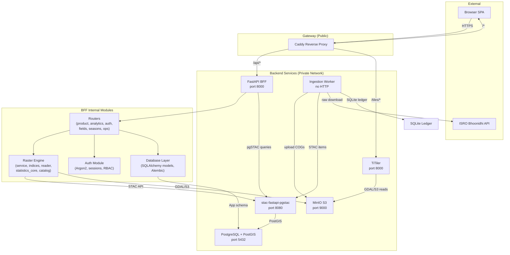
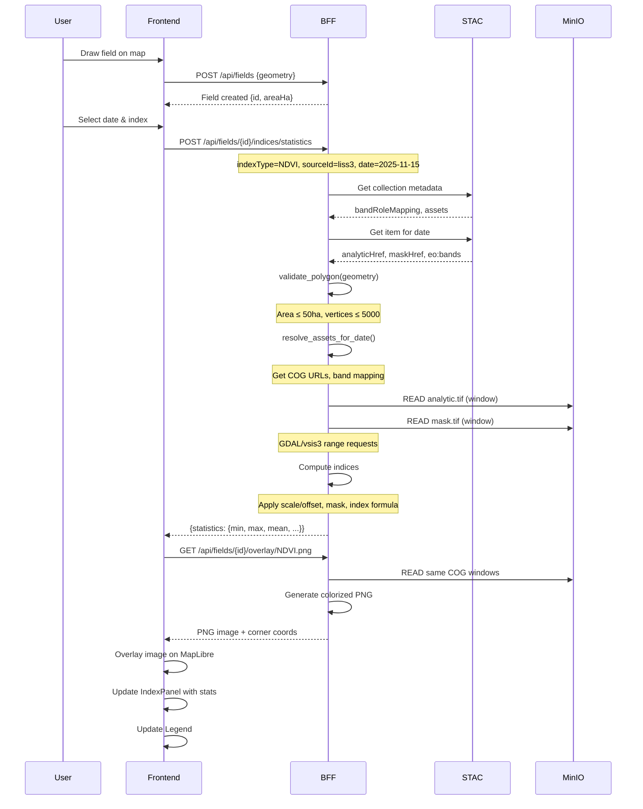
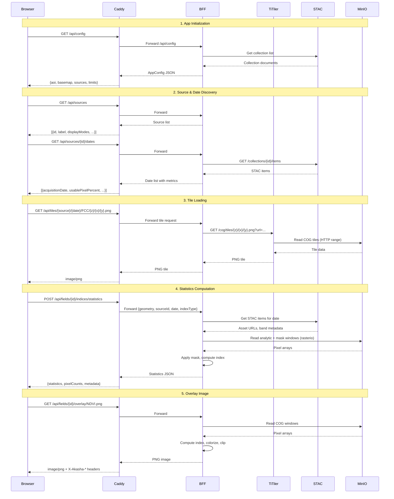

# Akasha Vegetation & Moisture Indices — Complete Technical Blueprint

> **Author:** Senior GIS / Remote Sensing Engineering Team  
> **Status:** Draft / Planning  
> **Version:** 1.0.0  
> **Target Application:** Akasha Farm Management Platform  
> **Reference Application:** [EOSDA Crop Monitoring](https://crop-monitoring.eos.com/)

---

## Table of Contents

1. [Codebase Architecture Analysis](#1-codebase-architecture-analysis)
2. [GIS & Remote Sensing Domain Primer](#2-gis--remote-sensing-domain-primer)
3. [Vegetation & Moisture Indices — Complete Reference](#3-vegetation--moisture-indices--complete-reference)
4. [EOS Crop Monitoring — Feature Analysis & Gap Assessment](#4-eos-crop-monitoring--feature-analysis--gap-assessment)
5. [Implementation Blueprint](#5-implementation-blueprint)
6. [Complete Processing Pipeline](#6-complete-processing-pipeline)
7. [Architecture Diagrams](#7-architecture-diagrams)
8. [Detailed Gap Analysis](#8-detailed-gap-analysis)
9. [Development Roadmap](#9-development-roadmap)
10. [Best Practices](#10-best-practices)

---

## 1. Codebase Architecture Analysis

### 1.1 Repository Overview

```
akasha-project/
├── apps/
│   ├── api/           # FastAPI BFF (Python 3.11)
│   └── frontend/      # React 18 + Vite + TypeScript SPA
├── services/
│   ├── ingestion/     # ResourceSat Bhoonidhi pipeline
│   ├── ingestion-sar/ # Legacy SAR pipeline
│   ├── titiler/       # rio-tiler tile server
│   ├── stac-api/      # pgSTAC catalog (stac-fastapi)
│   └── minio/         # S3-compatible object storage
├── infra/
│   ├── docker/        # Local Docker Compose
│   ├── gateway/       # Caddy reverse proxy
│   └── selfhosted/    # Coolify/Azure deployment
├── docs/              # Source-of-truth documentation
├── scripts/           # Validation & prep scripts
└── tests/             # Repo-root tests
```

### 1.2 Service Topology

```
Browser ─> web (Caddy + React SPA)
               │── /api/*    ──> api (FastAPI BFF)
               │── /tiles/*  ──> titiler (rio-tiler/GDAL)
               │── /*        ──> SPA static files

api ──> stac-api (pgSTAC) ──> postgis (PostgreSQL + PostGIS)
api ──> titiler ──> minio (S3 COG storage)
api ──> ingestion-worker's SQLite ledger

ingestion-worker ──> minio / stac-api / postgis / Bhoonidhi (ISRO)
```

**Key Rule:** Only `web` (Caddy) is publicly reachable. All internal services (`api`, `titiler`, `stac-api`, `postgis`, `minio`) are private on the Docker network.

### 1.3 Backend Architecture (`apps/api/app/`)

| Module | Purpose | Key Files |
|--------|---------|-----------|
| `raster/` | Index statistics engine | `service.py`, `indices.py`, `catalog_resolver.py`, `raster_reader.py`, `statistics_core.py`, `geo_validate.py` |
| `routers/` | API endpoints | `product_router.py`, `analytics_router.py`, `plot_router.py`, `auth_router.py`, `field_router.py`, etc. |
| Models | Database ORM | `models.py` (20+ tables in `akasha` schema) |
| Auth | Hand-rolled auth | `auth.py`, `auth_repo.py` (Argon2 + HMAC sessions) |
| Config | Environment config | `config.py` (Settings singleton) |

### 1.4 Frontend Architecture (`apps/frontend/src/`)

| Layer | Technology | Purpose |
|-------|-----------|---------|
| Map | MapLibre GL JS | Map rendering |
| Drawing | Terra Draw + MapLibre adapter | Field boundary drawing |
| State | React Context + useReducer | Map view state (MapViewProvider) |
| Server State | TanStack Query | API cache & mutations |
| Routing | react-router-dom | SPA routing |
| Styling | Tailwind CSS + shadcn/ui | UI components |

### 1.5 Current Raster Processing Pipeline

```
User draws polygon
       │
       ▼
POST /api/indices/statistics
       │
       ▼
service.compute_statistics()
       │
       ├── catalog_resolver.resolve_assets_for_date()  # Get STAC metadata
       ├── geo_validate.validate_polygon()              # Area/vertex checks
       ├── indices.get_index()                          # Get IndexDef
       ├── raster_reader.read_index_windows()           # Read analytic + mask COG windows
       └── statistics_core.compute_index_statistics()   # Pure numpy stats
```

### 1.6 Currently Supported Indices

| Index | Formula | LISS-3 Support | Sentinel-2 Support |
|-------|---------|----------------|-------------------|
| NDVI | `(NIR-RED)/(NIR+RED)` | ✅ | ✅ |
| MSAVI | `(2*NIR+1-sqrt((2*NIR+1)^2-8*(NIR-RED)))/2` | ✅ | ✅ |
| NDMI | `(NIR-SWIR1)/(NIR+SWIR1)` | ✅ | ✅ |
| NDWI_GREEN_NIR | `(GREEN-NIR)/(GREEN+NIR)` | ✅ | ✅ |
| NDRE | `(NIR-RED_EDGE)/(NIR+RED_EDGE)` | ❌ (no red-edge) | ✅ |

### 1.7 Missing from Current Implementation

| Area | Status | Details |
|------|--------|---------|
| NDVI/NDMI display tiles on map | Partial | BFF tile endpoints exist, need real COGs |
| Historical time-series UI | ❌ | Trends API exists, no frontend chart |
| Layer switching UI | ❌ | MapPage is placeholder |
| Statistics panel UI | ❌ | IndexPanel exists but is minimal |
| Legend display | Partial | Legend component exists with hardcoded gradients |
| Compare mode | ❌ | CompareControl component exists, not wired |
| Timeline/playback | ❌ | TimelineBar component exists, not wired |
| Historical archive (>5 years) | ❌ | No archive data source available |
| PlanetScope integration | ❌ | No commercial high-res source |
| EVI, ARVI, GCI, SAVI indices | ❌ | Not defined in registry |
| VRA maps (zoning) | ❌ | Not implemented |
| Scouting with field map | Partial | ScoutTask API exists, no map integration |
| Mobile app | ❌ | Web only |

---

## 2. GIS & Remote Sensing Domain Primer

### 2.1 Precision Agriculture

Precision agriculture (PA) is a farm management strategy that uses information technology (IT) and a wide array of items such as GPS guidance, control systems, sensors, robotics, drones, autonomous vehicles, variable rate technology, GPS-based soil sampling, and satellite imagery to optimize returns on inputs while preserving resources.

**Key principles:**
- **Right place, right time, right amount:** Apply inputs (water, fertilizer, pesticides) only where and when needed
- **Spatial variability management:** Fields are not uniform. Soil type, moisture, nutrient levels, pest pressure vary across even a single field
- **Temporal monitoring:** Crop conditions change daily. Satellite time-series captures this
- **Data-driven decisions:** Replace calendar-based or "feel" decisions with satellite-index-based decisions

**How Akasha fits in:**
- User draws field boundaries → satellite discovers images → indices computed → user sees which parts of field need attention → targeted intervention

### 2.2 Remote Sensing

Remote sensing is the science of obtaining information about objects or areas from a distance, typically from aircraft or satellites. In agriculture, it measures the electromagnetic radiation reflected or emitted from crops and soil.

**Key principles:**
- **Spectral signature:** Every material (green leaf, dry soil, water) reflects/absorbs different amounts of light at different wavelengths
- **Healthy vegetation:** Strongly absorbs visible red light (for photosynthesis) and strongly reflects near-infrared (NIR) light (cell structure scatters NIR)
- **Stressed vegetation:** Absorbs less red light, reflects less NIR → index values change
- **Clouds problem:** Optical satellites cannot see through clouds. Cloud masking is essential

**Sensors used by Akasha:**
- **ResourceSat-2A LISS-3:** ISRO satellite, 24m resolution, 4 bands (Green, Red, NIR, SWIR1), 5-day revisit
- **Sentinel-2 (legacy):** ESA satellite, 10m/20m resolution, 13 bands, 5-day revisit

### 2.3 GIS (Geographic Information Systems)

A GIS is a system that captures, stores, analyzes, and displays spatially referenced data. In Akasha's context:

- **Vector data:** Field boundaries (Polygon/MultiPolygon), points (scout locations), lines (boundaries)
- **Raster data:** Satellite imagery (GeoTIFFs), vegetation index maps
- **Spatial analysis:** Intersection of field polygons with raster pixels, zonal statistics

### 2.4 Satellite Imagery

Satellite imagery is photographs of Earth taken by orbiting satellites. Key characteristics:

- **Spatial resolution:** Pixel size on the ground (LISS-3 = 24m, Sentinel-2 = 10m, PlanetScope = 3m)
- **Temporal resolution:** How often the satellite revisits the same location (5 days for LISS-3)
- **Spectral resolution:** Number and width of spectral bands (LISS-3 = 4 bands, Sentinel-2 = 13 bands)
- **Radiometric resolution:** Bit depth (LISS-3 = 16-bit unsigned integer, values 0-65535)

### 2.5 Raster Data

Raster data represents geographic information as a grid of pixels (cells), each with a value. Satellite imagery is inherently raster data.

**Key properties:**
- **Pixel value:** Digital Number (DN) representing radiance measured by the sensor
- **NoData:** Pixels outside the sensor's field of view or with invalid measurements
- **CRS (Coordinate Reference System):** How the grid aligns with Earth's surface (e.g., EPSG:4326, EPSG:32643)
- **Transform:** Geo-transform matrix mapping pixel coordinates to CRS coordinates
- **Overviews:** Lower-resolution copies for fast zoomed-out display (pyramid structure)

### 2.6 Vector Data

Vector data represents geographic features as points, lines, and polygons with associated attributes.

**Key formats:**
- **GeoJSON:** Open standard JSON format for encoding geographic data structures
- **Shapefile:** Legacy Esri format (multiple files: .shp, .shx, .dbf, .prj)
- **WKT/WKB:** Well-Known Text/Binary for database storage (PostGIS uses this)

**In Akasha:**
- Fields stored as PostGIS GEOMETRY (Polygon/MultiPolygon, SRID 4326)
- Exported as GeoJSON FeatureCollection
- Frontend draws with MapLibre GL using GeoJSON sources

### 2.7 GeoJSON

```json
{
  "type": "Feature",
  "geometry": {
    "type": "Polygon",
    "coordinates": [[[lng, lat], [lng, lat], ...]]
  },
  "properties": {
    "name": "Field 1",
    "areaHa": 5.2
  }
}
```

- Coordinates in [longitude, latitude] order (EPSG:4326)
- Polygons: first and last coordinate must be the same (closed ring)
- MultiPolygon: array of polygon rings for disjoint/holey areas

### 2.8 GeoTIFF

A GeoTIFF is a TIFF file with embedded georeferencing information. It's the standard format for satellite imagery.

**Critical metadata in a GeoTIFF:**
- **CRS:** Coordinate Reference System (e.g., UTM zone 43N, EPSG:32643)
- **GeoTransform:** 6-element affine transform: (top-left-x, pixel-width, rotation, top-left-y, rotation, pixel-height)
- **NoData value:** Value representing no-data pixels
- **Band count:** Number of spectral bands (LISS-3 = 4 bands)
- **Data type:** uint8, uint16, float32, etc.

### 2.9 Cloud Optimized GeoTIFF (COG)

A COG is a regular GeoTIFF with a specific internal structure optimized for cloud/HTTP access:
- **Tiled storage:** Data stored in rectangular tiles (typically 256×256 or 512×512)
- **Internal overviews:** Lower-resolution versions stored internally (pyramid)
- **HTTP range requests:** Clients only download the tiles they need using range headers
- **GDAL compatibility:** Can be used with GDAL's `/vsis3/` or `/vsicurl/` virtual filesystems

**Why COGs matter:**
- No need to download full image — only request tiles visible on screen
- Enables server-side rendering (TiTiler uses COGs)
- Enables efficient window reads for statistics (rasterio reads only intersecting tiles)

### 2.10 Sentinel-2

**Satellite:** ESA's Sentinel-2A and Sentinel-2B  
**Resolution:** 10m (B02, B03, B04, B08), 20m (B05, B06, B07, B8A, B11, B12), 60m (B01, B09, B10)  
**Revisit:** 5 days at equator  
**Bands:** 13 spectral bands from 443nm to 2190nm  
**Archive:** 2015-present  
**License:** Free and open data (Copernicus)

| Band | Name | Center (nm) | Resolution | Use |
|------|------|-------------|------------|-----|
| B01 | Coastal aerosol | 443 | 60m | Aerosol correction |
| B02 | Blue | 490 | 10m | RGB, water bodies |
| B03 | Green | 560 | 10m | RGB, vegetation |
| B04 | Red | 665 | 10m | RGB, chlorophyll absorption |
| B05 | Vegetation Red Edge | 705 | 20m | Red-edge indices (NDRE, RECI) |
| B06 | Vegetation Red Edge | 740 | 20m | Red-edge indices |
| B07 | Vegetation Red Edge | 783 | 20m | Red-edge indices |
| B08 | NIR | 842 | 10m | NDVI, biomass |
| B8A | Narrow NIR | 865 | 20m | Red-edge indices |
| B09 | Water vapour | 945 | 60m | Atmospheric correction |
| B10 | SWIR - Cirrus | 1375 | 60m | Cirrus detection |
| B11 | SWIR1 | 1610 | 20m | Moisture (NDMI) |
| B12 | SWIR2 | 2190 | 20m | Moisture, geology |

### 2.11 Spectral Bands

**What is a spectral band?** A spectral band is a specific range of wavelengths that a satellite sensor measures. Each band captures how much light is reflected from the Earth's surface in that wavelength range.

**Key bands for vegetation monitoring:**

| Band | Wavelength | What it detects |
|------|-----------|----------------|
| Blue (B02) | 450-520nm | Water bodies, atmospheric scattering |
| Green (B03) | 520-600nm | Peak vegetation reflectance ("greenness") |
| Red (B04) | 630-690nm | Chlorophyll absorption (inverse of vegetation health) |
| Red Edge (B05-B07) | 700-780nm | Sharp transition between red absorption and NIR reflection — sensitive to chlorophyll content, stress |
| NIR (B08) | 760-900nm | Cell structure scattering — directly correlates with biomass |
| SWIR1 (B11) | 1550-1750nm | Water content in leaves and soil |
| SWIR2 (B12) | 2100-2300nm | Mineralogy, soil moisture |

### 2.12 NIR (Near-Infrared)

**Critical for vegetation indices.** Live, healthy vegetation reflects ~40-50% of NIR light while absorbing ~80-90% of red light. This stark contrast is what makes vegetation indices work.

**Why NIR works:** Mesophyll cell structure in healthy leaves scatters NIR radiation. When plants are stressed (drought, disease, nutrient deficiency), the cell structure degrades and NIR reflection drops.

### 2.13 Red Edge

The red edge is the region of rapid change in reflectance between red (chlorophyll absorption) and NIR (cell scattering), approximately 680-750nm.

**Why it matters:** Red-edge bands (Sentinel-2 B05, B06, B07) penetrate deeper into the canopy and are sensitive to:
- Chlorophyll content (nitrogen status)
- Early stress detection (before visible symptoms)
- Late-season senescence monitoring
- Indices (NDRE, RECI) saturate later than NDVI in dense canopies

**ResourceSat LISS-3 limitation:** No red-edge band, so NDRE and RECI are unavailable.

### 2.14 SWIR (Short-Wave Infrared)

SWIR bands (1550-1750nm and 2100-2300nm) are sensitive to water content in vegetation and soil.

**Why it matters for moisture monitoring:**
- Water absorbs SWIR radiation strongly
- Dry leaves/soil reflect more SWIR than wet leaves/soil
- NIR/SWIR ratios (NDMI) directly measure canopy water content
- NDMI is the primary drought/stress indicator

### 2.15 Cloud Masking

Cloud masking is the process of identifying and removing pixels covered by clouds, cloud shadows, and other atmospheric obstructions from satellite imagery.

**Why critical:** Even a few pixels of cloud contamination can completely distort vegetation index statistics.

**Masking approaches:**

| Approach | Source | Classes | Implementation |
|----------|--------|---------|---------------|
| SCL (Scene Classification Layer) | Sentinel-2 L2A | 0-11 (0=nodata, 1=saturated, 2=dark, 3=shadow, 4-6=vegetation, 7-9=clouds, 10=cirrus, 11=snow) | Built into ESA L2A product |
| Fmask | General | Cloud, shadow, snow, water | Algorithm-based |
| Akasha Threshold Mask v1 | ResourceSat LISS-3 | 0=nodata, 1=valid, 2=cloud, 3=shadow, 4=water | Provisional threshold-based |

**Current Akasha masking rules:**
- Default excluded classes: `{0}` (nodata)
- Optional: clouds `{7,8,9}` (Sentinel) or `{2}` (ResourceSat), shadows `{3}`, cirrus `{10}`
- ResourceSat always excludes class 0 (nodata), can toggle classes 2 (cloud) and 3 (shadow)

### 2.16 Tile Generation

Tile generation creates a pyramid of image tiles (256×256 or 512×512 pixels) from a source raster at multiple zoom levels.

**How it works:**
1. Source COG has internal overviews at levels 0, 2, 4, 8, 16 (each 1/4 the size of previous)
2. At a given zoom level Z, the server:
   - Determines which tile covers the requested `(z, x, y)`
   - Resamples from nearest overview level
   - Applies any requested band math/color mapping
   - Returns a PNG/JPEG image

**In Akasha:**
- TiTiler handles tile serving from COGs in MinIO
- BFF proxies tile requests or renders directly for display modes (FCC, indices)
- Tile URL pattern: `/api/tiles/{sourceId}/{date}/{displayMode}/{z}/{x}/{y}.png`

### 2.17 Color Maps (Color Ramps)

Color maps assign colors to index values for visual interpretation. Critical for making index data readable.

| Index | Standard Colormap | Color Progression | Meaning |
|-------|-------------------|-------------------|---------|
| NDVI | RdYlGn (Red-Yellow-Green) | Red → Yellow → Green | Bare soil → Sparse → Dense vegetation |
| NDMI | RdBu (Red-Blue) | Red → White → Blue | Dry → Moderate → Wet |
| NDRE | RdYlGn | Red → Yellow → Green | Low → Moderate → High chlorophyll |
| MSAVI | RdYlGn | Red → Yellow → Green | Bare soil → Sparse → Dense vegetation |

### 2.18 Raster Rendering

The process of converting raw raster pixel values into a displayable image:

1. **Read:** Extract pixel window from COG (with overview level selection)
2. **Rescale:** Map raw pixel values to display range (e.g., NDVI -0.2 to 0.9 → 0-255)
3. **Colorize:** Apply colormap to rescaled values
4. **Render:** Return as PNG with transparency for nodata

**In TiTiler/BFF:**
- For true-color/FCC: read bands, apply scale/offset, combine RGB, return PNG
- For indices: read bands, apply scale/offset, compute index expression, colorize, return PNG

---

## 3. Vegetation & Moisture Indices — Complete Reference

### 3.1 NDVI (Normalized Difference Vegetation Index)

#### Scientific Purpose
Measures the amount of photosynthetically active vegetation. NDVI is the most widely used vegetation index globally.

#### Formula
```
NDVI = (NIR - Red) / (NIR + Red)
```

#### For Akasha Sources
**ResourceSat LISS-3:** `(BAND4 - BAND3) / (BAND4 + BAND3)`  
**Sentinel-2:** `(B08 - B04) / (B08 + B04)`  
**Range:** -1.0 to 1.0 (typical vegetation: 0.2 to 0.9)

#### Mathematical Explanation
- Healthy vegetation: high NIR reflectance (cell structure), low red reflectance (chlorophyll absorption) → NDVI ~ 0.6-0.9
- Sparse vegetation: moderate NIR, moderate red → NDVI ~ 0.2-0.5
- Bare soil: NIR ≈ Red → NDVI ~ 0.0-0.1
- Water: NIR < Red → NDVI negative
- The division by sum normalizes for illumination differences, sun angle, and atmospheric effects

#### Interpretation of Values

| NDVI Range | Interpretation | Crop Stage |
|------------|---------------|------------|
| < 0.0 | Water, snow, clouds, artificial surfaces | N/A |
| 0.0 - 0.2 | Bare soil, fallow fields, residue | Pre-sowing, post-harvest |
| 0.2 - 0.4 | Sparse/sporadic vegetation | Early emergence, senescence |
| 0.4 - 0.6 | Moderate vegetation | Vegetative growth |
| 0.6 - 0.8 | Dense, healthy vegetation | Peak canopy, flowering |
| 0.8 - 1.0 | Very dense, lush vegetation | Peak biomass |

#### Agricultural Use Cases
- Crop health assessment
- Biomass estimation
- Yield prediction (as input)
- Nutrient stress detection
- Water stress detection (delayed — sees stress after visible wilting)
- Phenology tracking (green-up, peak, senescence dates)
- Damage assessment (hail, flood, pest)
- Field variability mapping for VRA

#### Advantages
- Simplicity: single formula, widely understood
- Normalized: compensates for sun angle, topography (partially)
- Long historical record (NOAA AVHRR since 1981)
- Works across satellite sensors

#### Limitations
- Saturates in dense vegetation (canopy closes, NIR stops increasing)
- Affected by soil background in sparse vegetation
- Not sensitive to early water stress (stomatal closure affects thermal before NDVI)
- Clouds and atmospheric aerosols reduce values
- Topographic effects in mountainous areas

#### Suitable Crop Stages
- All stages, but best during vegetative growth before full canopy closure
- Not ideal for late-season analysis (saturation)

#### Color Visualization
- **Colormap:** RdYlGn (Red-Yellow-Green)
- **Rescale:** -0.2 to 0.9 (values outside clamped to endpoints)
- Red: bare soil / stressed
- Yellow: transitional
- Green: healthy

#### Statistics Generation
```python
ndvi = (nir - red) / (nir + red)
# Exclude: nodata, cloudy, shadowed pixels
# Metrics: min, max, mean, stddev, median, p10, p25, p75, p90
# Pixel counts: total, nodata, coverage, masked, valid
```

#### Common Mistakes
- Not cloud masking (clouds cause false low NDVI)
- Applying to water bodies without masking (false negative values)
- Using single-date comparisons (NDVI varies with phenology, not just health)
- Ignoring soil background effects in early-season (<20% cover)
- Comparing across sensors without calibration

#### Performance Considerations
- 2 band reads (NIR + Red) per pixel window
- Fastest index to compute (simple arithmetic)
- No edge cases for denominator (NIR + Red > 0 for all vegetated surfaces)

---

### 3.2 NDRE (Normalized Difference Red Edge)

#### Scientific Purpose
Measures chlorophyll content using the red-edge band, which penetrates deeper into canopy and saturates later than NDVI.

#### Formula
```
NDRE = (NIR - Red Edge) / (NIR + Red Edge)
```

#### For Akasha Sources
**ResourceSat LISS-3:** ❌ NOT AVAILABLE (no red-edge band)  
**Sentinel-2:** `(B08 - B05) / (B08 + B05)` or `(B08A - B06) / (B08A + B06)`  
**Range:** -1.0 to 1.0 (typical: 0.1 to 0.7)

#### Mathematical Explanation
- Red-edge reflectance is between red (strong absorption) and NIR (strong scattering)
- Sensitive to chlorophyll content rather than green biomass
- Higher chlorophyll → more red-edge absorption → lower red-edge reflectance → higher NDRE
- Less affected by saturation than NDVI because red-edge doesn't absorb as strongly as red

#### Interpretation of Values

| NDRE Range | Interpretation | Crop Stage |
|------------|---------------|------------|
| < 0.0 | Non-vegetated | N/A |
| 0.0 - 0.15 | Low chlorophyll (stressed/senescing) | Late senescence, severe stress |
| 0.15 - 0.30 | Moderate chlorophyll | Early vegetative, mild stress |
| 0.30 - 0.50 | High chlorophyll | Active vegetative, flowering |
| 0.50 - 0.70 | Very high chlorophyll | Peak canopy, healthy |

#### Agricultural Use Cases
- Nitrogen status assessment (chlorophyll directly correlates with N)
- Mid-season and late-season fertilization decisions
- Crop stress detection (before NDVI shows changes)
- Senescence monitoring for harvest timing
- Distinguishing crop varieties

#### Advantages
- Does not saturate as quickly as NDVI in dense canopies
- More sensitive to chlorophyll content than NDVI
- Better for mid-to-late season assessments
- Less affected by soil background than NDVI

#### Limitations
- Requires red-edge band (LISS-3 doesn't have one)
- Narrower dynamic range than NDVI
- Less historical data (Sentinel-2 only from 2015)
- More atmospheric sensitivity than NDVI

#### Suitable Crop Stages
- Mid-to-late growing season (after canopy closure)
- Late-season nitrogen management
- Senescence detection

#### Color Visualization
- **Colormap:** RdYlGn
- **Rescale:** -0.2 to 0.9

---

### 3.3 RECI (Red Edge Chlorophyll Index)

#### Scientific Purpose
Quantifies chlorophyll content using the ratio of NIR to red edge reflectance. More linear response to chlorophyll than NDRE.

#### Formula
```
RECI = (NIR / Red Edge) - 1
```
Or equivalently: `RECI = (NIR - Red Edge) / Red Edge`

#### For Akasha Sources
**ResourceSat LISS-3:** ❌ NOT AVAILABLE  
**Sentinel-2:** `(B08 / B05) - 1` or `(B08A / B06) - 1`  
**Range:** 0 to ~20+ (typical vegetation: 2-15)

#### Mathematical Explanation
- Based on the same principle as NDRE but uses a simple ratio
- More sensitive at high chlorophyll levels
- Not normalized (no denominator sum), so values can exceed 1.0
- Less affected by saturation than both NDVI and NDRE

#### Agricultural Use Cases
- High-precision nitrogen management
- Chlorophyll content estimation
- Stress detection in high-biomass crops
- Yield potential assessment

#### Advantages
- Linear relationship with chlorophyll content
- No saturation at high chlorophyll levels
- Sensitive to subtle stress variations

#### Limitations
- Not normalized (affected by illumination/view angle)
- Requires red-edge band
- Less intuitive scale than NDVI
- Higher sensitivity to atmospheric effects

---

### 3.4 MSAVI (Modified Soil Adjusted Vegetation Index)

#### Scientific Purpose
Minimizes soil background influence on vegetation index values, particularly important in early-season/sparse vegetation.

#### Formula
```
MSAVI = (2 * NIR + 1 - sqrt((2 * NIR + 1)^2 - 8 * (NIR - Red))) / 2
```

#### For Akasha Sources
**ResourceSat LISS-3:** `(2*BAND4 + 1 - sqrt((2*BAND4 + 1)^2 - 8*(BAND4 - BAND3))) / 2`  
**Sentinel-2:** `(2*B08 + 1 - sqrt((2*B08 + 1)^2 - 8*(B08 + B04))) / 2`  
**Range:** 0.0 to 1.0 (typical: 0.0 to 0.9)

#### Mathematical Explanation
- MSAVI is a modification of SAVI that doesn't require a predefined soil adjustment factor
- The L parameter (soil adjustment) is dynamically calculated: `L = 1 - (2 * s * NDVI * WDVI)`
- The formula self-adjusts to minimize soil noise
- At low vegetation densities, MSAVI is more reliable than NDVI
- At high densities, MSAVI ≈ NDVI

#### Interpretation of Values

| MSAVI Range | Interpretation |
|-------------|---------------|
| 0.0 - 0.1 | Bare soil |
| 0.1 - 0.3 | Sparse vegetation (<30% cover) |
| 0.3 - 0.6 | Moderate vegetation (30-70% cover) |
| 0.6 - 0.9 | Dense vegetation (>70% cover) |

#### Agricultural Use Cases
- Early-season vegetation mapping (when soil is visible)
- Arid/semi-arid region monitoring
- Variable soil type areas
- Precision agriculture in fields with heterogeneous soils

#### Advantages
- Best for early crop stages (sparse cover)
- Self-adjusting soil correction factor
- Better than NDVI for low-cover conditions

#### Limitations
- Computationally more expensive (sqrt operation)
- Less intuitive than NDVI
- Slightly less sensitive at high vegetation densities
- Requires reflectance correction first

#### Suitable Crop Stages
- Early emergence and vegetative stages
- Fields with bare soil patches
- Arid/semi-arid agriculture

#### Color Visualization
- **Colormap:** RdYlGn
- **Rescale:** 0.0 to 1.0

---

### 3.5 NDMI (Normalized Difference Moisture Index)

#### Scientific Purpose
Measures water content in vegetation canopy. Primary drought and irrigation monitoring index.

#### Formula
```
NDMI = (NIR - SWIR1) / (NIR + SWIR1)
```

#### For Akasha Sources
**ResourceSat LISS-3:** `(BAND4 - BAND5) / (BAND4 + BAND5)`  
**Sentinel-2:** `(B08 - B11) / (B08 + B11)`  
**Range:** -1.0 to 1.0 (typical vegetation: -0.3 to 0.6)

#### Mathematical Explanation
- SWIR1 (1550-1750nm) is in a water absorption region
- Water in leaves absorbs SWIR; the more water, the lower the SWIR reflectance
- NIR is not affected by water content (scattered by cell structure)
- NDMI decreases when plants are water-stressed
- NDMI is also called NDWI (Normalized Difference Water Index) by some sources

#### Interpretation of Values

| NDMI Range | Moisture Status | Interpretation |
|------------|----------------|---------------|
| < 0.0 | Very dry | Dry soil, residue, water stress |
| 0.0 - 0.2 | Low moisture | Moderate stress, dry-down |
| 0.2 - 0.4 | Moderate moisture | Adequate irrigation |
| 0.4 - 0.6 | High moisture | Well-watered, good canopy |
| > 0.6 | Very high moisture | Saturated, possible flooding |

#### Agricultural Use Cases
- Drought detection and monitoring
- Irrigation scheduling
- Water stress assessment (detects stress before NDVI)
- Flood mapping
- Fire risk assessment
- Canopy water content estimation

#### Advantages
- Detects water stress BEFORE NDVI shows changes (stomatal closure → leaf water content drops before chlorophyll changes)
- Directly measures water content (not indirect like NDVI)
- Useful for irrigation management decisions

#### Limitations
- Affected by soil moisture (shallow roots may show false stress)
- SWIR resolution coarser than NIR (20m for Sentinel-2 vs 10m)
- Less sensitive in senesced/dry vegetation
- Atmospheric water vapor affects SWIR

#### Suitable Crop Stages
- All stages, especially during reproductive phase (water-critical)
- Pre-drought detection
- Irrigation management throughout season

#### Color Visualization
- **Colormap:** RdBu (Red-Blue)
- **Rescale:** -0.5 to 0.6
- Red: dry / stressed
- White: moderate
- Blue: wet / healthy

#### Comparison: NDMI vs NDWI

| Name | Formula | Bands | Purpose |
|------|---------|-------|---------|
| **NDMI** (Akasha) | `(NIR - SWIR1) / (NIR + SWIR1)` | NIR, SWIR1 | Canopy moisture |
| **NDWI** (Gao) | `(NIR - SWIR2) / (NIR + SWIR2)` | NIR, SWIR2 | Plant water content |
| **NDWI** (McFeeters) | `(Green - NIR) / (Green + NIR)` | Green, NIR | Water body detection |
| **NDWI_GREEN_NIR** (Akasha) | `(Green - NIR) / (Green + NIR)` | Green, NIR | Water body/surface moisture |

---

### 3.6 Additional Indices to Consider for Future Implementation

#### EVI (Enhanced Vegetation Index)
```
EVI = 2.5 * ((NIR - Red) / (NIR + 6 * Red - 7.5 * Blue + 1))
```
**Purpose:** Corrects for atmospheric aerosols and soil background. Better than NDVI in high-biomass regions.  
**Limitation:** Requires blue band (most sensors have it).  
**Akasha LISS-3:** ❌ No blue band.

#### SAVI (Soil Adjusted Vegetation Index)
```
SAVI = ((NIR - Red) / (NIR + Red + L)) * (1 + L)
```
Where L = 0.5 (standard soil adjustment factor).  
**Purpose:** Similar to MSAVI but uses a fixed soil adjustment factor.  
**Akasha LISS-3:** ✅ Could be implemented.

#### ARVI (Atmospherically Resistant Vegetation Index)
```
ARVI = (NIR - (Red - Blue * (Red - Blue))) / (NIR + (Red - Blue * (Red - Blue)))
```
**Purpose:** Reduces atmospheric sensitivity.  
**Limitation:** Needs blue band.

#### GCI (Green Chlorophyll Index)
```
GCI = (NIR / Green) - 1
```
**Purpose:** Chlorophyll estimation.  
**Akasha LISS-3:** ✅ Could be implemented with Green and NIR.

#### NDWI_GREEN_NIR (McFeeters NDWI for water)
```
NDWI_GREEN_NIR = (Green - NIR) / (Green + NIR)
```
**Purpose:** Water body detection, surface moisture.  
**Akasha LISS-3:** ✅ Already implemented.

---

## 4. EOS Crop Monitoring — Feature Analysis & Gap Assessment

### 4.1 EOSDA Crop Monitoring Overview

EOSDA Crop Monitoring is a commercial precision agriculture platform with the following key capabilities:

**Imagery Sources:**
- Sentinel-2 (10m, 5-day revisit) — primary source
- PlanetScope (3m, daily) — premium add-on
- Landsat 8/9 (30m, 8-day) — archive/historical
- Multiple other sources available through API

**Vegetation Indices (15+):**
- Basic: NDVI, NDRE, MSAVI, RECI, NDMI
- Advanced (add-on): EVI, ARVI, GCI, GNDVI, PSRI, RENDVI, SIPI
- Custom indices via formula builder
- Vegetation Meta Index (composite RGB of 3 indices)

**Map Features:**
- True-color (RGB) satellite imagery
- False-color (NIR) composite
- All vegetation index maps as overlay layers
- Layer switching with opacity control
- Split View (side-by-side comparison)
- Compare mode (two dates using slider)
- Cloud/shadow/cirrus mask layer display and toggling
- Legend with gradient and value range
- Latest Image layer (most recent cloud-free)

**Field Analytics:**
- Per-field statistics (mean, min, max, stddev)
- Time-series chart with date range selection
- Field ranking/leaderboard
- Scouting integration (pin issues on map)
- Zoning/VRA maps (vegetation, productivity, multilayer)
- Field activity log
- Report generation (weekly, custom)

**Weather:**
- Historical weather data
- Forecast (7/14 day)
- Growing Degree Days (GDD)
- Precipitation, temperature, humidity
- Weather stations integration (Davis)

**Risk Assessment:**
- Index Risk (based on vegetation index deviation)
- Disease Risk (based on weather + crop model)
- Pest Risk
- Weather Risk (frost, drought, hail)

**Other Features:**
- Weekly Reports (automated email summaries)
- Notifications (alerts for index drops, weather events)
- Mobile app (iOS/Android)
- Team collaboration
- Crop variety database (20+ crops)
- Soil erosion layer
- Elevation/Slope maps

### 4.2 Feature Comparison Matrix

| Feature | EOS Crop Monitoring | Akasha | Gap |
|---------|-------------------|--------|-----|
| **Imagery** | | | |
| Sentinel-2 L2A | ✅ Primary | ✅ Legacy | N/A |
| ResourceSat LISS-3 | ❌ | ✅ Production | Akasha unique for India |
| PlanetScope (3m) | ✅ Premium add-on | ❌ | **High** |
| Landsat archive | ✅ | ❌ | **Medium** |
| Multiple sources combo | ✅ | ❌ (one at a time) | **Medium** |
| **Indices** | | | |
| NDVI | ✅ | ✅ | N/A |
| NDRE | ✅ | ❌ (no red-edge on LISS-3) | **Medium** (for Sentinel) |
| RECI | ✅ | ❌ | **Medium** (for Sentinel) |
| MSAVI | ✅ | ✅ | N/A |
| NDMI | ✅ | ✅ | N/A |
| EVI | ✅ Add-on | ❌ | **Low** |
| ARVI | ✅ Add-on | ❌ | **Low** |
| GCI | ✅ Add-on | ❌ | **Low** |
| SAVI | ❌ | ❌ | **Low** |
| Custom formula | ✅ | ❌ | **Low** |
| Vegetation Meta Index | ✅ | ❌ | **Low** |
| **Map Layers** | | | |
| RGB imagery | ✅ | ✅ (legacy Sentinel) | **Medium** |
| FCC false-color | ✅ | ✅ (via TiTiler) | N/A |
| Index overlay maps | ✅ | ✅ (BFF renders PNG overlay) | N/A |
| Layer opacity control | ✅ | ✅ (OpacitySlider) | N/A |
| Layer visibility toggle | ✅ | ✅ (VisibilityToggle) | N/A |
| NDVI display tiles | ✅ | Partial (needs COGs) | **High** |
| Cloud mask layer | ✅ | ❌ | **High** |
| Legend with gradient | ✅ | ✅ (Legend component) | **Medium** (dynamic) |
| Split View / Compare | ✅ | Partial (CompareControl) | **High** |
| Latest Image layer | ✅ | ❌ | **Medium** |
| Elevation/Slope | ✅ | ❌ | **Low** |
| **Field Analytics** | | | |
| Per-field statistics | ✅ | ✅ | N/A |
| Time-series chart | ✅ | Partial (FieldTrendChart) | **High** |
| Field ranking | ✅ | ✅ (FieldLeaderboard) | N/A |
| Field grouping | ✅ | ✅ (FieldGroups) | N/A |
| Scouting integration | ✅ | Partial (ScoutTasks API) | **Medium** |
| VRA maps (Zoning) | ✅ | ❌ | **Medium** |
| Report generation | ✅ | Partial (ReportTemplate API) | **Medium** |
| **Weather** | | | |
| Historical weather | ✅ | ❌ | **Medium** |
| Weather forecast | ✅ | ❌ | **Medium** |
| GDD tracking | ✅ | ❌ | **Low** |
| Weather stations | ✅ (Davis) | ❌ | **Low** |
| **Risk** | | | |
| Index Risk | ✅ | Partial | **Medium** |
| Disease Risk | ✅ | ❌ | **Medium** |
| Weather Risk | ✅ | ❌ | **Medium** |
| **User Experience** | | | |
| Mobile app | ✅ | ❌ | **Medium** |
| Weekly reports | ✅ | ❌ | **Medium** |
| Notifications | ✅ | ✅ | N/A |
| Team collaboration | ✅ | ✅ | N/A |
| Crop variety DB | ✅ | ❌ | **Low** |
| Custom alerts | ✅ | ❌ | **Low** |

### 4.3 Deep Feature Analysis

#### 4.3.1 Layer Management (EOS vs Akasha)

**EOS Approach:**
- Single map interface with layer panel on left
- Base layer: choose between satellite RGB, FCC, or index map
- Overlay: clouds mask layer toggle
- Opacity slider for current layer
- Compare mode: two dates with slide divider or A/B opacity blend
- Split View: two maps side by side with synchronized navigation

**Akasha Current:**
- MapPage renders map but is largely placeholder
- LayerControlBar, LayerPanel, LayersSurface components exist
- DisplayModeToggle component works
- Layer management state in MapViewProvider (useReducer)
- CompareControl component exists for A/B blend
- Legend component has 19 hardcoded index gradients

**Akasha Gaps:**
- Layer panel not fully wired to map
- Split View not implemented
- Cloud mask layer overlay not rendered
- Compare mode not functionally active
- Legend gradients cached, not dynamic from API

#### 4.3.2 Statistics Panel (EOS vs Akasha)

**EOS Approach:**
- Right panel when field is selected
- Current index value display (mean with trend arrow)
- Min/Max/StdDev in compact display
- Histogram of pixel value distribution
- Time-series chart (line chart across available dates)
- Date range selector for chart
- Data download (CSV, GeoJSON, shapefile, image)

**Akasha Current:**
- IndexPanel component exists with trend chart and statistics tabs
- FieldTrendChart (pure SVG line chart) exists
- FieldTrendPoint schema defined in api_models.py
- Field analytics API endpoints exist: statistics, trend, overlay, point
- DownloadMenu component exists with export options

**Akasha Gaps:**
- Statistics not displayed on map page (missing data wiring)
- No pixel histogram
- No trend arrow indicator (up/down from previous)
- Export formats limited (CSV, GeoJSON — no shapefile, no image)
- No comparison with baselines (field average, regional average)

#### 4.3.3 Timeline/Date Selection (EOS vs Akasha)

**EOS Approach:**
- Bottom filmstrip with date thumbnails
- Each thumbnail shows cloud cover badge
- Calendar range picker for filtering dates
- "Latest" auto-selects most recent usable scene
- Playback button to animate through dates
- Per-date cloud cover indicator

**Akasha Current:**
- TimelineBar component exists (bottom filmstrip)
- DateChip component with usability dot
- CalendarRangePicker component exists
- PlaybackControls component exists
- CloudUsabilityChip component exists
- selectDefaultDate utility function

**Akasha Gaps:**
- Timeline not wired to map data
- Date thumbnails not showing
- Playback not functional
- Calendar range picker not wired to API

#### 4.3.4 Scouting Integration (EOS vs Akasha)

**EOS Approach:**
- Scouting points on map (color-coded by status)
- Photo attachments linked to scouting points
- Scouting report with findings
- Integrates with field activity log
- Mobile app for field data collection

**Akasha Current:**
- ScoutTask API fully defined (CRUD + status/priority/assignee)
- ScoutTasksPage for list management
- FieldActivity API for operation log
- Attachment API for file uploads
- No map-based scouting UI

**Akasha Gaps:**
- No scouting pins on map
- No mobile app for field collection
- No offline scouting capability
- No photo capture integrated

---

## 5. Implementation Blueprint

### 5.1 Backend Architecture

#### 5.1.1 Current Architecture

```
product_router.py (ticks.py /api/sources, /api/dates, /api/layers, /api/tiles, /api/indices/statistics)
       │
       ▼
catalog_resolver.py (STAC API + seed fallback + source registry)
       │
       ▼
raster_reader.py (rasterio dual-COG window reader)
       │
       ▼
statistics_core.py (pure numpy index math)
       │
       ▼
indices.py (index definitions, band mapping)
```

#### 5.1.2 Enhanced Architecture

```
api gateway (Caddy)
    │
    ├── /api/*  ──> FastAPI BFF
    │                │
    │                ├── product_router.py     (config, sources, dates, layers, tiles)
    │                ├── analytics_router.py    (field stats, trends, overlays, point query)
    │                ├── plot_router.py         (plot CRUD, import/export)
    │                ├── auth_router.py         (auth endpoints)
    │                ├── field_router.py        (field CRUD)
    │                ├── season_router.py       (season CRUD)
    │                ├── operation_router.py    (activity log)
    │                ├── scout_task_router.py   (scouting)
    │                ├── report_router.py       (reports + leaderboard)
    │                ├── risk_router.py         (risk assessment)
    │                ├── source_monitoring.py   (operator dashboard)
    │                └── NEW: compare_router.py (compare mode endpoints)
    │
    └── /tiles/* ──> TiTiler (rio-tiler)
                        │
                        ├── /cog/tiles/{...}           (analytic RGB/FCC)
                        └── /cog/colormap/{...}        (index colormap tiles)

BFF Raster Engine (internal):
    raster/
    ├── service.py            (orchestrator)
    ├── indices.py            (index definitions)
    ├── catalog_resolver.py   (STAC resolver)
    ├── raster_reader.py      (COG reader)
    ├── statistics_core.py    (numpy math)
    ├── geo_validate.py       (geometry validation)
    ├── NEW: overlay_renderer.py     (PNG overlay generation)
    ├── NEW: time_series_engine.py   (multi-date async statistics)
    └── NEW: zonal_stats_cache.py    (redis-based statistics cache)
```

### 5.2 New Backend Components

#### 5.2.1 Index Overlay Renderer (`raster/overlay_renderer.py`)

**Purpose:** Generate georeferenced PNG/WMTS layers for index overlay on the map.

**Functionality:**
- Read analytic + mask COG for given field geometry
- Apply reflectance correction
- Compute requested index
- Colorize using configurable colormap
- Apply clipping mask (only show values inside field boundary)
- Return georeferenced image with corner coordinates
- Support for transparency (nodata/outside field = transparent)

**Already partially exists** in `analytics_router.py:_index_overlay_response()` — needs to be refactored into a reusable service.

#### 5.2.2 Time Series Engine (`raster/time_series_engine.py`)

**Purpose:** Efficiently compute multi-date statistics for trend analysis.

**Current Limitation:** The `get_field_analytics_trend` endpoint iterates through dates sequentially, computing statistics one by one. This is slow for large date ranges.

**Enhanced Approach:**
- Parallel date processing with asyncio + thread pool (rasterio is blocking)
- Batch resolution of COG metadata from STAC
- Smart caching of per-field, per-date results in Redis
- Incremental computation (only compute new dates)
- Paginated response for large date ranges

#### 5.2.3 Statistics Cache (`raster/zonal_stats_cache.py`)

**Purpose:** Cache computed statistics to avoid re-computation.

**Cache key:** `stats:{source_id}:{field_id}:{index_type}:{date}:{mask_classes_hash}`  
**Cache value:** Computed IndexStatistics as JSON  
**TTL:** Configurable (default 24 hours)  
**Backend:** Redis (optional, falls back to in-memory LRU)

**Strategy:**
- Check cache before computation
- Store statistics after computation
- Invalidate on field geometry change
- Invalidate on new imagery date

#### 5.2.4 Compare Mode API (`routers/compare_router.py`)

**Purpose:** Support side-by-side and swipe comparison of two dates/layers.

**Endpoints:**
- `GET /api/fields/{field_id}/compare/{date_a}/{date_b}/{index_type}` — Returns both date's statistics
- `GET /api/tiles/compare/{source}/{date_a}/{date_b}/{mode}/{z}/{x}/{y}.png` — Composite tile for swipe
- `POST /api/fields/{field_id}/compare/delta` — Index change map (difference between two dates)

### 5.3 New API Endpoints

| Method | Path | Purpose | Priority |
|--------|------|---------|----------|
| `GET` | `/api/sources/{source_id}/dates/range` | Date range query with pagination | Medium |
| `GET` | `/api/fields/{field_id}/layers` | Available layer configs for a field | High |
| `GET` | `/api/fields/{field_id}/layers/{layer_type}/tilejson.json` | TileJSON for layer overlay | High |
| `GET` | `/api/indices/{index_type}/legend` | Dynamic legend (colormap + scale) | High |
| `POST` | `/api/fields/{field_id}/statistics/batch` | Batch compute multiple indices | Medium |
| `GET` | `/api/fields/{field_id}/analytics/histogram` | Pixel value histogram | Medium |
| `GET` | `/api/fields/{field_id}/compare/{date_a}/{date_b}/delta` | Change detection map | Medium |
| `GET` | `/api/fields/{field_id}/profile/transect` | Cross-section profile along a line | Low |
| `POST` | `/api/indices/statistics/batch` | Multi-polygon statistics in one call | Low |

### 5.4 Frontend Architecture

#### 5.4.1 Enhanced Map Page

```
MapPage
├── TopBar (field name + actions)
├── MapLayerManager
│   ├── BasemapLayer (Esri/tiles)
│   ├── SatelliteLayer_A (current date)
│   ├── SatelliteLayer_B (compare date, optional)
│   ├── FieldBoundaryLayer (plot geometry)
│   ├── IndexOverlayLayer (clipped PNG overlay)
│   └── CloudMaskOverlayLayer (optional)
├── MapControls
│   ├── ZoomIn/Out
│   ├── Compass (bearing reset)
│   ├── Fullscreen
│   ├── LocateField
│   ├── LegendToggle
│   └── CompareToggle
├── Legend (dynamic from API)
├── LayerControlPanel
│   ├── SourceSelector
│   ├── DisplayModeToggle (RGB, FCC, NDVI, NDMI, etc.)
│   ├── DateSelector (timeline + calendar)
│   ├── OpacitySlider
│   ├── CloudMaskControl (clouds/shadow/cirrus toggles)
│   └── CompareToggle
├── TimelineBar (bottom filmstrip)
│   ├── DateChips (with cloud usability dots)
│   ├── CalendarRangePicker
│   └── PlaybackControls
├── IndexPanel (right sidebar)
│   ├── CurrentStats (mean, min, max, stddev, trend)
│   ├── TrendChart (SVG line chart, multi-date)
│   ├── PixelHistogram
│   ├── DateRangeSelector
│   └── DownloadMenu
├── CompareOverlay (if enabled)
│   ├── DateA / DateB selectors
│   ├── OpacitySlider / SwipeControl
│   └── DeltaIndicator
├── FieldDrawController (Terra Draw)
├── MeasureTool
│   ├── Distance measurement
│   └── Area measurement
├── CoordinateReadout (bottom-right)
└── CommandPalette (⌘K)
```

#### 5.4.2 Frontend Data Flow

```
[User selects source] ──> GET /api/sources/{sourceId}/dates
                               │
                               ▼
                         [Date list displayed in TimelineBar]
                               │
[User selects date] ──────────┤
                               │
                               ▼
                         GET /api/layers/default (or query)
                               │
                               ▼
                         [Tile URLs resolved]
                         composeTileTemplate(sourceId, date, displayMode)
                               │
                               ▼
                         [MapLibre source added]
                         applySatelliteLayer(map, tileUrl, opacity)
                               │
[User draws field] ───────────┤
                               │
                               ▼
                         POST /api/fields (geometry saved)
                               │
                               ▼
                         POST /api/fields/{id}/indices/statistics
                               │
                               ▼
                         GET /api/fields/{id}/overlay/{index}.png
                               │
                               ▼
                         [IndexOverlayLayer added to map]
                               │
                               ▼
                         GET /api/fields/{id}/analytics/trend
                               │
                               ▼
                         [TrendChart, StatisticsPanel updated]
```

### 5.5 Database Changes

#### New Tables

```sql
-- Cached field statistics (pre-computed for dashboard)
CREATE TABLE akasha.field_statistics_cache (
    id UUID PRIMARY KEY DEFAULT gen_random_uuid(),
    field_id UUID NOT NULL REFERENCES akasha.fields(id) ON DELETE CASCADE,
    source_id TEXT NOT NULL,
    acquisition_date DATE NOT NULL,
    index_type TEXT NOT NULL,
    statistics JSONB NOT NULL,       -- { min, max, mean, stddev, ... }
    pixel_counts JSONB NOT NULL,     -- { totalPixels, validPixels, ... }
    metadata JSONB NOT NULL DEFAULT '{}',
    computed_at TIMESTAMPTZ NOT NULL DEFAULT now(),
    UNIQUE(field_id, source_id, acquisition_date, index_type)
);

-- Historical field comparisons
CREATE TABLE akasha.field_comparisons (
    id UUID PRIMARY KEY DEFAULT gen_random_uuid(),
    field_id UUID NOT NULL REFERENCES akasha.fields(id) ON DELETE CASCADE,
    source_id TEXT NOT NULL,
    date_a DATE NOT NULL,
    date_b DATE NOT NULL,
    index_type TEXT NOT NULL,
    delta_mean FLOAT,
    delta_percent FLOAT,
    statistics_a JSONB,
    statistics_b JSONB,
    delta_image_key TEXT,             -- S3 key for delta PNG
    computed_at TIMESTAMPTZ NOT NULL DEFAULT now()
);

-- User layer preferences
CREATE TABLE akasha.user_layer_preferences (
    id UUID PRIMARY KEY DEFAULT gen_random_uuid(),
    user_id UUID NOT NULL REFERENCES akasha.users(id) ON DELETE CASCADE,
    field_id UUID REFERENCES akasha.fields(id) ON DELETE CASCADE,
    source_id TEXT,
    display_mode TEXT,
    index_type TEXT,
    cloud_mask JSONB DEFAULT '{"clouds":true,"shadows":true,"cirrus":true}',
    opacity FLOAT DEFAULT 1.0,
    compare_enabled BOOLEAN DEFAULT false,
    compare_date DATE,
    created_at TIMESTAMPTZ NOT NULL DEFAULT now(),
    updated_at TIMESTAMPTZ NOT NULL DEFAULT now()
);

-- Index definitions (dynamic, admin-managed)
CREATE TABLE akasha.index_definitions (
    id TEXT PRIMARY KEY,              -- e.g., 'NDVI', 'EVI'
    label TEXT NOT NULL,
    formula TEXT NOT NULL,            -- expression using band roles
    formula_kind TEXT NOT NULL,       -- 'normalized_difference', 'msavi', 'custom'
    role_a TEXT,                     -- 'NIR', 'RED', etc.
    role_b TEXT,
    rescale_min FLOAT DEFAULT -1.0,
    rescale_max FLOAT DEFAULT 1.0,
    colormap TEXT DEFAULT 'rdylgn',
    enabled BOOLEAN DEFAULT true,
    description TEXT,
    created_at TIMESTAMPTZ NOT NULL DEFAULT now()
);
```

#### Indexes

```sql
CREATE INDEX idx_stats_cache_field_date 
    ON akasha.field_statistics_cache(field_id, acquisition_date DESC);
CREATE INDEX idx_stats_cache_source_index 
    ON akasha.field_statistics_cache(source_id, index_type);
CREATE INDEX idx_comparisons_field 
    ON akasha.field_comparisons(field_id, computed_at DESC);
CREATE INDEX idx_layer_prefs_user 
    ON akasha.user_layer_preferences(user_id, field_id);
```

### 5.6 Storage Strategy

#### S3 Bucket Structure

```
akasha-cogs/
├── {source_id}/
│   ├── scene/{date}/{sceneComponent}/
│   │   ├── analytic.tif
│   │   └── mask.tif
│   └── composite/{aoiId}/{date}/
│       ├── analytic.tif
│       └── mask.tif
├── overlays/
│   └── {field_id}/
│       ├── {index_type}/{date}/overlay.png
│       └── delta/{date_a}_{date_b}/delta.png
├── exports/
│   └── {field_id}/
│       ├── {report_id}.geojson
│       ├── {report_id}.csv
│       └── {report_id}.pdf
└── thumbnails/
    └── {field_id}_{date}_thumb.jpg
```

#### Cache Strategy

| Level | Cache | Key Pattern | TTL | Backend |
|-------|-------|-------------|-----|---------|
| 1 | In-memory | `stats:{field}:{date}:{index}` | 5 min | dict/LRU |
| 2 | Redis | `stats:{field}:{date}:{index}` | 24 hours | Redis |
| 3 | Database | field_statistics_cache | Permanent | PostgreSQL |

**Cache invalidation triggers:**
- Field geometry updated (invalidate all stats for field)
- New imagery date discovered (invalidate "latest" cache)
- Cloud mask preference changed (invalidate for affected date)

### 5.7 Error Handling

#### Standard Error Shape (already implemented)
```json
{
    "error": {
        "code": "ERROR_CODE",
        "message": "Human-readable message",
        "details": {}
    }
}
```

#### New Error Codes Needed

| Code | HTTP Status | When |
|------|-------------|------|
| `COMPARE_DATE_UNAVAILABLE` | 404 | Requested compare date has no data |
| `TREND_INSUFFICIENT_DATA` | 422 | Less than 2 dates available for trend |
| `HISTOGRAM_COMPUTATION_ERROR` | 500 | Pixel histogram failed |
| `OVERLAY_GENERATION_ERROR` | 500 | Overlay PNG generation failed |
| `CACHE_UNAVAILABLE` | 503 | Redis cache down (degraded, not fatal) |
| `MULTI_SCENE_STATISTICS_UNAVAILABLE` | 422 | Multiple scenes intersect geometry |

---

## 6. Complete Processing Pipeline

### 6.1 Field Creation Pipeline

```
User draws polygon on map
        │
        ▼
[Terra Draw captures GeoJSON]
        │
        ▼
[Validate geometry in frontend]
   ├── Type must be Polygon/MultiPolygon
   ├── Minimum 4 vertices (triangle not allowed)
   └── Area within limits (max 50 ha default)
        │
        ▼
POST /api/fields  { name, geometry, cropType, variety, ... }
        │
        ▼
[Backend validation]
   ├── geo_validate.validate_polygon()
   │   ├── Shapely validity check (no self-intersection)
   │   ├── Vertex count ≤ maxPolygonVertices (5000)
   │   └── Geodesic area ≤ maxPolygonAreaHa (50)
   └── Insert into PostgreSQL (PostGIS GEOMETRY)
        │
        ▼
[Create spatial index entry]
        │
        ▼
Response: { id, name, areaHa, geometry, ... }
        │
        ▼
[Frontend adds field to FieldBoundaryLayer]
        │
        ▼
[Auto-select latest imagery for this field]
```

### 6.2 Satellite Discovery Pipeline

```
GET /api/sources
        │
        ▼
[Source registry returns available sources]
   ├── resourcesat-2a-liss3-boa (default)
   ├── sentinel-2-l2a (legacy, if enabled)
   └── others (gated)
        │
        ▼
GET /api/sources/{sourceId}/dates
        │
        ▼
[catalog_resolver.list_dates()]
        │
   ├── Query STAC API: /collections/{id}/items
   │   └── Filter by geometry (AOI bbox) if applicable
   │       └── Or use seed JSON fallback
   │
   ▼
[Dates grouped and sorted (newest first)]
   ├── For each date:
   │   ├── sceneCount
   │   ├── usablePixelPercent
   │   ├── cloudMaskedPercent
   │   ├── coveragePercent
   │   ├── isLatestUsable
   │   └── tileAvailable
        │
        ▼
Response: [{ acquisitionDate, sceneCount, usablePixelPercent, ... }]
        │
        ▼
[Frontend populates TimelineBar]
   ├── Latest usable date highlighted
   ├── CloudUsabilityChip shows status
   └── Unavailable dates marked
```

### 6.3 Satellite Image Selection Pipeline

```
User clicks a date in TimelineBar (or auto-selects "latest")
        │
        ▼
[Frontend resolves tile URL]
   ├── composeTileTemplate(sourceId, date, displayMode)
   └── Result: /api/tiles/{source}/{date}/{mode}/{z}/{x}/{y}.png
        │
        ▼
[MapLibre source updated]
   ├── Source tiles re-fetched from BFF proxy
   ├── TiTiler reads COG from MinIO via GDAL/S3
   └── Display mode applied (RGB/FCC/Index/Context)
        │
        ▼
[Frontend updates layer state]
   ├── activeSourceId = sourceId
   ├── selectedDate = acquisitionDate
   └── displayMode = currentMode
```

### 6.4 Cloud Masking Pipeline

```
[User configures cloud mask toggles]
   ├── Clouds (default: ON)
   ├── Cloud Shadows (default: ON)
   └── Cirrus (default: ON)
        │
        ▼
[CloudMaskOptions sent with statistics request]
   ├── { clouds: true, cloud_shadows: true, cirrus: true }
        │
        ▼
[Backend: cloud_mask.py]
   ├── source_excluded_mask_classes(source, maskOptions)
   │
   ├── For Sentinel-2:
   │   ├── Hard excludes: {0, 1, 2, 11} (nodata, saturated, dark, snow)
   │   ├── If clouds: add {7, 8, 9}
   │   ├── If shadows: add {3}
   │   └── If cirrus: add {10}
   │
   └── For ResourceSat (Akasha Mask v1):
       ├── Always exclude: {0} (nodata)
       ├── If clouds: add {2}
       ├── If shadows: add {3}
       └── Water (4) always kept as valid
        │
        ▼
[Excluded classes passed to statistics_core]
```

### 6.5 Band Extraction Pipeline

```
[After geometry validation and COG resolution]
        │
        ▼
raster_reader.read_index_windows(analytic_href, mask_href, geometry, positions)
        │
        ▼
1. Transform geometry from EPSG:4326 to COG CRS (e.g., UTM 43N)
        │
        ▼
2. Compute pixel window from transformed bounds
   ├── rasterio.windows.from_bounds(...)
   └── Clamp to raster dimensions
        │
        ▼
3. Open analytic COG via GDAL S3 /vsis3/
   ├── rasterio.open(analytic_path)
   └── With rasterio.Env(AWSSession, GDAL options)
        │
        ▼
4. Read selected band positions
   ├── For NDVI: positions (3, 2) = (NIR, RED)
   ├── band_arrays[3] = src.read(3)
   └── band_arrays[2] = src.read(2)
        │
        ▼
5. Create geometry mask (rasterized polygon)
   └── rasterio.features.geometry_mask([geom], ...)
        │
        ▼
6. Open mask COG (must match analytic grid)
   ├── rasterio.open(mask_path)
   ├── CRS, transform, dimensions validated against analytic
   └── Read mask = src.read(1)
        │
        ▼
7. Return WindowRead
   ├── band_arrays, mask, geometry_mask
   ├── nodata, height, width
   ├── footprint_corners (for overlay georeferencing)
   └── intersects: bool
```

### 6.6 Vegetation Index Calculation Pipeline

```
statistics_core.compute_index_statistics(
    index_type, band_a_dn, band_b_dn, mask, geometry_mask,
    scale, offset, nodata, excluded_mask_classes, nodata_policy
)
        │
        ▼
1. Total pixels = geometry_mask.sum()
        │
        ▼
2. Nodata mask
   ├── mask_nodata = (mask == 0)
   ├── If "mask_only": analytic_nodata = all False
   ├── If "selected_band_or_mask": analytic_nodata = (band == nodata)
   ├── nodata_mask = geometry_mask & (analytic_nodata | mask_nodata)
   └── coverage_mask = geometry_mask & ~nodata_mask
        │
        ▼
3. Source mask exclusion
   ├── excluded_within_coverage = excluded_classes - {0}
   ├── mask_excluded = np.isin(mask, excluded_within_coverage)
   └── valid_mask = coverage_mask & ~mask_excluded
        │
        ▼
4. Reflectance correction
   ├── band_a_ref = band_a_dn[valid_mask] * scale + offset
   └── band_b_ref = band_b_dn[valid_mask] * scale + offset
        │
        ▼
5. Index evaluation
   ├── evaluate_index_values(formula_kind, a_ref, b_ref)
   │
   ├── Normalized difference:
   │   ├── denom = a_ref + b_ref
   │   ├── good = (denom != 0)
   │   └── values[good] = (a_ref[good] - b_ref[good]) / denom[good]
   │
   └── MSAVI:
       ├── term = 2 * a_ref + 1
       ├── radicand = term^2 - 8 * (a_ref - b_ref)
       ├── good = (radicand >= 0)
       └── values[good] = (term[good] - sqrt(radicand[good])) / 2
        │
        ▼
6. Statistics computation
   ├── min = values.min()
   ├── max = values.max()
   ├── mean = values.mean()
   ├── stddev = values.std(ddof=0)  # population stddev
   ├── validPixelPercent = validPixels / totalPixels * 100
   ├── cloudMaskedPercent = maskedPixels / totalPixels * 100
   └── coveragePercent = coveragePixels / totalPixels * 100
        │
        ▼
7. Warnings
   ├── If valid_pixels == 0: "No valid pixels"
   ├── If coverage < 30%: "Low coverage percentage"
   ├── If no average/mean: "No valid pixel average"
   └── metricsProvisional flag
```

### 6.7 Color Mapping Pipeline

```
[User selects NDVI display mode (or any index)]
        │
        ▼
GET /api/tiles/{sourceId}/{date}/NDVI/{z}/{x}/{y}.png
        │
        ▼
[Backend: product_router._render_index_tile()]
        │
        ▼
1. Resolve index definition
   ├── indices.get_index("NDVI")
   └── IndexDef { formula, roles, colormap: "rdylgn", rescale: (-0.2, 0.9) }
        │
        ▼
2. Build TiTiler band-math expression
   ├── indices.index_tile_expression(...)
   ├── Result: "(b3*0.0001+0.0-b2*0.0001+0.0)/(b3*0.0001+0.0+b2*0.0001+0.0)"
   └── Note: This is ResourceSat with bands 3 (NIR) and 2 (RED)
        │
        ▼
3. Request TiTiler with colormap
   ├── GET /titiler/cog/tiles/{z}/{x}/{y}.png
   │       ?url=s3://akasha-cogs/.../analytic.tif
   │       &bidx=3&bidx=2
   │       &expression={index_expression}
   │       &colormap_name=rdylgn
   │       &rescale=-0.2,0.9
   └── TiTiler returns PNG with colormap applied
        │
        ▼
4. BFF proxies back to frontend
   └── Content-Type: image/png
```

### 6.8 Statistics Generation Pipeline

```
User clicks field → IndexPanel shows statistics
        │
        ▼
POST /api/fields/{field_id}/indices/statistics
{
    "sourceId": "resourcesat-2a-liss3-boa",
    "indexType": "NDVI",
    "acquisitionDate": "2025-11-15",
    "cloudMask": { "clouds": true, "cloudShadows": true }
}
        │
        ▼
[analytics_router._field_statistics()]
        │
        ├── 1. Resolve best resolution source (catalog_resolver)
        │    ├── Check LISS-4 availability (5.8m enhancement)
        │    ├── If available & within window: use LISS-4
        │    └── Otherwise: use LISS-3
        │
        ├── 2. Resolve cloud mask mapping (cloud_mask.py)
        │    └── source_excluded_mask_classes()
        │
        ├── 3. Compute statistics (service.compute_statistics())
        │    ├── Validate polygon
        │    ├── Resolve assets for date
        │    ├── Read index windows (raster_reader)
        │    └── Compute stats (statistics_core)
        │
        └── 4. Build response
             ├── Statistics: { min, max, mean, stddev, ... }
             ├── Pixel counts: { total, valid, masked, ... }
             ├── Metadata: { formula, bands, maskMethod, ... }
             └── Provenance: { resolvedSource, enhanced, basisDate }
```

### 6.9 Tile Generation Pipeline (for Display)

```
GET /api/tiles/{sourceId}/{date}/{displayMode}/{z}/{x}/{y}.png
        │
        ▼
[product_router.get_display_mode_tile()]
        │
        ▼
1. Resolve source and items
   ├── catalog_resolver.items_for_date(sourceId, date)
   └── Get STAC item with asset URLs
        │
        ▼
2. Route to mode handler
   ├── RGB: _render_rgb_tile()
   │   ├── Read B02, B03, B04 (Sentinel) or BAND2, BAND3, BAND4 (LISS-3)
   │   ├── Apply scale/offset
   │   └── Combine into RGB PNG
   │
   ├── FCC: _render_fcc_tile()
   │   ├── Read NIR, RED, GREEN (band positions [3,2,1] for LISS-3)
   │   ├── Apply scale/offset
   │   └── Combine into false-color PNG
   │
   ├── Index (NDVI, NDMI, etc.): _render_index_tile()
   │   ├── Build TiTiler expression
   │   ├── Request colormap tile from TiTiler
   │   └── Return colorized PNG
   │
   ├── VV_GRAYSCALE: _render_sar_vv_grayscale_tile()
   │   └── Single band grayscale PNG
   │
   └── CONTEXT: _render_context_tile()
       └── Single band with optional colormap
        │
        ▼
3. Return image/png response
```

### 6.10 Frontend Rendering Pipeline

```
[MapPage mounts]
        │
        ▼
1. MapViewProvider initializes state
   ├── activeSourceId = "resourcesat-2a-liss3-boa" (default)
   ├── selectedDate = null
   ├── displayMode = "FCC"
   └── overlaysVisible = true
        │
        ▼
2. MapLibre map created
   ├── Basemap (Esri/OSM) added as first layer
   └── Style loaded
        │
        ▼
3. MapLayerManager initializes layers
   ├── SatelliteLayer A (current source + date + mode)
   ├── FieldBoundaryLayer (if field selected)
   └── IndexOverlayLayer (if overlay image loaded)
        │
        ▼
4. Data fetching
   ├── useQuery: GET /api/sources → populate SourceSelector
   ├── useQuery: GET /api/sources/{id}/dates → populate TimelineBar
   └── useQuery: GET /api/layers/default → initial layer config
        │
        ▼
5. User selects date → layer updates
   ├── SatelliteLayer source URL updated
   ├── Map repaints with new tiles
   └── If field active → statistics request triggered
        │
        ▼
6. User selects display mode → layer updates
   ├── Tile URL changes: /api/tiles/{source}/{date}/{mode}/{z}/{x}/{y}.png
   ├── Legend updates for new mode
   └── IndexPanel updates statistics if applicable
```

### 6.11 User Interaction Flow

```
[User interaction flow for vegetation monitoring]
        │
        ▼
1. User logs in → AuthGate verifies session
        │
        ▼
2. User navigates to Monitoring > Field Analytics
        │
        ▼
3. MapPage loads with:
   ├── Default source (ResourceSat LISS-3)
   ├── Latest available date auto-selected
   ├── FCC display mode (default)
   └── Satellite imagery tiles loading
        │
        ▼
4. User selects a field from list (or draws new one)
        │
        ▼
5. Field boundary highlights on map
        │
        ▼
6. Auto-triggered:
   ├── POST .../indices/statistics → field stats
   ├── GET .../analytics/trend → time series data
   ├── GET .../overlay/NDVI.png → index overlay image
   └── Legend updates for current display mode
        │
        ▼
7. IndexPanel shows:
   ├── Current NDVI: 0.72 (↑ from previous)
   ├── Min: 0.45, Max: 0.88, StdDev: 0.12
   ├── Valid pixels: 92% coverage
   ├── Trend chart: NDVI over past 90 days
   └── Date range selector (default: last 90 days)
        │
        ▼
8. User changes display mode to NDMI
        │
        ▼
9. Tile URL updates → map reloads with moisture index tiles
        │
        ▼
10. Legend updates to NDMI (RdBu, -0.5 to 0.6)
        │
        ▼
11. IndexPanel updates to show NDMI statistics
        │
        ▼
12. User toggles cloud mask off → statistics recomputed
        │
        ▼
13. User switches to compare mode → selects Date B
        │
        ▼
14. Map shows A/B overlay (opacity or swipe)
        │
        ▼
15. Delta statistics displayed (change from Date A to Date B)
```

---

## 7. Architecture Diagrams

### 7.1 Backend Architecture (Mermaid)



### 7.2 Frontend Architecture (Mermaid)

```mermaid
graph TB
    subgraph "Frontend SPA (React 18 + Vite)"
        APP[App.tsx]
        ROUTER[ProductRoutes.tsx]
        AUTHGATE[AuthGate.tsx]
        MAPVIEW[MapViewProvider<br/>Context + useReducer]
        SHELL[AppShell.tsx<br/>Sidebar Nav]
        
        subgraph "Pages"
            MAP[MapPage.tsx]
            FIELDS[FieldAnalyticsPage]
            FIELDGROUPS[FieldGroupsPage]
            SCOUT[ScoutTasksPage]
            REPORTS[ReportingPage]
            SETTINGS[AccountSettingsPage]
        end

        subgraph "Map Components"
            MAPMGR[MapLayerManager.tsx]
            FIELDLAYER[FieldBoundaryLayer.tsx]
            DRAWC[FieldDrawController.tsx]
            MAPCTRLS[MapControls.tsx]
            LEGEND[Legend.tsx]
            COMPARE[CompareControl.tsx]
            COORD[CoordinateReadout.tsx]
            MEASURE[MeasureTool.tsx]
        end

        subgraph "Layer Components"
            LAYERBAR[LayerControlBar.tsx]
            LAYERPANEL[LayerPanel.tsx]
            SURFACE[LayersSurface.tsx]
            MODETOGGLE[DisplayModeToggle.tsx]
            SOURCECARD[SourceCard.tsx]
            DATELIST[DateList.tsx]
            CLOUDCHIP[CloudUsabilityChip.tsx]
        end

        subgraph "Timeline"
            TIMELINE[TimelineBar.tsx]
            DATECHIP[DateChip.tsx]
            CALPICKER[CalendarRangePicker.tsx]
            PLAYBACK[PlaybackControls.tsx]
        end

        subgraph "Analytics"
            INDEXPANEL[IndexPanel.tsx]
            TRENDCHART[FieldTrendChart.tsx]
            DOWNLOAD[DownloadMenu.tsx]
            CLOUDCTRL[CloudMaskControl.tsx]
        end

        subgraph "State & Data"
            QUERIES[TanStack Queries]
            API[API Client (fetchApi)]
            URLSTATE[useMapUrlState.ts]
        end

        subgraph "Types"
            APITYPES[types/api.ts]
        end
    end

    subgraph "BFF Backend"
        PROD["/api/config, sources, dates"]
        STATS["/api/fields/{id}/indices/statistics"]
        TRENDAPI["/api/fields/{id}/analytics/trend"]
        OVERLAY["/api/fields/{id}/overlay/{index}.png"]
        TILES["/api/tiles/{source}/{date}/{mode}/{z}/{x}/{y}.png"]
    end

    APP --> ROUTER
    ROUTER --> AUTHGATE
    AUTHGATE --> SHELL
    SHELL --> MAPVIEW
    MAPVIEW --> MAP

    MAP --> MAPMGR
    MAP --> FIELDLAYER
    MAP --> DRAWC
    MAP --> MAPCTRLS
    MAP --> LEGEND
    MAP --> COMPARE
    MAP --> COORD
    MAP --> MEASURE
    MAP --> LAYERBAR
    MAP --> TIMELINE
    MAP --> INDEXPANEL

    MAPMGR --> QUERIES
    INDEXPANEL --> QUERIES
    TIMELINE --> QUERIES
    LAYERBAR --> QUERIES
    
    QUERIES --> API
    QUERIES --> APITYPES

    API --> PROD
    API --> STATS
    API --> TRENDAPI
    API --> OVERLAY
    API --> TILES

    URLSTATE --> MAPVIEW
    MAPVIEW --> LAYERBAR
    MAPVIEW --> TIMELINE
```

### 7.3 Raster Processing Pipeline (Mermaid)



### 7.4 Data Flow (Mermaid)

```mermaid
flowchart LR
    subgraph "Data Sources"
        LISS3[ResourceSat LISS-3]
        S2[Sentinel-2 L2A]
        PLANET[PlanetScope]
    end

    subgraph "Storage"
        MINIO[(MinIO<br/>COG Storage)]
        PG[(PostgreSQL<br/>PostGIS)]
        REDIS[(Redis<br/>Cache)]
    end

    subgraph "Processing"
        INGEST[Ingestion Worker]
        COMPOSITE[Composite Builder]
        STAC[pgSTAC Catalog]
        STATS[Statistics Engine]
        OVERLAY[Overlay Renderer]
        TILE[Tile Renderer]
    end

    subgraph "API Layer"
        CONFIG[/api/config]
        SOURCES[/api/sources]
        DATES[/api/sources/id/dates]
        TILES[/api/tiles]
        STAT[/api/indices/statistics]
        ANA[/api/fields/id/analytics]
    end

    subgraph "Frontend"
        MAP[MapPage]
        LAYER[LayerManager]
        PANEL[IndexPanel]
        TIMELINE[TimelineBar]
    end

    LISS3 -->|Bhoonidhi API| INGEST
    S2 -->|CDSE API| INGEST
    PLANET -->|Planet API| INGEST

    INGEST -->|COG upload| MINIO
    INGEST -->|STAC items| STAC
    INGEST -->|Composite| COMPOSITE

    STAC -->|Read| PG
    COMPOSITE --> MINIO

    MINIO --> TILE
    MINIO --> STATS
    MINIO --> OVERLAY

    STAC --> CONFIG
    STAC --> SOURCES
    STAC --> DATES

    TILE --> TILES
    STATS --> STAT
    STATS --> ANA
    OVERLAY --> ANA

    TILES --> MAP
    SOURCES --> LAYER
    DATES --> TIMELINE
    STAT --> PANEL
    ANA --> PANEL

    MAP --> LAYER
    MAP --> TIMELINE
    MAP --> PANEL
```

### 7.5 Request/Response Flow (Mermaid)



---

## 8. Detailed Gap Analysis

### 8.1 Critical Gaps

| # | Gap | Impact | Current State | Required |
|---|-----|--------|---------------|----------|
| CG-01 | **No real COG tiles on map** | Map shows blank/placeholder. Core feature unusable. | TiTiler, MinIO, COGs infrastructure exists but COGs not loaded | Upload real COGs + STAC registration |
| CG-02 | **MapPage not functional** | Users cannot see satellite imagery or interact with layers | MapPage renders but layers not wired | Complete WireMapPage flow |
| CG-03 | **NDVI tiles not rendering** | Users cannot see index map on the map (only bare stats) | BFF tile endpoints exist, but need TiTiler colormap flow | Fix tile rendering pipeline |
| CG-04 | **No multi-index support on map** | Can't switch between NDVI/NDMI/MSAVI views | DisplayModeToggle exists, not wired | Wire display mode switching |

### 8.2 High Priority Gaps

| # | Gap | Impact | Current State | Required |
|---|-----|--------|---------------|----------|
| HG-01 | **Timeline not wired** | Users cannot navigate through dates | TimelineBar component exists | Wire date selection → tile reload |
| HG-02 | **Statistics panel not populated** | Users can't see field stats on map | IndexPanel component exists | Wire statistics API → display |
| HG-03 | **Cloud mask toggles not affecting map** | Users can't see masked areas | CloudMaskControl, cloud_mask.py exist | Wire toggles to statistics + overlay |
| HG-04 | **Legend not dynamic** | Legend colormaps hardcoded | Legend.tsx has 19 hardcoded gradients | Dynamic legend from API |
| HG-05 | **No overlay image clipping** | Index values shown across entire field, not clipped to boundary | Overlay endpoint exists | Add polygon clipping mask |
| HG-06 | **Trend chart not wired** | No time-series visualization | FieldTrendChart component exists | Wire trend API → chart component |
| HG-07 | **No field context on map** | Selecting a field doesn't update the map view | FieldContextHeader, TopBar exist | Wire field selection → map fly-to |

### 8.3 Medium Priority Gaps

| # | Gap | Impact | Current State | Required |
|---|-----|--------|---------------|----------|
| MG-01 | **No compare mode (A vs B dates)** | Cannot compare vegetation change over time | CompareControl exists, not wired | Wire compare date A/B flow |
| MG-02 | **Limited export formats** | CSV and GeoJSON only | DownloadMenu, field_exports exist | Add shapefile, GeoTIFF, PDF |
| MG-03 | **No pixel histogram** | Cannot see pixel value distribution | Not implemented | Add histogram endpoint + chart |
| MG-04 | **No scouting on map** | Cannot place scouting pins on image | ScoutTask API exists | Add map pin interaction |
| MG-05 | **No NDRE/RECI for Sentinel** | Limited index options for legacy source | NDRE/RECI defined in registry but Sentinel not active | Activate Sentinel + red-edge indices |
| MG-06 | **No batch statistics** | Computing multiple indices requires separate calls | Single-index endpoint exists | Add batch endpoint |
| MG-07 | **No cross-source comparison** | Can't see LISS-3 vs Sentinel-2 for same date | Not implemented | Add source comparison UI + API |
| MG-08 | **No statistics cache** | Re-computes stats on every request | Not implemented | Add Redis caching layer |

### 8.4 Low Priority Gaps

| # | Gap | Impact | Current State | Required |
|---|-----|--------|---------------|----------|
| LG-01 | **Additional indices (EVI, ARVI, GCI, SAVI)** | Limited index selection | Not defined in registry | Add when sources support |
| LG-02 | **Custom index formula builder** | Advanced users can't create custom indices | Not implemented | Add formula parser + validation |
| LG-03 | **VRA maps (zoning)** | No variable-rate application maps | Not implemented | K-means clustering service |
| LG-04 | **Historical archive (>5 years)** | Limited to current satellite mission life | No archive source | Integrate Landsat or IRS archive |
| LG-05 | **PlanetScope integration** | Higher resolution not available | Not implemented | Add Planet API connector + licensing |
| LG-06 | **Weather data integration** | No weather overlay with vegetation data | Not implemented | Add OpenWeather/IMD integration |
| LG-07 | **Mobile app** | No field data collection on mobile | Not implemented | PWA or native app |
| LG-08 | **Automated weekly reports** | No scheduled report delivery | ReportTemplate API exists | Add report scheduling service |
| LG-09 | **Offline mode** | No offline map capability | Not implemented | Add service worker + tile caching |
| LG-10 | **Notifications for index changes** | Users not alerted to significant changes | Notification API exists | Add index delta monitoring service |

---

## 9. Development Roadmap

### Phase 1: Foundation (Weeks 1-2)

**Objective:** Get real satellite imagery displaying on the map with basic layer switching.

**Tasks:**
- [ ] Upload real ResourceSat LISS-3 COGs to MinIO
- [ ] Register COGs in STAC catalog (collection + items)
- [ ] Verify `/api/tiles/{source}/{date}/FCC/{z}/{x}/{y}.png` returns real tiles
- [ ] Wire MapLayerManager to display satellite layer from BFF tile URLs
- [ ] Wire DisplayModeToggle to switch between FCC/RGB/Index modes
- [ ] Wire SourceSelector to switch between available sources
- [ ] Wire TimelineBar → date selection reloads tile URL
- [ ] Verify field boundary overlay on map

**Deliverables:**
- Functional map with real satellite imagery
- Source switching between ResourceSat and Sentinel (if available)
- Display mode switching (FCC, index layers)
- Date navigation via timeline

**Dependencies:**
- Real COGs must be in MinIO
- STAC must have registered items
- TiTiler must be running

**Risks:**
- COG preparation may fail for some scenes
- GDAL S3 configuration may need tuning
- TiTiler colormap expression may differ between sources

**Testing Strategy:**
- `worker.py verify-cogs` — validate COGs are valid
- Browser: visually confirm tiles render on map
- Browser: confirm date switching changes tiles
- Browser: confirm display mode switching changes tiles

### Phase 2: Satellite Integration (Weeks 3-4)

**Objective:** Complete satellite imagery ingestion, validation, and multi-source support.

**Tasks:**
- [ ] Automate Bhoonidhi search → download → COG preparation pipeline
- [ ] Add Sentinel-2 L2A COG ingestion (legacy path)
- [ ] Implement scheduled sync (Bhoonidhi cron job)
- [ ] Add STAC item validation (correct band order, CRS, metadata)
- [ ] Add COG validation (overviews, CRS alignment, data types)
- [ ] Implement source freshness monitoring dashboard
- [ ] Add per-date cloud cover metadata to date list

**Deliverables:**
- Automated ingestion pipeline
- Multiple dates available for AOI
- Source monitoring dashboard operational
- Cloud cover metadata per date

**Dependencies:**
- Phase 1 complete
- Bhoonidhi credentials configured
- Adequate MinIO storage

**Risks:**
- Bhoonidhi API rate limits may slow ingestion
- COG preparation scripts may need adjustment per scene
- Disk space for intermediate COG processing

**Testing Strategy:**
- `worker.py bhoonidhi-search` — verify search results
- `worker.py bhoonidhi-download` — verify downloads
- `scripts/prepare_resourcesat_liss3_boa_cogs.py` — verify COGs
- `worker.py verify-cogs` — validate all COGs

### Phase 3: Vegetation Indices (Weeks 5-6)

**Objective:** Complete vegetation index computation, display, and statistics.

**Tasks:**
- [ ] Verify NDVI statistics computation end-to-end (match against QGIS reference)
- [ ] Verify overlay PNG generation with polygon clipping
- [ ] Implement dynamic legend generation (GET /api/indices/{index}/legend)
- [ ] Wire IndexPanel to display field statistics
- [ ] Wire index overlay layer on map (clipped to field boundary)
- [ ] Add MSAVI support in frontend
- [ ] Add NDWI (moisture) support in frontend
- [ ] Implement per-field statistics caching
- [ ] Add cloud mask toggles → statistics recomputation

**Deliverables:**
- Field NDVI statistics displayed in panel
- Colored index overlay clipped to field boundary
- Dynamic legend matching display mode
- Cloud mask toggles functional
- Statistics cached (faster subsequent loads)

**Dependencies:**
- Phase 1-2 complete
- Real COGs available for test fields
- Test polygon with known NDVI values for validation

**Risks:**
- Index values may not match QGIS reference due to scale/offset differences
- Overlay rendering may have CRS reprojection artifacts
- Cache invalidation strategy may be wrong

**Testing Strategy:**
- `python -m pytest tests/test_slice2.py` — raster de-risk tests
- Compare BFF statistics with QGIS zonal stats on same COG
- Visual validation: overlay aligns with field boundary
- Verify cache hit/miss behavior

### Phase 4: Moisture Indices (Weeks 7-8)

**Objective:** Implement and validate moisture-related indices (NDMI, NDWI).

**Tasks:**
- [ ] Verify NDMI statistics (require SWIR1 band)
- [ ] Implement NDMI display tiles with RdBu colormap
- [ ] Implement NDWI display tiles
- [ ] Add moisture legend
- [ ] Wire moisture index selection in frontend
- [ ] Add NDMI trend data to analytics
- [ ] Validate NDMI against known dry/wet field reference

**Deliverables:**
- NDMI display and statistics
- NDWI display and statistics
- Moisture legend display
- Trend chart for moisture indices

**Dependencies:**
- Phase 3 complete
- SWIR1 band available in COGs

**Risks:**
- LISS-3 SWIR1 band may have different characteristics than Sentinel-2
- Moisture index ground truth hard to obtain without field measurements
- SWIR resolution (24m LISS-3) may show mixed pixels

**Testing Strategy:**
- Compare NDMI values with expected moisture patterns
- Verify trend chart shows moisture changes after rain events

### Phase 5: Historical Analysis (Weeks 9-10)

**Objective:** Implement time-series analysis, trend visualization, and date navigation.

**Tasks:**
- [ ] Optimize trend computation (parallel requests, caching)
- [ ] Wire FieldTrendChart to analytics API
- [ ] Add date range selector to trend chart
- [ ] Add trend arrow (↑/↓ from previous period)
- [ ] Implement compare mode (A/B date selection)
- [ ] Add delta/change detection (index difference map)
- [ ] Add pixel histogram
- [ ] Add image export (field image + stats report)

**Deliverables:**
- Functional trend chart with date range
- Compare mode (two dates side by side)
- Delta/change map
- Pixel value histogram
- Exportable reports (CSV, GeoJSON, PNG)

**Dependencies:**
- Phase 3-4 complete
- Multiple dates available in STAC
- Trend API working

**Risks:**
- Computing trends for many dates is slow (needs caching optimization)
- Compare mode rendering may have performance issues
- Delta map requires two COG reads per request

**Testing Strategy:**
- Test trend computation for 50+ dates
- Verify compare mode visual correctness
- Test delta map values match manual calculation

### Phase 6: Statistics Enhancement (Weeks 11-12)

**Objective:** Add advanced statistics features and integration.

**Tasks:**
- [ ] Add batch statistics (multiple indices in one call)
- [ ] Add multi-field statistics comparison
- [ ] Add field ranking/leaderboard integration
- [ ] Implement zonal statistics for sub-field zones
- [ ] Add statistics export (CSV download)
- [ ] Add historical statistics archive
- [ ] Add per-field index request audit log reporting
- [ ] Integrate statistics with report templates

**Deliverables:**
- Batch statistics API
- Multi-field comparison
- Field ranking integration
- Zonal statistics for sub-field zones
- Statistics export

**Dependencies:**
- Phase 5 complete
- Sufficient compute resources for batch processing

**Risks:**
- Batch statistics for many fields may timeout
- Zonal statistics need sub-field polygon support

**Testing Strategy:**
- Test batch statistics with 10+ fields simultaneously
- Verify export format correctness

### Phase 7: Optimization (Weeks 13-14)

**Objective:** Performance optimization, caching, and scalability improvements.

**Tasks:**
- [ ] Implement Redis statistics cache layer
- [ ] Add background pre-computation for frequently accessed fields
- [ ] Optimize COG reading (overview selection, tile-level reads)
- [ ] Implement tile caching (CDN or BFF-side)
- [ ] Add request timeout handling and progress indicators
- [ ] Add API rate limiting per field/date
- [ ] Profile and optimize slow endpoints
- [ ] Add database query optimization (indexes, materialized views)

**Deliverables:**
- <1 second statistics response for cached fields
- <3 second statistics response for uncached fields
- Tile loading <500ms
- Rate limiting prevents abuse
- Graceful error handling for timeouts

**Dependencies:**
- Phase 6 complete
- Redis available
- Load testing tooling

**Risks:**
- Redis adds operational complexity
- Pre-computation triggers may conflict with ingestion pipeline
- CDN may cache stale tiles

**Testing Strategy:**
- Load test: 100 concurrent field statistics requests
- Measure: p50/p95/p99 response times
- Verify cache invalidation works correctly
- Test with slow/disconnected network

### Phase 8: Production Deployment (Weeks 15-16)

**Objective:** Production-hardening, CI/CD, documentation, and handover.

**Tasks:**
- [ ] Complete deployment documentation
- [ ] Add monitoring dashboards (Grafana/Prometheus)
- [ ] Configure automated smoke tests
- [ ] Add health check improvements
- [ ] Configure log aggregation
- [ ] Create operational runbooks
- [ ] Security audit (auth, CORS, rate limiting)
- [ ] Performance benchmark report
- [ ] User acceptance testing
- [ ] Production deployment + verification

**Deliverables:**
- Production-ready deployment
- Monitoring dashboards
- Operational documentation
- Security audit report
- UAT sign-off

**Dependencies:**
- Phase 7 complete
- Production infrastructure provisioned
- UAT testers available

**Risks:**
- Production may have different performance characteristics
- Security audit may find issues

**Testing Strategy:**
- Full smoke test suite passes
- Canary deployment: 10% traffic → ramp to 100%
- Monitor error rates, response times, resource usage post-deployment

---

## 10. Best Practices

### 10.1 GIS Development Best Practices

1. **Always specify CRS/SRID explicitly.** Never assume WGS84. Ensure all geometry operations specify CRS.
2. **Use geodesic area for field size.** Projected area (e.g., Mercator) is distorted. Use pyproj.Geod for accurate hectares.
3. **Validate geometry server-side AND client-side.** Clients can send arbitrary data.
4. **Store geometry in PostGIS with GiST index.** Spatial queries without GiST index are unusable for production.
5. **Simplify geometry before storage.** Remove unnecessary vertices (use ST_Simplify / Shapely simplify) to reduce storage and computation.
6. **Use SRID 4326 for storage, transform for analysis.** Store lat/lng, transform to local UTM for area/perimeter calculations.

### 10.2 Remote Sensing Best Practices

1. **Always cloud-mask statistics.** A single cloudy pixel can skew mean/percentile significantly.
2. **Use reflectance-corrected values for indices.** Raw DN values produce incorrect index values. Always apply scale + offset.
3. **Document scale/offset per source.** ResourceSat uses (0.0001, 0.0), Sentinel-2 uses (0.0001, -0.1). Never confuse them.
4. **Validate against known reference.** Compare computed indices with QGIS/SNAP zonal statistics on the same COG.
5. **Check band order before processing.** LISS-3: [Green, Red, NIR, SWIR1]. Sentinel-2 L2A: [B02, B03, B04, B08, ...]. Never hard-code positions.
6. **Use nearest-neighbor for categorical masks.** Bilinear/cubic interpolation would create impossible intermediate classes.
7. **Apply nodata policy per source.** ResourceSat uses "mask_only" (mask determines nodata). Sentinel uses "selected_band_or_mask".

### 10.3 Raster Processing Best Practices

1. **Use COGs not GeoTIFFs for cloud storage.** COGs enable window reads and range requests.
2. **Build overviews for COGs.** Without overviews, zoomed-out views require reading the full resolution image.
3. **Validate grid match between analytic and mask COGs.** Mismatched CRS, transform, or dimensions cause silent misalignment.
4. **Use the appropriate overview level for tile requests.** Overview level Z determines which pyramid level to read.
5. **Close rasterio datasets after reading.** File handles leak with GDAL S3 connections.
6. **Set GDAL cache size appropriately.** GDAL cache (GDAL_CACHEMAX) affects tile read performance.
7. **Use rasterio window reading for polygon statistics.** Never read the whole COG for a field stats request.

### 10.4 GeoTIFF/COG Handling Best Practices

1. **Validate COGs after preparation.** Use rio validate, rio info, and rio overviews to check COG validity.
2. **Ensure consistent internal tile size.** 512×512 is recommended for COGs (good balance of HTTP range requests and data transfer).
3. **Set proper nodata value.** LISS-3 uint16 uses 0 (no data) and 65535 (saturated).
4. **Use DEFLATE compression.** COGs should use DEFLATE (ZSTD for lossless is also good) for best compression/decompression balance.
5. **Check CRS alignment.** All COGs in a composite must share the same CRS and pixel grid.
6. **Verify overview count.** At least 6-8 overview levels for full-resolution COGs (e.g., for a 10,000×10,000 pixel COG).

### 10.5 PostGIS Best Practices

1. **Always create GiST spatial indexes.** `CREATE INDEX idx_geometry ON akasha.fields USING GIST (geometry)`.
2. **Use ST_Transform carefully.** Transformed geometries may have reduced accuracy.
3. **Use ST_MakeValid to repair invalid geometries.** User-drawn polygons may self-intersect.
4. **Prefer ST_Area with geography for area.** `ST_Area(geometry::geography) / 10000` for hectares.
5. **Use ST_DWithin for proximity queries.** Much faster than ST_Distance with index, using `ST_DWithin(geom1, geom2, distance)`.
6. **Set SRID 4326 for storage.** Transform to projected CRS for operations needing accurate distances/areas.

### 10.6 API Design Best Practices

1. **Use consistent error shape.** Akasha uses `{ error: { code, message, details } }` — this must be universal.
2. **Include provenance metadata.** Response headers like `X-Akasha-Resolved-Source`, `X-Akasha-Enhanced` help debugging.
3. **Paginate large responses.** Date lists for long time series need pagination (cursor or offset).
4. **Rate limit expensive operations.** Index statistics are computationally expensive — rate limit per-IP.
5. **Timeout long operations.** Statistics computation should have a configurable timeout (default 30s).
6. **Use camelCase in API responses.** Consistent with frontend conventions.
7. **Validate inputs thoroughly.** Geometry validation before any raster processing saves compute.

### 10.7 Performance Best Practices

1. **Cache everything that can be cached.** Statistics, tile responses, STAC metadata.
2. **Use async where possible.** FastAPI async handlers for I/O-bound operations.
3. **Computation is thread-pool bound.** Use `run_in_executor` for rasterio operations (GDAL is not async).
4. **Prefer window reads to full reads.** Read only the pixel window intersecting the geometry, not the full COG.
5. **Batch requests when possible.** Single request for multiple indices is faster than N individual requests.
6. **Use compressed responses.** Enable gzip/Brotli compression for JSON responses.
7. **Profile before optimizing.** Use cProfile, py-spy, or similar to find actual bottlenecks.

### 10.8 Scalability Best Practices

1. **Statistics computation is CPU-bound.** Scale horizontally with multiple BFF replicas.
2. **Use a shared cache (Redis).** In-memory cache doesn't scale across replicas.
3. **COG reads are I/O-bound.** Ensure MinIO/network bandwidth is adequate.
4. **Database connection pooling.** Use PgBouncer for production PostgreSQL connections.
5. **Separate statistics from tiles.** Statistics and tile serving can be on different scaling paths.
6. **Use connection pools for external services.** Both STAC API and MinIO connections should be pooled.
7. **Asynchronous background processing for trends.** Computing 100 dates should not block the request.

### 10.9 Security Best Practices

1. **Never expose internal service URLs.** Frontend must never reference MinIO, STAC, or PostGIS directly.
2. **Rate limit authentication endpoints.** Prevent brute force login attempts.
3. **Validate geometry size server-side.** Prevent polygon bombs (extremely large/small geometries).
4. **Set maximum request body size.** Currently 1 MB — adequate for geometry payloads.
5. **Use signed URLs for direct downloads.** If allowing direct COG download, use presigned URLs with expiration.
6. **Sanitize file uploads.** Validate content type, size, and scan for malicious content.
7. **CORS restrictions in production.** Only allow specific origins.
8. **Never log secrets or credentials.** Strip sensitive data from logs.

### 10.10 Testing Best Practices

1. **Unit-test statistics_core with synthetic arrays.** Pure numpy is easy to test — no COG dependencies.
2. **Use pytest fixtures for COG test data.** Small synthetic COGs should be in version control for testing.
3. **Mock STAC API and S3 in integration tests.** Use responses library for STAC, moto for S3.
4. **Validate statistics against reference.** Compare with QGIS zonal stats on the same COGs.
5. **Test error cases explicitly.** Invalid geometry, unsupported index, timeout, empty response.
6. **Performance test with realistic data sizes.** 50 ha polygon on a full-resolution COG.
7. **Frontend tests with Vitest + React Testing Library.** Test rendering, user interactions, state changes.
8. **E2E tests with Playwright/Cypress.** Critical user flows: login → view map → select field → view stats.

### 10.11 Monitoring Best Practices

1. **Track statistics computation duration.** `duration_ms` in IndexRequest models helps identify slowdowns.
2. **Monitor COG read times.** Slow COG reads may indicate MinIO performance issues.
3. **Track cache hit ratios.** Low hit rates indicate ineffective caching strategy.
4. **Monitor STAC API response times.** STAC API slowness affects all product routes.
5. **Set up error rate alerts.** Sudden spikes in 500 errors require immediate attention.
6. **Track ingestion pipeline success rate.** Failed Bhoonidhi downloads mean stale imagery.
7. **Monitor disk/object storage usage.** COGs grow over time — need capacity planning.
8. **Log request/response shapes for debugging.** Include request ID for correlation.

### 10.12 Deployment Best Practices

1. **One public service rule.** Only `web` (Caddy) gets a public domain. Everything else is private.
2. **Pinned container images.** No `latest` tags. Pin exact versions with SHA digests.
3. **Pre-built images in CI/CD.** Build once, deploy to staging, promote to production. Never build on deploy.
4. **Immutable infrastructure.** No in-place upgrades. Replace containers.
5. **Health checks on all services.** Each service must have a health endpoint for orchestration.
6. **Graceful shutdown.** Services should drain connections before stopping.
7. **Backup critical data.** PostGIS databases and MinIO COGs need regular backups.
8. **Log aggregation.** Centralized logging (e.g., Loki, ELK) for cross-service debugging.
9. **Resource limits.** Set CPU/memory limits for all containers to prevent resource starvation.
10. **Separate env configuration.** Use environment variables, never hard-coded configs.

---

## Appendix A: Index Formula Reference Card

| Index | Formula | Bands Required | Source Support | Colormap | Rescale | Primary Use |
|-------|---------|---------------|----------------|----------|---------|-------------|
| NDVI | `(NIR-RED)/(NIR+RED)` | NIR, RED | L3, S2 | RdYlGn | (-0.2, 0.9) | General vegetation health |
| MSAVI | `(2*NIR+1-sqrt(...))/2` | NIR, RED | L3, S2 | RdYlGn | (0.0, 1.0) | Sparse vegetation, soil-adjusted |
| NDMI | `(NIR-SWIR1)/(NIR+SWIR1)` | NIR, SWIR1 | L3, S2 | RdBu | (-0.5, 0.6) | Canopy moisture stress |
| NDWI | `(GREEN-NIR)/(GREEN+NIR)` | GREEN, NIR | L3, S2 | RdBu | (-0.5, 0.6) | Surface water, moisture |
| NDRE | `(NIR-RED_EDGE)/(NIR+RED_EDGE)` | NIR, RE | S2 | RdYlGn | (-0.2, 0.9) | Chlorophyll, N status |
| RECI | `(NIR/RED_EDGE)-1` | NIR, RE | S2 | RdYlGn | (0, 15) | High-precision chlorophyll |
| EVI | `2.5*(NIR-RED)/(NIR+6*RED-7.5*BLUE+1)` | NIR, RED, BLUE | S2 | RdYlGn | (0, 1) | High-biomass, aerosol resistant |
| SAVI | `((NIR-RED)/(NIR+RED+L))*(1+L)` | NIR, RED | L3, S2 | RdYlGn | (0, 1) | Soil-adjusted (L=0.5) |
| GCI | `(NIR/GREEN)-1` | NIR, GREEN | L3, S2 | YlGn | (0, 10) | Chlorophyll, nitrogen |
| ARVI | `(NIR-(RED-BLUE*(RED-BLUE)))/(...)` | NIR, RED, BLUE | S2 | RdYlGn | (-0.2, 0.9) | Atmosphere-resistant |

*L3 = ResourceSat LISS-3, S2 = Sentinel-2, RE = Red Edge*

## Appendix B: ResourceSat LISS-3 vs Sentinel-2 Comparison

| Property | ResourceSat LISS-3 BOA | Sentinel-2 L2A |
|----------|----------------------|-----------------|
| **Provider** | ISRO | ESA/Copernicus |
| **Resolution** | 24m (all bands) | 10m (visible/NIR), 20m (red-edge/SWIR) |
| **Revisit** | 5 days | 5 days |
| **Bands** | 4: Green, Red, NIR, SWIR1 | 13: Coastal, Blue, Green, Red, RE×3, NIR, NIRn, WV, Cirrus, SWIR×2 |
| **Red Edge** | ❌ | ✅ (B05, B06, B07) |
| **Blue Band** | ❌ | ✅ (B02) |
| **Mask** | Akasha threshold v1 (provisional) | SCL (Scene Classification Layer) |
| **Reflectance Scale** | 0.0001 | 0.0001 |
| **Reflectance Offset** | 0.0 | -0.1 |
| **Archive** | 2021-present | 2015-present |
| **Access** | Bhoonidhi (ISRO portal) | Copernicus Data Space Ecosystem |
| **Cost** | Free for Indian users | Free (open data) |
| **Indices** | NDVI, MSAVI, NDMI, NDWI | All indices (with red-edge) |
| **Display Default** | FCC (NIR,RED,GREEN) | RGB (true-color) |
| **Ideal For** | India agriculture monitoring | Global agriculture monitoring |

## Appendix C: Common COG Problems and Solutions

| Problem | Symptom | Cause | Solution |
|---------|---------|-------|----------|
| Black tiles | Tile returns all zeros | Wrong band positions | Check band order in STAC metadata |
| Striped tiles | Alternating bands visible | Byte order or interleave | Use proper GDAL creation options |
| Wrong colors | False colors on RGB mode | Incorrect band mapping | Verify rgb_band_positions for source |
| Missing overviews | Slow zoomed-out tiles | No overviews built | Run `rio cogeo` or build overviews |
| CRS mismatch | Overlay doesn't align | COG CRS ≠ tile CRS | Reproject COG to match tile grid |
| Scale/offset wrong | Index values out of range | Wrong scale/offset for source | Verify `raster:bands` scale/offset |
| Mask misaligned | Cloud mask off by pixels | Mask COG ≠ analytic COG grid | Regenerate mask for matching grid |
| Corrupt COG | GDAL open fails | Incomplete upload or bad compression | Re-upload and re-verify COG |

## Appendix D: Key Environment Variables

| Variable | Default | Service | Purpose |
|----------|---------|---------|---------|
| `STAC_API_URL` | `http://stac-api:8080` | api | STAC catalog URL |
| `TITILER_URL` | `http://titiler:8000` | api | TiTiler service URL |
| `S3_ENDPOINT_URL` | `http://minio:9000` | api, ingestion | MinIO S3 endpoint |
| `AWS_ACCESS_KEY_ID` | — | api, ingestion | MinIO access key |
| `AWS_SECRET_ACCESS_KEY` | — | api, ingestion | MinIO secret key |
| `COG_BUCKET` | `akasha-cogs` | api, ingestion | COG storage bucket |
| `DATABASE_URL` | — | api | PostgreSQL connection string |
| `BHOONIDHI_USER_ID` | — | ingestion | ISRO Bhoonidhi username |
| `BHOONIDHI_PASSWORD` | — | ingestion | ISRO Bhoonidhi password |
| `DEFAULT_SOURCE_ID` | `resourcesat-2a-liss3-boa` | api | Default satellite source |
| `USABLE_PIXEL_THRESHOLD_PERCENT` | 70 | api | Minimum usable pixels for "latest" |
| `MAX_POLYGON_AREA_HA` | 50 | api | Maximum field area limit |
| `MAX_POLYGON_VERTICES` | 5000 | api | Maximum geometry vertices |
| `INDEX_REQUEST_TIMEOUT_SECONDS` | 30 | api | Statistics computation timeout |
| `AUTH_MODE` | `disabled` | api | Auth on/off for local dev |
| `CORS_ALLOWED_ORIGINS` | `*` (dev only) | api | CORS origins |

---

*Document version 1.0.0 — Generated as comprehensive implementation blueprint.  
Next step: Begin Phase 1 implementation — wire real COGs to the map layer pipeline.*
