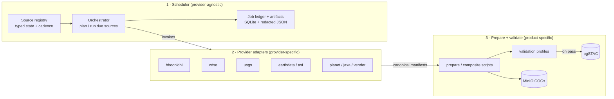
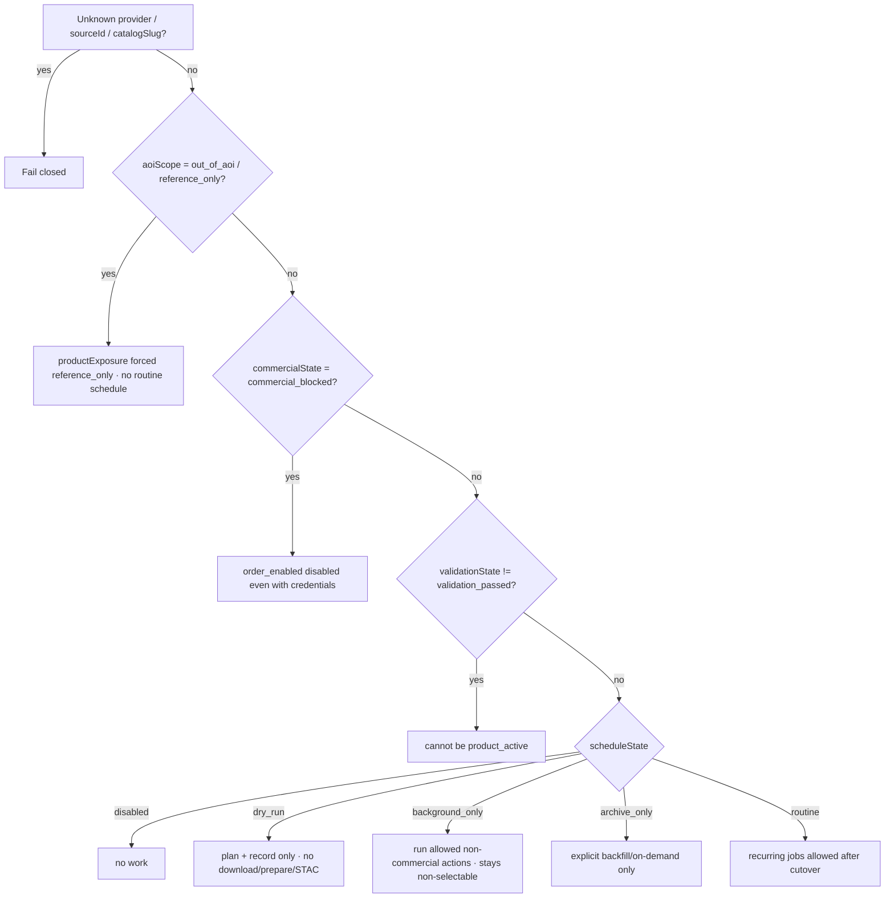
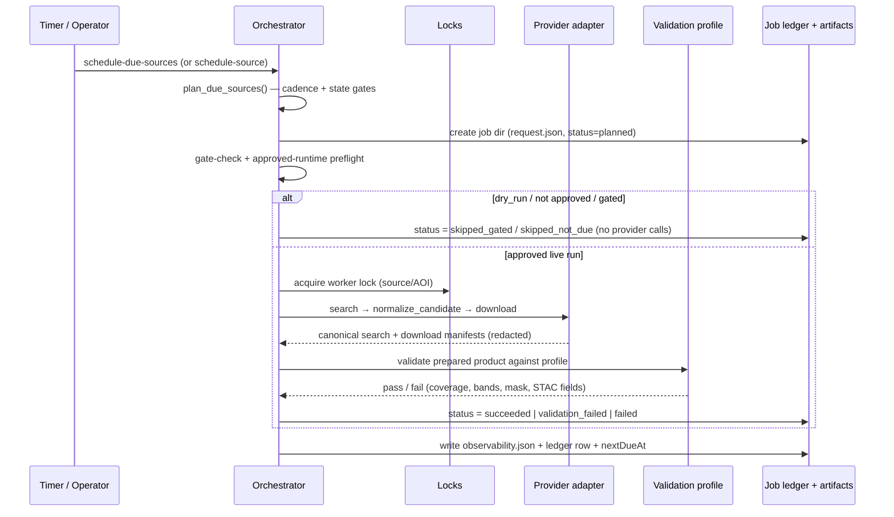
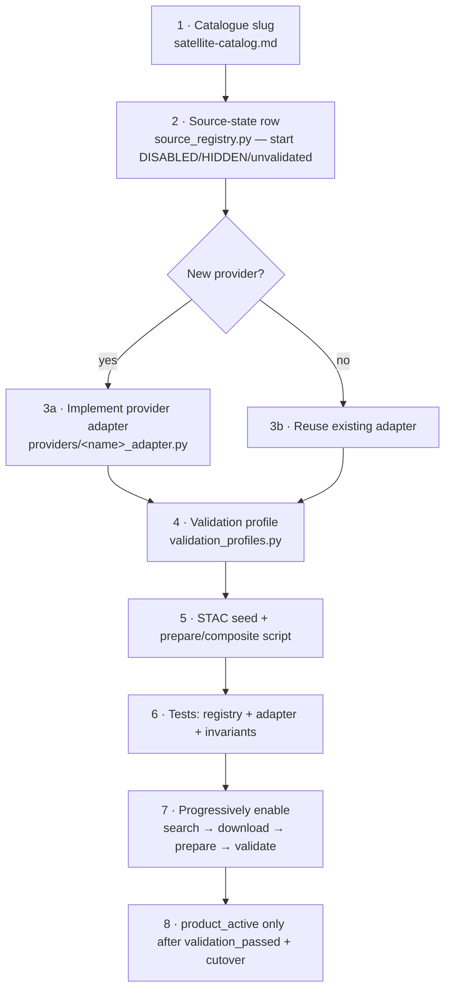

# Satellite Ingestion Orchestration & Scheduler

This is the **operator + developer guide** for the provider-agnostic satellite ingestion
scheduler. It explains, in one place:

1. **What we built** — the architecture and every moving part.
2. **What is working today** — and what is intentionally still gated.
3. **How to trigger ingestion** — CLI, dry-run, staging wrapper, and the systemd timer.
4. **How to control it** — source-state gates, locks, cutover, and rollback.
5. **How to observe it** — CLI, redacted APIs, and the internal admin console.
6. **How to add a new satellite** — a copy-paste checklist for ISRO and non-ISRO sources.

It is the *narrative companion* to three deeper documents. Read those when you need the
exact field-level rules:

| Document | What it is |
|---|---|
| [reference/satellite-ingestion-scheduler-contracts.md](reference/satellite-ingestion-scheduler-contracts.md) | The frozen **Phase 0 contract**: source-state schema, ledger fields, monitoring API boundary, cutover/rollback rules, alerts. |
| [reference/satellite-ingestion-onboarding-matrix.md](reference/satellite-ingestion-onboarding-matrix.md) | The **per-provider** onboarding reference: adapter responsibilities, auth, per-source feasibility. |
| [reference/satellite-catalog.md](reference/satellite-catalog.md) | The **20-platform catalogue** inventory and selection guide. |
| [impl-plan/architecture-satellite-ingestion-scheduler-1.md](impl-plan/architecture-satellite-ingestion-scheduler-1.md) | The **build plan** (phases, tasks, tests). |

> **One-line summary:** The scheduler decides *what source is due* and records the *job
> lifecycle*; **provider adapters** own the connection/auth/search/download/order differences;
> **validation profiles** decide whether a product is good enough to expose. None of these layers
> hard-code satellite names.
>
> **Admin console boundary:** visual ingestion orchestration is an **internal owner/admin console**
> under `/admin/ingestion/*`. It is not a public product feature and does not belong in the
> crop/field-oriented product Monitoring surface.

---

## 1. The core idea (why it is built this way)

The original ingestion path was one systemd timer and one `bhoonidhi-sync` command per satellite.
That does not scale to the 20 catalogue platforms — it duplicates provider logic, fragments
monitoring, and grows one timer per source.

The scheduler replaces that with **three orthogonal layers**:



- **Layer 1 — Scheduler** never contains provider HTTP/auth logic. It reads source state +
  cadence, decides which `source/AOI` pairs are due, runs them through the adapter interface, and
  writes a job record + redacted artifacts.
- **Layer 2 — Provider adapters** implement a single contract (`search`, `normalize_candidate`,
  `download`, optional `order/poll_order/cancel_order`). Unknown providers and unsupported actions
  **fail closed**.
- **Layer 3 — Prepare + validation** turns provider output into Akasha COGs and decides, via a
  **validation profile**, whether the product can become user-selectable.

This separation is the whole point: **adding a satellite means adding a registry row (+ maybe an
adapter and a validation profile), not rewriting scheduling, monitoring, or product logic.**

---

## 2. Component map (where everything lives)

| Layer | File | Responsibility |
|---|---|---|
| Source state | [services/ingestion/akasha_ingest/source_registry.py](../services/ingestion/akasha_ingest/source_registry.py) | Typed source-state taxonomy, the 20-slug catalogue→source mapping, and **fail-closed `_validate_row()`** that rejects contradictory state at load time. |
| Provider contract | [services/ingestion/akasha_ingest/providers/base.py](../services/ingestion/akasha_ingest/providers/base.py) | `ProviderAdapter` protocol + typed `SearchRequest/Result`, `DownloadRequest/Result`, `OrderRequest/Result`, pagination/rate-limit/token-refresh metadata, and provider exceptions. |
| Provider factory | [services/ingestion/akasha_ingest/providers/registry.py](../services/ingestion/akasha_ingest/providers/registry.py) | `get_provider_adapter(provider)` → adapter instance or `UnknownProviderError` (fail closed). |
| Bhoonidhi adapter | [services/ingestion/akasha_ingest/providers/bhoonidhi_adapter.py](../services/ingestion/akasha_ingest/providers/bhoonidhi_adapter.py) | The one **fully implemented** adapter; wraps `BhoonidhiClient` (`search` + `normalize_candidate` + `download`). |
| Placeholder adapters | `providers/_placeholder.py`, `providers/{cdse,usgs,earthdata,asf,planet,jaxa,vendor,usda}_adapter.py` | Scaffolds. Free-provider placeholders raise `ProviderActionUnsupported`; commercial placeholders raise `CommercialPreflightFailed` from `order()`. |
| Canonical manifests | [services/ingestion/akasha_ingest/manifests.py](../services/ingestion/akasha_ingest/manifests.py) | `SearchManifest` / `DownloadManifest` / `OrderManifest` + **redaction** (`REDACTION_VERSION`) for secrets/tokens/signed URLs. |
| Orchestrator | [services/ingestion/akasha_ingest/orchestrator.py](../services/ingestion/akasha_ingest/orchestrator.py) | `plan_due_sources`, `run_source_job`, `run_due_sources` + `SchedulerLedger`, `DueDecision`, `SourceJobResult`. |
| Job artifacts | [services/ingestion/akasha_ingest/jobs.py](../services/ingestion/akasha_ingest/jobs.py) | Per-job directory: `request.json`, `status.json`, `command.txt`, `result.json`, `events.jsonl`, `observability.json`; `JobStatus` lifecycle; opaque artifact handles. |
| Job ledger | [services/ingestion/akasha_ingest/job_ledger.py](../services/ingestion/akasha_ingest/job_ledger.py) | SQLite `scheduler_jobs` table (WAL, busy-timeout, 90-day prune). |
| Locks | [services/ingestion/akasha_ingest/scheduler_locks.py](../services/ingestion/akasha_ingest/scheduler_locks.py) | Global + per-source/AOI file locks, PID/TTL stale-lock reclaim, **legacy Bhoonidhi lock-path compatibility**. |
| Validation profiles | [services/ingestion/akasha_ingest/validation_profiles.py](../services/ingestion/akasha_ingest/validation_profiles.py) | `optical_composite`, `optical_scene`, `sar_backscatter`, `precomputed_context`, `archive_only`, `visual_only` + LISS-3 invariant constants. |
| Worker CLI | [services/ingestion/worker.py](../services/ingestion/worker.py) | `schedule-plan`, `schedule-due-sources`, `schedule-source`, `verify-raster-product`, `verify-composite`, and the `bhoonidhi-*` compatibility commands. |
| BFF admin monitoring | [apps/api/app/ingestion_jobs.py](../apps/api/app/ingestion_jobs.py) | Same-origin `/api/monitoring/*` endpoints for ingestion schedules, jobs, job details, events, and satellite-source summaries. They are owner/admin-gated and return **redacted, opaque** snapshots only. Admin source visibility is separate from map-layer/product exposure. |
| Source monitoring | [apps/api/app/source_monitoring.py](../apps/api/app/source_monitoring.py) | Admin/operator source scheduler health: latest scheduler job + due/overdue status. Product Monitoring remains crop/field oriented. |
| Best-observation | [apps/api/app/raster/catalog_resolver.py](../apps/api/app/raster/catalog_resolver.py) | `resolve_best_observation()` ranks validated sources per date (Phase 11). |
| Admin ingestion UI | `apps/frontend/src/pages/monitoring/*` | Internal owner/admin pages at `/admin/ingestion`, `/admin/ingestion/jobs`, `/admin/ingestion/jobs/:jobId`, and `/admin/ingestion/schedules`. It manages data ingestion, including backend-only sources such as EOS-04 SAR, and does not imply the source is selectable on the map. |
| Deployment | [infra/selfhosted/systemd/](../infra/selfhosted/systemd/) | `akasha-ingestion-scheduler.{timer,service,sh}`, `ingestion-scheduler.env.example`, installer. |
| Staging wrapper | [scripts/staging_ingestion_job.py](../scripts/staging_ingestion_job.py) | Operator entry point: `trigger`, `job-inspect`, `job-artifact`, `schedule-plan`, `schedule-next`. |

---

## 3. The source-state model (how control is expressed)

Every source is one row of **orthogonal** state fields. We never overload one `state` string or
`mvp_enabled` to mean scheduling + product exposure + commercial + AOI + validation. The full field
list and allowed values are frozen in
[the Phase 0 contract](reference/satellite-ingestion-scheduler-contracts.md#1-typed-source-state-schema);
the most important fields are:

| Field | Controls | Example values |
|---|---|---|
| `lifecycleState` | Highest milestone reached | `catalogued` → `search_enabled` → `download_enabled` → `prepare_enabled` → `validate_enabled` |
| `scheduleState` | Scheduler posture | `disabled`, `dry_run`, `manual_only`, `background_only`, `routine`, `archive_only` |
| `capabilities` | Actions the scheduler may invoke | `search_enabled`, `download_enabled`, `order_enabled`, `prepare_enabled`, `validate_enabled` |
| `productExposure` | What the BFF/UI shows | `hidden`, `background_only`, `product_active`, `reference_only` |
| `commercialState` | Cost/licensing gate | `free`, `approved`, `commercial_blocked` |
| `aoiScope` | Applicability to the AOI | `in_aoi`, `partial_aoi`, `out_of_aoi`, `reference_only` |
| `validationState` | Last accepted validation | `unvalidated`, `validation_pending`, `validation_failed`, `validation_passed` |
| `readinessReasons` | Machine-readable "why gated" | `coverage_below_threshold`, `commercial_approval_required`, `out_of_aoi`, `awaiting_validation` |

### Gate precedence (evaluated in order, fail closed)



The registry **rejects contradictory rows at load time** (`_validate_row()`), e.g.
`commercial_blocked + order_enabled`, `archive_only + routine cadence`,
`background_only + product_active`, or an executable row with no `catalogSlug`. This is enforced by
[tests/test_satellite_catalog_registry.py](../tests/test_satellite_catalog_registry.py).

### Admin management versus map/product exposure

`/admin/ingestion` is an operator console, not a map layer selector. A source can be
**admin-manageable** even when it is not **map-active**:

- `availabilityStatus=active` / `productExposure=product_active` means users may select the source
  in product/map workflows where supported.
- `productExposure=background_only` means the source can be searched, downloaded, validated, and
  monitored behind the scenes, but must not appear as a user-selectable optical/index layer.
- `scheduleState=manual_only` means no timer owns the source; owner/admin users may submit bounded
  manual sync requests from `/admin/ingestion` when the row has an AOI plus search/download
  capabilities. The request is still routed through the staging inbox/wrapper and shared locks.

EOS-04 SAR-MRS L2B is the canonical example: it is validated for backend SAR-assisted cloudy
optical analytics (`productExposure=background_only`, `scheduleState=manual_only`) while remaining
`availabilityStatus=gated` for the map/source selector because SAR is not an optical index layer.

---

## 4. What runs when you trigger the scheduler (the job lifecycle)



**Due decision** uses: source cadence + last successful run (from the scheduler ledger) + typed
state + AOI + host pool + manual overrides + explicit first-run policy. A source is **never** due
if it is `disabled`, `archive_only` (without explicit backfill), `out_of_aoi`, `commercial_blocked`,
or gated by ownership.

**Job statuses** (`JobStatus`): `planned → queued → running → succeeded | failed |
validation_failed | blocked_by_lock | cancelled | skipped_not_due | skipped_gated`.

> ### The live provider pipeline runs through the orchestrator
> In an **approved, non-dry-run** run, `run_source_job()` executes the real ResourceSat pipeline
> ([resourcesat_pipeline.run_resourcesat_ingest](../services/ingestion/akasha_ingest/resourcesat_pipeline.py)):
> search→download→prepare→composite→verify→upload→STAC→cleanup. On success it records `SUCCEEDED`
> and advances the scheduler cadence ledger; on a stage failure it records `FAILED` with a
> classified `failureKind` (e.g. `low_coverage`, `stac_registration_failed`). The pipeline is covered
> by mocked unit/integration tests; the **live end-to-end run is operator-side on the staging VM**
> (Bhoonidhi's whitelisted egress). See
> [§7 Current state](#7-current-state--what-works-and-what-is-pending).

---

## 5. How to trigger ingestion

### 5.1 Local / dry-run inspection (safe anywhere, no provider calls)

```bash
cd services/ingestion

# Why is each source due or not? (no provider calls, no downloads)
python worker.py schedule-plan --json
python worker.py schedule-plan --source resourcesat-2a-liss3-boa --aoi bangalore-60km --json

# Walk one source through the orchestrator in dry-run (records artifacts, no download)
python worker.py schedule-source \
  --source resourcesat-2a-liss3-boa --aoi bangalore-60km --dry-run --json

# Plan + run all due sources in dry-run, bounded
python worker.py schedule-due-sources --dry-run --max-concurrent-source 1 --json
```

Useful flags (shared by `schedule-*`): `--source`, `--aoi`, `--json`, `--window-days`,
`--dry-run`, `--approved-runtime`, `--local-test`, `--max-concurrent-source`, `--manual`,
`--base-dir`, `--lock-dir`, `--ledger-db-path`.

### 5.2 Production (staging only, through the safe wrapper)

Bhoonidhi is **IP-whitelisted to the staging VM** (egress `20.219.3.35`). All real ISRO jobs must
run there, through the wrapper — never as ad hoc `docker run` (that has wedged the VM before; see
the repo memory note). The wrapper owns bounded windows, locks, redaction, and `ionice`/`nice`.

```bash
# From a workstation — submit a bounded job to staging and wait
python scripts/staging_ingestion_job.py trigger \
  --host akasha-staging \
  --source resourcesat-2a-liss3-boa --aoi bangalore-60km \
  --dry-run --wait

# Inspect a finished job (redacted)
python scripts/staging_ingestion_job.py job-inspect <job_id> --host akasha-staging --json
python scripts/staging_ingestion_job.py job-artifact <job_id> request --host akasha-staging
python scripts/staging_ingestion_job.py schedule-next --source resourcesat-2a-awifs-boa --aoi bangalore-60km
```

The production path for ResourceSat is the orchestrator: the automatic
`akasha-ingestion-scheduler.timer` runs `schedule-due-sources`, and the on-demand
`staging_ingestion_job.py trigger` runs `schedule-source --approved-runtime`. The legacy
`bhoonidhi-sync` timers have been removed. See
[staging-ingestion-developer-guide.md](staging-ingestion-developer-guide.md).

### 5.3 Scheduled (systemd, installed disabled/dry-run first)

The orchestrator runs as **one** timer (not one-per-satellite). Artifacts live in
[infra/selfhosted/systemd/](../infra/selfhosted/systemd/):

| Artifact | Role |
|---|---|
| `akasha-ingestion-scheduler.timer` | Hourly/4-hourly cadence, `Persistent=true`. The **orchestrator** decides which sources are actually due. |
| `akasha-ingestion-scheduler.service` | Runs the wrapper from `/srv/akasha` under a global flock. |
| `akasha-ingestion-scheduler.sh` | Safe wrapper: bounded defaults, global + worker locks, redaction, `ionice`/`nice`, approved-runtime signal. |
| `ingestion-scheduler.env.example` | Scheduler-wide knobs: max concurrent sources, per-run budget, dry-run/canary flags, stale-lock TTL, retention. |
| `install-akasha-ingestion-scheduler.sh` | Installer. |

It is installed **disabled or dry-run-only** for the cutover window (see §6).

---

## 6. How to control it — cutover, ownership, locks

### One-owner rule

A `source/AOI` pair must have **exactly one** active owner. Never force a manual scheduler job while
an automatic scheduler job is in-flight for the same source/AOI — that causes double downloads,
duplicate STAC items, and lock contention.

| `ownedBy` | Meaning |
|---|---|
| `scheduler_dry_run` | Scheduler may plan/log only. |
| `scheduler_active` | Scheduler owns real jobs. |
| `manual_only` | Operators trigger via the staging CLI; no timer owns it. |

`manual_only` sources with an AOI and search/download capabilities can also be triggered through the
owner/admin `/admin/ingestion` console. This is still a bounded manual path: the API writes an inbox
request, the host dispatcher invokes the staging wrapper, and the same source/AOI locks prevent
double-runs.

### Canary sequence

1. Install the scheduler in `dry_run`; verify redacted snapshots + `schedule-plan`.
2. Pick one canary, initially `resourcesat-2a-liss3-boa` / `bangalore-60km`.
3. Confirm automatic and ad hoc scheduler paths share the same canonical worker lock directory.
4. Enable scheduler active with `maxConcurrentSources=1`.
5. Verify one dry-run + one capped real run before widening the budget.
6. Record `cutoverDate`, owner, and rollback command in the ownership matrix.

### Rollback

Stop the scheduler timer → confirm no scheduler job owns the source/AOI → use bounded manual
`schedule-source` runs if needed. Full sequence + the ownership matrix are in the
[Phase 0 contract §6](reference/satellite-ingestion-scheduler-contracts.md#6-ownership-and-rollback).

### Commercial gates (cost safety)

Paid `order/task/subscription` calls require **all** of: `commercialState != commercial_blocked`,
`allowPaidOrder=true`, an explicit operator command flag, **and** a documented commercial-readiness
record. Credentials alone never enable a paid call. Commercial placeholder adapters fail closed by
default — proven by [tests/test_provider_adapter_contract.py](../tests/test_provider_adapter_contract.py).

---

## 7. Current state — what works and what is pending

### Active / gated sources (AOI `bangalore-60km`)

| Source | `scheduleState` | `productExposure` | Owner today | Notes |
|---|---|---|---|---|
| `resourcesat-2a-liss3-boa` (LISS-3) | `routine` | **`product_active`** | `scheduler_active` | MVP production default (FCC display). |
| `resourcesat-2a-liss4-mx70-l2` (LISS-4) | `routine` | **`product_active`** | `scheduler_active` | High-res field enhancement. |
| `resourcesat-2a-awifs-boa` (AWiFS) | `routine` | **`product_active`** | `scheduler_active` | Regional coarse (56 m); `validation_passed` with a 60% regional coverage threshold (prior 95% gate failed at 62.98%). `analysisLevel` stays regional so the best-observation resolver keeps it out of small-field decisions. |
| `eos-04-sar-mrs-l2b` (EOS-04 SAR MRS L2B) | `manual_only` | **`background_only`** | `manual_only` | Validated backend SAR support for cloudy optical analytics; admin-syncable, not a selectable optical/index map layer. |
| Sentinel-2/-1, Landsat-8/9, MODIS, EOS-06, NISAR, IRS-1C, Cartosat-3, Planet/SkySat/SuperView/etc., NAIP | `disabled` / `manual_only` | `hidden` / `reference_only` | — | Scaffolded rows with explicit `readinessReasons`; not admin-syncable until source-specific gates pass. |

### Build status by layer

| Capability | Status |
|---|---|
| Source-state taxonomy + 20-slug registry + fail-closed validation | ✅ Implemented + tested |
| Provider contract + factory + **Bhoonidhi** adapter | ✅ Implemented + tested |
| Other provider adapters (cdse/usgs/earthdata/asf/planet/jaxa/vendor/usda) | 🟡 Placeholders (fail closed) |
| Canonical manifests + redaction | ✅ Implemented + tested |
| Orchestrator (`plan/run` + locks + ledger + artifacts) | ✅ Implemented + tested |
| **Live provider pipeline through the orchestrator** | ✅ Implemented + mocked-tested — `run_source_job` runs `run_resourcesat_ingest` (success → `SUCCEEDED` + ledger advance); live staging run is operator-side |
| Validation profiles (6) + LISS-3 invariants | ✅ Implemented + tested |
| BFF monitoring endpoints + frontend job UI | ✅ Implemented + tested |
| Best-observation resolver (`resolve_best_observation`) | ✅ Implemented |
| Systemd scheduler timer/service/wrapper | ✅ Implemented (installed disabled/dry-run) |

### What "complete" means here

The **ResourceSat/Bhoonidhi migration is complete**: the orchestrator runs the real pipeline,
LISS-3/LISS-4/AWiFS are `scheduler_active` (AWiFS is product-active with a regional coverage
threshold), the cutover ownership gate and the legacy Bhoonidhi timers/lock-compat are removed, and
the runtime entry points call the scheduler. The one remaining step is **operator-side**: run the
live end-to-end ingestion on the staging VM (Bhoonidhi's whitelisted egress) to produce fresh
COGs/STAC, since that cannot be executed from a developer workstation.

Every non-ISRO provider is **Phase 12 onboarding** that now only needs an adapter + registry row +
validation profile, not scheduler changes.

> **Test-file naming note:** the build plan lists aspirational test filenames
> (`test_generic_scheduler_orchestrator.py`, `test_ingestion_jobs_monitoring.py`,
> `test_resourcesat_scheduler_invariants.py`). The shipped equivalents are
> [tests/test_scheduler_observability.py](../tests/test_scheduler_observability.py),
> [tests/test_phase7_bhoonidhi_scheduler.py](../tests/test_phase7_bhoonidhi_scheduler.py),
> [tests/test_scheduler_phase0_contracts.py](../tests/test_scheduler_phase0_contracts.py),
> [tests/test_satellite_catalog_registry.py](../tests/test_satellite_catalog_registry.py),
> [tests/test_provider_adapter_contract.py](../tests/test_provider_adapter_contract.py), and
> [apps/api/tests/test_ingestion_jobs.py](../apps/api/tests/test_ingestion_jobs.py).

---

## 8. How to add a new satellite

Adding a source is a **registry-first** workflow. You almost never touch the orchestrator.



### Step-by-step checklist

1. **Catalogue** — confirm/add the slug in
   [docs/reference/satellite-catalog.md](reference/satellite-catalog.md). Every executable source
   must trace to exactly one slug.
2. **Source-state row** — add a `SourceStateRow` in
   [source_registry.py](../services/ingestion/akasha_ingest/source_registry.py). Fill **all** typed
   fields (`catalogSlug`, `providerAdapter`, `productFamily`, `instrumentMode`, `productVariant`,
   `analysisLevel`, `validationProfile`, `cadence`, `hostPool`, gates). **Start safe:**
   `scheduleState=disabled`, `productExposure=hidden`, `validationState=unvalidated`, with
   `readinessReasons` explaining the gate. The load-time validator will reject contradictions.
3. **Provider adapter** —
   - *Existing provider* (e.g. another Bhoonidhi product): reuse `bhoonidhi`.
   - *New provider*: implement a `providers/<name>_adapter.py` against the `ProviderAdapter`
     protocol (`search`, `normalize_candidate`, `download`, and `order/poll_order/cancel_order`
     only if the provider supports orders) and register it in
     [providers/registry.py](../services/ingestion/akasha_ingest/providers/registry.py). Use the
     placeholder as your starting point; commercial providers extend
     `CommercialPlaceholderAdapterBase` so paid actions stay fail-closed.
4. **Validation profile** — pick one of the six profiles or extend
   [validation_profiles.py](../services/ingestion/akasha_ingest/validation_profiles.py):
   `optical_composite` / `optical_scene` (NIR+RED etc.), `sar_backscatter` (**never** optical
   indices), `precomputed_context` (MODIS/EOS-06 NDVI), `archive_only`, `visual_only` (VHR display).
5. **STAC + prepare** — add the collection/seed under `data/seed/stac/` and a
   `scripts/prepare_<source>_cogs.py` (mirror
   [prepare_resourcesat_liss3_boa_cogs.py](../scripts/prepare_resourcesat_liss3_boa_cogs.py)); add a
   composite step if it is a composite-served optical source.
6. **Tests** — extend
   [test_satellite_catalog_registry.py](../tests/test_satellite_catalog_registry.py) (slug coverage
   + gates), [test_provider_adapter_contract.py](../tests/test_provider_adapter_contract.py) (new
   adapter shape / fail-closed), and add invariant tests if it has hard product rules.
7. **Progressively enable** — advance `lifecycleState`/`capabilities` one step at a time:
   `search_enabled` → `download_enabled` → `prepare_enabled` → `validate_enabled`. Keep
   `scheduleState=background_only` while validating.
8. **Promote** — only after `validationState=validation_passed` may you set
   `productExposure=product_active`, and only after a staging canary may you move ownership to
   `scheduler_active` (§6).

### ISRO-via-Bhoonidhi specifics (the immediate next satellites)

All ISRO sources use the `bhoonidhi` adapter, run **only on staging**, and go through the safe
wrapper. Scaffolded rows already exist; bring them online via their validation profile:

| Source | Provider | Profile | Gating reason today |
|---|---|---|---|
| EOS-04 (RISAT SAR, MRS L2B) | `bhoonidhi` | `sar_backscatter` | SAR ARD validation pending; no optical indices. See [eos04-sar-mrs-l2b-cog-prep-runbook.md](eos04-sar-mrs-l2b-cog-prep-runbook.md). |
| EOS-06 (OCM NDVI, 8-day context) | `bhoonidhi` | `precomputed_context` | Regional context only; not a raw-reflectance field source. |
| NISAR (SSAR beta GCOV) | `bhoonidhi`/`asf` | `sar_backscatter` | Data-gated until calibrated ARD. See [nisar-ssar-beta-gcov-cog-prep-runbook.md](nisar-ssar-beta-gcov-cog-prep-runbook.md). |
| IRS-1C | `bhoonidhi` | `archive_only` | Backfill/on-demand, not routine cadence. |
| Cartosat-3 | `bhoonidhi`/manual | `visual_only` | VHR; manual context, no routine API path. |

For non-ISRO providers (CDSE Sentinel, USGS Landsat, Earthdata/ASF, Planet/JAXA/VHR), the only extra
work is implementing the provider adapter; the registry/validation/monitoring flow is identical.
Per-provider auth and feasibility details are in
[reference/satellite-ingestion-onboarding-matrix.md](reference/satellite-ingestion-onboarding-matrix.md).

---

## 9. Monitoring & observability

- **CLI:** `worker.py schedule-plan --json` (due reasons),
  `scripts/staging_ingestion_job.py job-inspect/job-artifact/schedule-next`.
- **Admin API (same-origin, owner/admin-gated, redacted/opaque only):**
  `GET /api/monitoring/ingestion-schedules`,
  `GET /api/monitoring/ingestion-jobs?limit=…&sourceId=…&state=…`,
  `GET /api/monitoring/ingestion-jobs/{jobId}`,
  `GET /api/monitoring/ingestion-jobs/{jobId}/events`, and admin source-health endpoints under
  `/api/monitoring/*`. These remain behind the same app/gateway origin and require owner/admin
  RBAC. They read only the redacted scheduler snapshot/ledger via explicit config — **never** raw
  provider archives, signed URLs, credentials, internal hosts, or filesystem paths. Artifact handles
  are opaque (`<jobId>:<artifactType>`), and event payloads are recursively sanitized before they
  reach the browser.
- **Admin UI:** visual ingestion orchestration lives only in the internal owner/admin console:
  - `/admin/ingestion` — source/scheduler overview.
  - `/admin/ingestion/jobs` — scheduler job queue.
  - `/admin/ingestion/jobs/:jobId` — job detail, redacted artifacts, and pipeline/timeline.
  - `/admin/ingestion/schedules` — cadence, due/overdue, and validation state.
- **Product Monitoring boundary:** product Monitoring remains crop/field oriented. It must not expose
  ingestion job queues, scheduler internals, provider health, raw artifacts, or source cutover state to
  member/viewer users.
- **Deprecated compatibility aliases:** `/monitoring/global`, `/monitoring/ingestion-jobs`, and
  `/monitoring/ingestion-jobs/:jobId` are temporary owner/admin-gated redirects to the canonical
  admin routes. Remove these aliases after `/admin/ingestion/*` stabilizes and bookmarks/tests have
  migrated.
- **Alerts/runbooks:** failures are classified into operator-actionable kinds — `missed_due_run`,
  `repeated_failures`, `stale_search`, `failed_validation`, `low_coverage`, `disk_pressure`,
  `minio_upload_failed`, `stac_registration_failed`, `provider_auth_or_rate_limit`, `stale_lock`,
  `rollback_required` (see the [Phase 0 contract §9](reference/satellite-ingestion-scheduler-contracts.md#9-alerts-and-runbooks)).

---

## 10. Hard guardrails (do not break these)

- **One public service.** The browser only calls `/api/*` and `/tiles/*`. The frontend never talks
  to Bhoonidhi/CDSE/USGS/MinIO/pgSTAC/TiTiler directly.
- **Redact before write.** Every artifact, command file, log, and API payload runs through the
  manifest redaction utilities. Never commit credentials, tokens, signed URLs, or raw archives.
- **Fail closed.** Unknown provider/source/slug, unsupported adapter action, or staging-only
  provider without an approved runtime → explicit error, never a silent best-effort.
- **`/srv/akasha` only.** All raster/raw/work/COG/job data stays there; never `/tmp`, `/`, or
  `/var/lib/docker`.
- **ResourceSat LISS-3 invariants are release-blocking.** 4-band order
  `[BAND2 Green, BAND3 Red, BAND4 NIR, BAND5 SWIR1]`, FCC `NIR,RED,GREEN`, no SCL (Akasha mask v1,
  keep `{1,4}`), reflectance scale `0.0001` offset `0.0`, separate analytic/mask COGs, deterministic
  keys, STAC upsert. Any scheduler change must preserve these.
- **SAR is never an optical-index source.** Optical indices are decided by band roles, not satellite
  names.

---

## 11. Related documents

- [Phase 0 scheduler contract](reference/satellite-ingestion-scheduler-contracts.md)
- [Provider/source onboarding matrix](reference/satellite-ingestion-onboarding-matrix.md)
- [Satellite catalogue & selection guide](reference/satellite-catalog.md)
- [Scheduler build plan](impl-plan/architecture-satellite-ingestion-scheduler-1.md)
- [Multi-source ingestion roadmap](impl-plan/data-multi-source-ingestion-roadmap-1.md)
- [Staging ingestion developer guide](staging-ingestion-developer-guide.md)
- [Data ingestion & satellite rules](data-ingestion-and-satellite-rules.md)
- [Engineering do's and don'ts](engineering-dos-donts.md)
