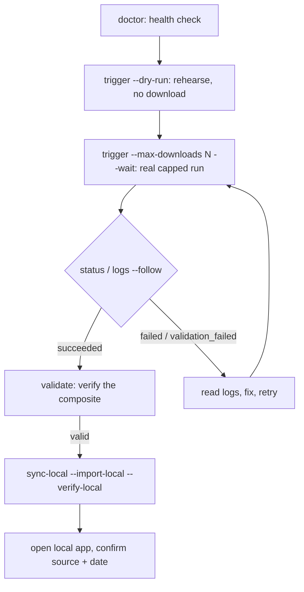

# Staging Ingestion — Developer Workflow, Debugging & Validation Guide

This guide is for **every developer on the team**. It explains how we trigger satellite
imagery ingestion, how to **debug** a run, and how to **validate** that the imagery is good —
on a day-to-day basis — without ever logging into the staging VM by hand.

> **Status:** This describes the implemented CLI-first workflow from
> [docs/impl-plan/process-staging-ingestion-workflow-1.md](impl-plan/process-staging-ingestion-workflow-1.md).
> The local CLI is `scripts/staging_ingestion_job.py`; the staging-side forced-command wrapper is
> installed as `/opt/akasha/bin/akasha-ingestion-job.sh`. Install/ops steps live in
> [infra/selfhosted/README.md](../infra/selfhosted/README.md).

---

## 1. The one thing to understand first

You run **one local CLI** on your laptop. All the risky, IP-restricted work — Bhoonidhi search,
downloads, COG transforms, compositing — runs **on the staging VM** (the only machine whitelisted
for Bhoonidhi at egress IP `20.219.3.35`). Only the **final, prepared COG/TIFF bundles** come back
to your laptop for local testing.

| Rule | Why it matters to you |
|---|---|
| You never SSH into staging for an interactive shell | Job-control keys are locked to the job CLI. `sync-local` also needs an ops-approved artifact-sync SSH path because it reads final manifests/COGs with noninteractive `cat`/`tar`; it still must not expose a shell or raw provider archives. |
| Bhoonidhi only runs on staging | It's the whitelisted IP; running it locally would fail and leak nothing useful. |
| Only final COGs reach your laptop | No raw provider ZIPs, no credentials, ever. |
| One running job per AOI worker lock | Prevents you + the scheduled timer + another dev from triple-hitting Bhoonidhi. Different sources on the same AOI serialize today. |

There are **two ways imagery gets produced** on staging:

1. **Automatic** — scheduled timers (`akasha-bhoonidhi-sync`, plus source-specific timers such as
   `akasha-bhoonidhi-liss4-sync`) keep staging fresh on their own.
2. **On-demand** — you trigger a job with the CLI when you need specific imagery now.

The ad hoc runner shares the standard Bhoonidhi AOI worker lock. Source-specific timers may have
their own wrapper locks; coordinate LISS-4 ad hoc runs with the timer window until those locks are
unified.

### Scheduler transition note

The provider-agnostic ingestion scheduler is planned in
[architecture-satellite-ingestion-scheduler-1.md](impl-plan/architecture-satellite-ingestion-scheduler-1.md).
Until that scheduler is installed and cut over, this CLI remains the production-safe path for
Bhoonidhi ad hoc jobs. During cutover, each source/AOI must have exactly one owner:

| Ownership mode | Meaning |
|---|---|
| `legacy_timer` | Existing source-specific timer owns that source/AOI. |
| `scheduler_dry_run` | Scheduler may plan/log due decisions but must not run real jobs. |
| `scheduler_active` | Scheduler owns real jobs; corresponding legacy timer is disabled. |
| `manual_only` | Operators trigger jobs manually through this CLI. |

Do not run the scheduler and a legacy source-specific timer against the same source/AOI at the
same time. Rollback is: stop/disable scheduler timer, re-enable the previous source timer/env,
and confirm no queued/running scheduler job owns that source/AOI.

---

## 2. One-time setup (per developer)

```bash
# 1. SSH alias so you don't repeat connection details.
#    In ~/.ssh/config:
#      Host akasha-staging
#        HostName <staging-host>
#        User     <your-user>
#        IdentityFile ~/.ssh/<your-key>
#    (Alternatively: export AKASHA_STAGING_SSH_HOST=akasha-staging)

# 2. Your local stack must be running — it's where pulled imagery lands.
make dev

# 3. Confirm everything is wired end-to-end.
python scripts/staging_ingestion_job.py doctor --host akasha-staging
```

`doctor` must pass before you do anything else. It checks: local `ssh`, the remote wrapper,
remote Docker Compose discovery + Bhoonidhi env, local Docker/Compose, and write access to
`data/seed/rasters`. If a check fails, fix that one thing and re-run.

---

## 3. The daily loop



```bash
# Rehearse cheaply — validates source/AOI/window and performs staging-side search,
# but does not download, transform, composite, or ingest.
python scripts/staging_ingestion_job.py trigger --host akasha-staging \
  --source resourcesat-2a-liss3-boa --aoi bangalore-60km --dry-run --wait

# Real, capped ingestion (returns a job_id immediately; runs detached on staging).
python scripts/staging_ingestion_job.py trigger --host akasha-staging \
  --source resourcesat-2a-liss3-boa --aoi bangalore-60km \
  --max-downloads 1 --wait

# Watch progress / debug.
python scripts/staging_ingestion_job.py status <job_id> --host akasha-staging
python scripts/staging_ingestion_job.py logs   <job_id> --host akasha-staging --follow

# Validate the output (see §6).
python scripts/staging_ingestion_job.py validate <job_id> --host akasha-staging

# Pull the final COGs into your local stack and verify them locally.
python scripts/staging_ingestion_job.py sync-local <job_id> --host akasha-staging \
  --import-local --verify-local
```

`--wait` polls until the job reaches a terminal state, bounded by `--wait-timeout` (default 1800s).
Even without `--wait`, `trigger` prints a `job_id` right away and the job keeps running on staging.

---

## 4. Command reference

| Command | What it does | Key flags |
|---|---|---|
| `doctor` | Verify local + remote prerequisites | `--host` |
| `trigger` | Submit an ingestion job | `--source`, `--aoi`, `--window-days`, `--max-downloads`, `--min-coverage-percent`, `--dry-run`, `--wait`, `--wait-interval`, `--wait-timeout`, `--overwrite`, `--force-upload`, `--notes` |
| `status <job_id>` | Print the job's current state | `--json` |
| `logs <job_id>` | Print/stream the job log | `--tail N`, `--follow` |
| `list` | Show recent jobs | `--limit N` |
| `validate` | Verify the produced composite | `<job_id>` **or** `--source --aoi --date latest\|YYYY-MM-DD` |
| `retry <job_id>` | Re-run a failed job (new job_id) | `--overwrite`, `--force-upload`, `--notes` |
| `sync-local` | Pull final COGs into local MinIO/STAC | `<job_id>` **or** `--source --aoi --date`; `--import-local`, `--verify-local`, `--overwrite`, `--force-upload` |

**MVP sources:** `resourcesat-2a-liss3-boa` (default), `resourcesat-2a-liss4-mx70-l2`,
`resourcesat-2a-awifs-boa`. **Default AOI:** `bangalore-60km`.

---

## 5. Job lifecycle states

`status` and `list` report one of these. The first two are in-progress; the rest are terminal.

| State | Meaning | Your move |
|---|---|---|
| `queued` | Accepted, runner about to start | wait |
| `running` | Worker is executing | `logs --follow` |
| `succeeded` | Worker + validation passed | `sync-local` |
| `failed` | Worker/runner errored | read `logs`, fix, `retry` |
| `blocked_by_lock` | Same source/AOI is already running (timer or another dev) | wait, then `retry` |
| `validation_failed` | Composite built but failed acceptance | see §6 / §7 |
| `cancelled` | Operator stopped the unit | re-`trigger` if still needed |

---

## 6. Validation — how to check imagery is good (the daily habit)

Validation is `worker.py verify-composite` run for you by the `validate` command. A composite is
**valid** only when **all** of these hold:

- The composite **manifest and COGs exist** and are structurally valid Cloud-Optimized GeoTIFFs
  (analytic + mask, with overviews).
- **Coverage ≥ threshold.** Default `min-coverage-percent` is **95%** for LISS-3/AWiFS. LISS-4 is a
  narrow-swath layer and should be triggered with a lower threshold (for example,
  `--min-coverage-percent 10`) when you intentionally build it for narrow-swath coverage.
- **CRS matches** the AOI's expected grid (e.g. `EPSG:32643`).
- **Resolution matches** the source's expected grid resolution.

Run it two ways:

```bash
# Validate a specific job you just ran.
python scripts/staging_ingestion_job.py validate <job_id> --host akasha-staging

# Validate whatever the latest composite is for a source/AOI (independent of a job).
python scripts/staging_ingestion_job.py validate --host akasha-staging \
  --source resourcesat-2a-liss3-boa --aoi bangalore-60km --date latest
```

**Reading the result:**

- **Pass** → prints the verification detail; depending on the remote wrapper path this may be a
  structured summary or the raw `worker.py verify-composite` `[PASS]` output. Safe to `sync-local`.
- **Fail (`validation_failed`)** → the message says which check failed (usually coverage). Go to §7.
- **"no composite produced; nothing to validate"** (exit `0`) → the run was a `--dry-run`, or there
  was **no new data** in the window. This is **not** an error — widen the window (§7) if you needed
  fresh imagery.

Standalone remote `validate --source resourcesat-2a-liss4-mx70-l2 ...` currently runs the remote
verification path with the default validation profile. For LISS-4, prefer validating the run that
was triggered with the intended lower threshold, and rely on `sync-local --verify-local` for the
local LISS-4 coverage default.

When you pull locally, `sync-local --verify-local` runs local composite verification with the
source-aware local defaults, so you confirm the imagery is valid in your own MinIO/STAC before
opening the app.

---

## 7. Debugging playbook (symptom → cause → fix)

Start every investigation with these two:

```bash
python scripts/staging_ingestion_job.py status <job_id> --host akasha-staging   # state + failure_kind + message
python scripts/staging_ingestion_job.py logs   <job_id> --host akasha-staging --tail 200
```

`status.json` carries a `failure_kind` and a human `message`; `job.log` is the full (redacted)
worker output. Then match the symptom:

| Symptom | Likely cause | What to do |
|---|---|---|
| `blocked_by_lock` | Scheduled timer or another dev is holding the same AOI worker lock | `list` to see active ad hoc jobs; wait and `retry <job_id>` later |
| `failed` early, log mentions search/auth/session | Bhoonidhi session/auth hiccup or transient network | usually transient — `retry <job_id>`; if persistent, flag ops (egress IP / credentials) |
| `failed` during download | Bhoonidhi rate limit, or products are offline (`Online=N`) | lower `--max-downloads`, retry later; offline products can't be pulled this run |
| `validation_failed`, message = coverage below threshold | Too few clear scenes (clouds) in the window | re-run with a wider `--window-days` (e.g. 60), or add `--backfill-days`; rebuild with `--overwrite` |
| `succeeded` but `composite_date` empty | Dry-run, or no new data in window | not an error — widen `--window-days` / set explicit `--window-start/--window-end` |
| Upload-stage failure / partial objects | Interrupted MinIO upload | `retry <job_id> --force-upload` to replace existing objects |
| Stale/garbled local artifacts | A previous prepare left bad files | `retry <job_id> --overwrite` (rebuild) and/or `sync-local --overwrite` |
| `sync-local` fails immediately | Local Docker stack not running | `make dev`, then re-run `sync-local` |
| `doctor` fails one check | That specific dependency is missing/misconfigured | fix only that item (SSH, Docker, env) and re-run `doctor` |

Rules of thumb:

- **Transient provider errors** (search/download) → just `retry`.
- **Coverage / "no composite"** → it's a **data window** problem, not a bug → widen the window or backfill.
- **Conversion / upload** → `retry` with `--overwrite` and/or `--force-upload`.

---

## 8. Retrying safely

`retry` reuses the original request, gives you a **new** `job_id`, and clears `dry_run` so the
retry does real work:

```bash
# Re-run, rebuilding artifacts and replacing object storage.
python scripts/staging_ingestion_job.py retry <job_id> --host akasha-staging \
  --overwrite --force-upload --notes "retry after coverage fix"
```

- `--overwrite` → rebuild prepared/composite artifacts even if they exist.
- `--force-upload` → replace existing MinIO objects.
- `--notes` → leave an audit trail for the team.

Retries respect the lock — if the source/AOI is busy you'll get `blocked_by_lock`; just wait.

---

## 9. Getting imagery into your local app

```bash
# By job:
python scripts/staging_ingestion_job.py sync-local <job_id> --host akasha-staging \
  --import-local --verify-local

# Or pull the latest composite directly, no job needed:
python scripts/staging_ingestion_job.py sync-local --host akasha-staging \
  --source resourcesat-2a-liss3-boa --aoi bangalore-60km --date latest \
  --import-local --verify-local
```

This pulls **only** `analytic.tif` / `mask.tif` / `prepare_manifest.json`, imports them into your
local Docker MinIO + pgSTAC, and verifies the composite locally. Then open the local app — the new
source/date appears through the normal product endpoints, exactly like production (ResourceSat shows
as an FCC composite by default, never NDVI).

On success, `sync-local` also prints machine-readable lines after `local bundle:`:

```text
local_manifest=<local prepare_manifest.json path>
source=<source>
aoi=<aoi>
date=<composite date>
```

If the job was a dry run or produced no new composite, `sync-local <job_id>` exits with a clear
message that `composite_date` is missing. In that case there is no final bundle to pull; widen the
window and re-trigger if you expected imagery.

---

## 10. Team coordination & guardrails

- **One active worker per AOI lock.** A second trigger for the same AOI usually returns
  `blocked_by_lock`, even when the source differs. Use `list` to see ad hoc jobs before you
  re-trigger, and coordinate around scheduled timer windows.
- **Conservative caps.** `--max-downloads` defaults low (3) so an accidental trigger can't run away
  on the Bhoonidhi quota. Prefer `--max-downloads 1` while iterating.
- **What you can't do (by design):** open an interactive shell on staging, run arbitrary Docker,
  copy raw Bhoonidhi ZIPs, or see credentials. Job-control SSH access only allows the job
  subcommands. Artifact sync access is read-only in practice and is limited to final prepared
  artifacts.

---

## 11. Quick troubleshooting FAQ

- **"It's stuck in `queued`/`running` for a long time."** Big windows + downloads take time. Use
  `logs --follow`; jobs run detached on staging, so closing your terminal is safe.
- **"`validate` says no composite but the job succeeded."** No new data in the window (or a
  dry-run). Widen the window and re-trigger.
- **"I just want what staging already has."** Skip `trigger` — run `sync-local ... --date latest`.
- **"Two of us need imagery at once."** Different AOIs can run independently. Jobs for the same AOI
  usually serialize, even when sources differ, and the second one may return `blocked_by_lock`;
  coordinate via `list` and the scheduled timer windows.
- **"Where do I see secrets / signed URLs in logs?"** You don't — `job.log` and `command.txt` are
  redacted on purpose.

---

## 12. Reference — where things live on staging

Every job writes durable artifacts you can inspect via the CLI (no SSH needed):

| File (under `/srv/akasha/ingestion/jobs/<job_id>/`) | Contents |
|---|---|
| `request.json` | The exact request that was submitted |
| `status.json` | Current state, timestamps, `exit_code`, `failure_kind`, `message` |
| `command.txt` | Redacted worker command that ran |
| `job.log` | Redacted combined stdout/stderr (what `logs` streams) |
| `result.json` | Final manifest/composite paths, `composite_date`, verification summary |

**Not in this phase:** there is no web dashboard yet — everything is this CLI. A persistent,
app-backed job view is the deferred follow-up phase.

---

### See also

- [infra/selfhosted/README.md](../infra/selfhosted/README.md) — install, SSH setup, ops runbook.
- [docs/impl-plan/process-staging-ingestion-workflow-1.md](impl-plan/process-staging-ingestion-workflow-1.md) — the full implementation plan.
- [docs/data-ingestion-and-satellite-rules.md](data-ingestion-and-satellite-rules.md) — satellite/COG/mask/index rules.
